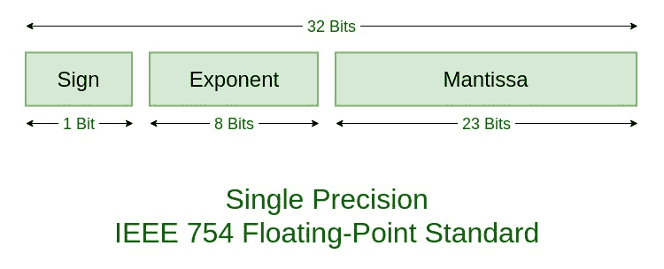

# 32 位单精度 IEEE 754 浮点表示转换程序

> 原文:[https://www . geesforgeks . org/32 位单精度 ieee-754 浮点表示转换程序/](https://www.geeksforgeeks.org/program-for-conversion-of-32-bits-single-precision-ieee-754-floating-point-representation/)

**先决条件:** [IEEE 标准 754 浮点数](https://www.geeksforgeeks.org/ieee-standard-754-floating-point-numbers/)
编写一个程序，找出给定实数的 **32 位单精度 IEEE 754 浮点表示**，反之亦然。



**例:**

```
Input: real number = 16.75
Output: 0 | 10000011 | 00001100000000000000000

Input: floating point number = 0 | 10000011 | 00001100000000000000000
Output: 16.75
```

**方法:**
该实现基于 C 中的 [**联合数据类型，并使用**](https://www.geeksforgeeks.org/union-c/) **[**位字段的概念。**](https://www.geeksforgeeks.org/bit-fields-c/)
当我们不需要通常分配给某些变量的全部内存，但我们想限制这些变量占用的内存量时，就会分配位字段。在 C 语言中，一个联盟的成员共享公共内存空间，因此我们一次只能访问一个成员。
**下面是上述方法的实现:**
**程序 1:** 将一个实数值转换为它的浮点表示形式** 

## C++

```
// C++ program to convert a real value
// to IEEE 754 floating point representation
#include<bits/stdc++.h>
using namespace std;

void printBinary(int n, int i)
{

    // Prints the binary representation
    // of a number n up to i-bits.
    int k;
    for (k = i - 1; k >= 0; k--) {

        if ((n >> k) & 1)
            cout << "1";
        else
            cout << "0";
    }
}

typedef union {

    float f;
    struct
    {

        // Order is important.
        // Here the members of the union data structure
        // use the same memory (32 bits).
        // The ordering is taken
        // from the LSB to the MSB.
        unsigned int mantissa : 23;
        unsigned int exponent : 8;
        unsigned int sign : 1;

    } raw;
} myfloat;

// Function to convert real value
// to IEEE floating point representation
void printIEEE(myfloat var)
{

    // Prints the IEEE 754 representation
    // of a float value (32 bits)

    cout << var.raw.sign << " | ";
    printBinary(var.raw.exponent, 8);
    cout << " | ";
    printBinary(var.raw.mantissa, 23);
    cout << "\n";
}

// Driver Code
int main()
{

    // Instantiate the union
    myfloat var;

    // Get the real value
    var.f = -2.25;

    // Get the IEEE floating point representation
    cout << "IEEE 754 representation of ";
    cout << fixed << setprecision(6) << var.f << " is : " << endl;
    printIEEE(var);

    return 0;
}

//This code is contributed by shubhamsingh10
```

## C

```
// C program to convert a real value
// to IEEE 754 floating point representation

#include <stdio.h>

void printBinary(int n, int i)
{

    // Prints the binary representation
    // of a number n up to i-bits.
    int k;
    for (k = i - 1; k >= 0; k--) {

        if ((n >> k) & 1)
            printf("1");
        else
            printf("0");
    }
}

typedef union {

    float f;
    struct
    {

        // Order is important.
        // Here the members of the union data structure
        // use the same memory (32 bits).
        // The ordering is taken
        // from the LSB to the MSB.
        unsigned int mantissa : 23;
        unsigned int exponent : 8;
        unsigned int sign : 1;

    } raw;
} myfloat;

// Function to convert real value
// to IEEE floating point representation
void printIEEE(myfloat var)
{

    // Prints the IEEE 754 representation
    // of a float value (32 bits)

    printf("%d | ", var.raw.sign);
    printBinary(var.raw.exponent, 8);
    printf(" | ");
    printBinary(var.raw.mantissa, 23);
    printf("\n");
}

// Driver Code
int main()
{

    // Instantiate the union
    myfloat var;

    // Get the real value
    var.f = -2.25;

    // Get the IEEE floating point representation
    printf("IEEE 754 representation of %f is : \n",
           var.f);
    printIEEE(var);

    return 0;
}
```

## 蟒蛇 3

```
# Python program to convert a real value
# to IEEE 754 Floating Point Representation.

# Function to convert a
# fraction to binary form.
def binaryOfFraction(fraction):

    # Declaring an empty string
    # to store binary bits.
    binary = str()

    # Iterating through
    # fraction until it
    # becomes Zero.
    while (fraction):

        # Multiplying fraction by 2.
        fraction *= 2

        # Storing Integer Part of
        # Fraction in int_part.
        if (fraction >= 1):
            int_part = 1
            fraction -= 1
        else:
            int_part = 0

        # Adding int_part to binary
        # after every iteration.
        binary += str(int_part)

    # Returning the binary string.
    return binary

# Function to get sign  bit,
# exp bits and mantissa bits,
# from given real no.
def floatingPoint(real_no):

    # Setting Sign bit
    # default to zero.
    sign_bit = 0

    # Sign bit will set to
    # 1 for negative no.
    if(real_no < 0):
        sign_bit = 1

    # converting given no. to
    # absolute value as we have
    # already set the sign bit.
    real_no = abs(real_no)

    # Converting Integer Part
    # of Real no to Binary
    int_str = bin(int(real_no))[2 : ]

    # Function call to convert
    # Fraction part of real no
    # to Binary.
    fraction_str = binaryOfFraction(real_no - int(real_no))

    # Getting the index where
    # Bit was high for the first
    # Time in binary repres
    # of Integer part of real no.
    ind = int_str.index('1')

    # The Exponent is the no.
    # By which we have right
    # Shifted the decimal and
    # it is given below.
    # Also converting it to bias
    # exp by adding 127.
    exp_str = bin((len(int_str) - ind - 1) + 127)[2 : ]

    # getting mantissa string
    # By adding int_str and fraction_str.
    # the zeroes in MSB of int_str
    # have no significance so they
    # are ignored by slicing.
    mant_str = int_str[ind + 1 : ] + fraction_str

    # Adding Zeroes in LSB of
    # mantissa string so as to make
    # it's length of 23 bits.
    mant_str = mant_str + ('0' * (23 - len(mant_str)))

    # Returning the sign, Exp
    # and Mantissa Bit strings.
    return sign_bit, exp_str, mant_str

# Driver Code
if __name__ == "__main__":

    # Function call to get
    # Sign, Exponent and
    # Mantissa Bit Strings.
    sign_bit, exp_str, mant_str = floatingPoint(-2.250000)

    # Final Floating point Representation.
    ieee_32 = str(sign_bit) + '|' + exp_str + '|' + mant_str

    # Printing the ieee 32 representation.
    print("IEEE 754 representation of -2.250000 is :")
    print(ieee_32)
```

**Output:** 

```
IEEE 754 representation of -2.250000 is : 
1 | 10000000 | 00100000000000000000000
```

**程序 2:** 将浮点表示转换为其真实值

## C++

```
// C++ program to convert
// IEEE 754 floating point representation
// into real value

#include<bits/stdc++.h>
using namespace std;

typedef union {

    float f;
    struct
    {

        // Order is important.
        // Here the members of the union data structure
        // use the same memory (32 bits).
        // The ordering is taken
        // from the LSB to the MSB.
        unsigned int mantissa : 23;
        unsigned int exponent : 8;
        unsigned int sign : 1;

    } raw;
} myfloat;

// Function to convert a binary array
// to the corresponding integer
unsigned int convertToInt(unsigned int* arr, int low, int high)
{
    unsigned int f = 0, i;
    for (i = high; i >= low; i--) {
        f = f + arr[i] * pow(2, high - i);
    }
    return f;
}

// Driver Code
int main()
{

    // Get the 32-bit floating point number
    unsigned int ieee[32]
        = { 1,
            1, 0, 0, 0, 0, 0, 0, 0, 0, 0, 1,
            0, 0, 0, 0, 0, 0, 0, 0, 0, 0, 0,
            0, 0, 0, 0, 0, 0, 0, 0, 0 };

    myfloat var;

    // Convert the least significant
    // mantissa part (23 bits)
    // to corresponding decimal integer
    unsigned int f = convertToInt(ieee, 9, 31);

    // Assign integer representation of mantissa
    var.raw.mantissa = f;

    // Convert the exponent part (8 bits)
    // to a corresponding decimal integer
    f = convertToInt(ieee, 1, 8);

    // Assign integer representation
    // of the exponent
    var.raw.exponent = f;

    // Assign sign bit
    var.raw.sign = ieee[0];

    cout << "The float value of the given"
           " IEEE-754 representation is : \n";
    cout << fixed << setprecision(6) << var.f <<endl;
    return 0;
}

// This code is contributed by ShubhamSingh10
```

## C

```
// C program to convert
// IEEE 754 floating point representation
// into real value

#include <math.h>
#include <stdio.h>

typedef union {

    float f;
    struct
    {

        // Order is important.
        // Here the members of the union data structure
        // use the same memory (32 bits).
        // The ordering is taken
        // from the LSB to the MSB.

        unsigned int mantissa : 23;
        unsigned int exponent : 8;
        unsigned int sign : 1;

    } raw;
} myfloat;

// Function to convert a binary array
// to the corresponding integer
unsigned int convertToInt(int* arr, int low, int high)
{
    unsigned f = 0, i;
    for (i = high; i >= low; i--) {
        f = f + arr[i] * pow(2, high - i);
    }
    return f;
}

// Driver Code
int main()
{

    // Get the 32-bit floating point number
    unsigned int ieee[32]
        = { 1,
            1, 0, 0, 0, 0, 0, 0, 0, 0, 0, 1,
            0, 0, 0, 0, 0, 0, 0, 0, 0, 0, 0,
            0, 0, 0, 0, 0, 0, 0, 0, 0 };

    myfloat var;

    // Convert the least significant
    // mantissa part (23 bits)
    // to corresponding decimal integer
    unsigned f = convertToInt(ieee, 9, 31);

    // Assign integer representation of mantissa
    var.raw.mantissa = f;

    // Convert the exponent part (8 bits)
    // to a corresponding decimal integer
    f = convertToInt(ieee, 1, 8);

    // Assign integer representation
    // of the exponent
    var.raw.exponent = f;

    // Assign sign bit
    var.raw.sign = ieee[0];

    printf("The float value of the given"
           " IEEE-754 representation is : \n");
    printf("%f", var.f);
}
```

## 蟒蛇 3

```
# Python program to convert
# IEEE 754 floating point representation
# into real value

# Function to convert Binary
# of Mantissa to float value.
def convertToInt(mantissa_str):

    # variable to make a count
    # of negative power of 2.
    power_count = -1

    # variable to store
    # float value of mantissa.
    mantissa_int = 0

    # Iterations through binary
    # Number. Standard form of
    # Mantissa is 1.M so we have
    # 0.M therefore we are taking
    # negative powers on 2 for
    # conversion.
    for i in mantissa_str:

        # Adding converted value of
        # Binary bits in every
        # iteration to float mantissa.
        mantissa_int += (int(i) * pow(2, power_count))

        # count will decrease by 1
        # as we move toward right.
        power_count -= 1

    # returning mantissa in 1.M form.
    return (mantissa_int + 1)

if __name__ == "__main__":
    # Floating Point Representation
    # to be converted into real
    # value.
    ieee_32 = '1|10000000|00100000000000000000000'

    # First bit will be sign bit.
    sign_bit = int(ieee_32[0])

    # Next 8 bits will be
    # Exponent Bits in Biased
    # form.
    exponent_bias = int(ieee_32[2 : 10], 2)

    # In 32 Bit format bias
    # value is 127 so to have
    # unbiased exponent
    # subtract 127.
    exponent_unbias = exponent_bias - 127

    # Next 23 Bits will be
    # Mantissa (1.M format)
    mantissa_str = ieee_32[11 : ]

    # Function call to convert
    # 23 binary bits into
    # 1.M real no. form
    mantissa_int = convertToInt(mantissa_str)

    # The final real no. obtained
    # by sign bit, mantissa and
    # Exponent.
    real_no = pow(-1, sign_bit) * mantissa_int * pow(2, exponent_unbias)

    # Printing the obtained
    # Real value of floating
    # Point Representation.
    print("The float value of the given IEEE-754 representation is :",real_no)
```

**Output:** 

```
The float value of the given IEEE-754 representation is : 
-2.250000
```