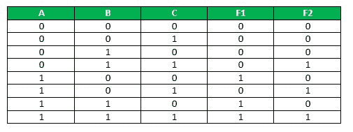
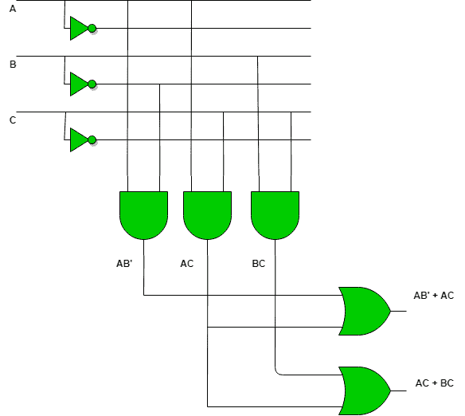

# 可编程逻辑阵列

> 原文:[https://www.geeksforgeeks.org/programmable-logic-array/](https://www.geeksforgeeks.org/programmable-logic-array/)

可编程逻辑阵列(PLA)是一种固定结构的逻辑器件，具有可编程的与门和可编程的或门。
PLA 基本上是一种用于构建可重构数字电路的可编程逻辑器件。可编程逻辑器件在制造时具有未定义的功能，但在投入使用前已被编程。PLA 是记忆和逻辑的结合体。

**与其他可编程逻辑器件的比较:**

*   PLA 有可编程的与门阵列和可编程的或门阵列。
*   PAL 有可编程的与门阵列，但有固定的或门阵列。
*   只读存储器有固定的与门阵列，但可编程的或门阵列。

PLA 在概念上类似于 ROM 但是，它不提供变量的完全解码，也不像在 ROM 中那样生成所有的 minterms。虽然它的名字由单词“可编程”组成，但它不需要像 C 和 C++那样的任何类型的编程。

**PLA 基本框图:**

下面的真值表将有助于理解输入数的功能-

F1 = AB'C' + ABC' + ABC
关于简化我们得到:F1 = AB + AC '

F2 = A'BC + AB'C + ABC
关于简化我们得到:F2 = BC + AC

**为了实现上述** **功能，将使用以下电路图。**

PLA 用于使用缓冲器、与门和或门来实现各种组合电路。在 PLA 中，所有的最小项都没有实现，只实现了所需的最小项。由于 PLA 有可编程的 AND 门阵列和可编程的 OR 门阵列，所以它提供了更多的灵活性，但缺点是不容易使用。

**应用:**

*   PLA 用于提供对数据路径的控制。
*   PLA 被用作计数器。
*   PLA 被用作解码器。
*   PLA 在编程输入输出中用作总线接口