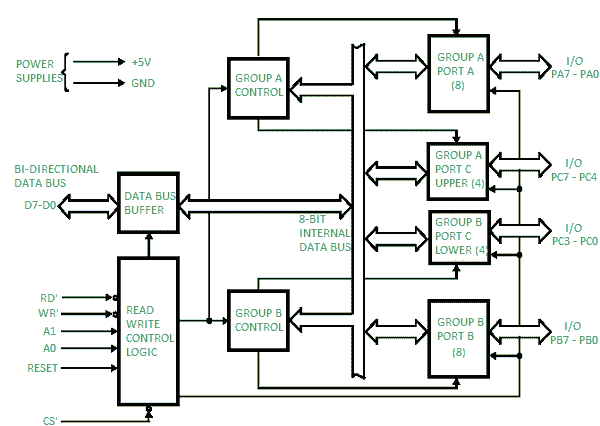
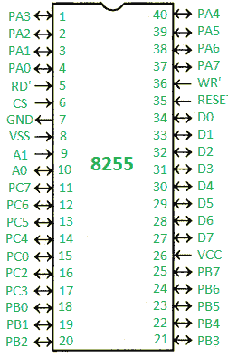
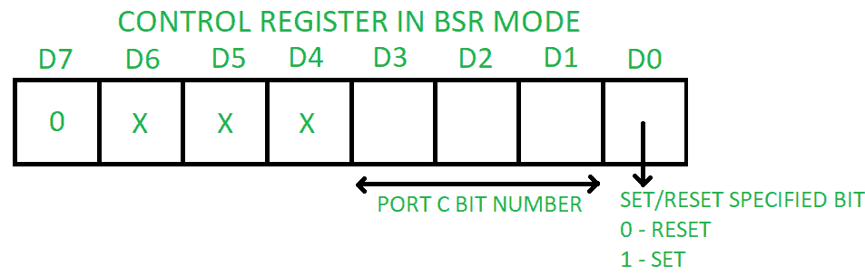
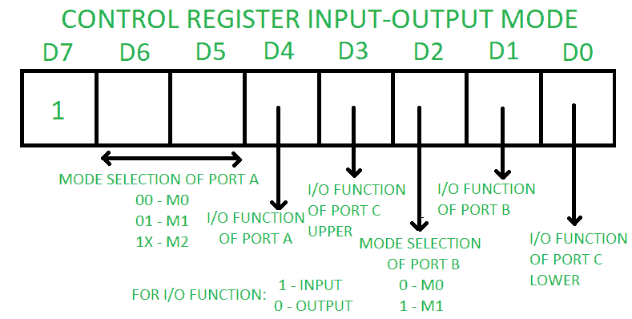

# 可编程外设接口 8255

> 原文:[https://www . geesforgeks . org/可编程-外设-接口-8255/](https://www.geeksforgeeks.org/programmable-peripheral-interface-8255/)

PPI 8255 是一种通用可编程输入/输出设备，旨在将中央处理器与其外部世界(如模数转换器、数模转换器、键盘等)连接起来。我们可以根据给定的条件进行编程。它几乎可以与任何微处理器一起使用。

它由三个 8 位双向输入输出端口组成，即端口 A、端口 B 和端口 c。我们可以分配不同的端口作为输入或输出功能。

**框图–**

它由 40 个引脚组成，采用+5V 稳压电源供电。端口 C 进一步分为两个 4 位端口，即端口 C 下部和端口 C 上部，端口 C 可以工作在 BSR(位设置静止)模式或 8255 输入输出模式的模式 0。端口 B 可以在输入输出模式的模式 0 或模式 1 下工作。端口 A 可以在输入输出模式的模式 0、模式 1 或模式 2 下工作。

它有两个控制组，控制组甲和控制组乙。控制组甲由上层的端口甲和端口丙组成。控制组 B 由下端口 C 和上端口 B 组成。

根据 CS’、A1 和 A0 的值，我们可以在不同模式下选择不同的端口作为输入输出函数或 BSR。这是通过在控制寄存器中写入一个合适的字(控制字 D0-D7)来实现的。

<figure class="table">

| ' CS ' | 一流的 | A0 | 选择 | 地址 |
| --- | --- | --- | --- | --- |
| Zero | Zero | Zero | 港口 A | 80 小时 |
| Zero | Zero | one | 端口 B | 81 小时 |
| Zero | one | Zero | 端口 C | 82 小时 |
| Zero | one | one | 控制寄存器 | 83 小时 |
| one | X | X | 无选择 | X |

**引脚图–**

*   **端口 A 的 PA0–PA7–**引脚
*   **端口 B 的 PB0–PB7–**引脚
*   **PC0–PC7–**端口 C 的引脚
*   **D0–D7–**用于数据传输的数据引脚
*   **复位–**复位输入
*   **RD’–**读取输入
*   **WR '–**写输入
*   **CS’–**芯片选择
*   **A1 和 A0–**地址引脚

**操作模式–**

1.  **位设置复位(BSR)模式–**
    如果控制字(D7)的 MSB 为 0，PPI 工作在 BSR 模式。在这种模式下，只有端口 C 位用于置位或复位。
2.  **输入输出模式–**
    如果控制字(D7)的 MSB 为 1，PPI 工作在输入输出模式。这又分为三种模式:
    *   **模式 0–**在该模式下，所有三个端口(端口 A、B、C)都可以作为简单输入功能或简单输出功能工作。在这种模式下，没有中断处理能力。
    *   **Mode 1 –** Handshake I/O mode or strobbed I/O mode. In this mode either port A or port B can work as simple input port or simple output port, and port C bits are used for handshake signals before actual data transmission. It has interrupt handling capacity and input and output are latched. 

        例如:一个中央处理器想要将数据传输到打印机。在这种情况下，由于与相对较慢的打印机相比，处理器的速度非常快，因此在实际数据传输之前，它将向打印机发送握手信号，以同步中央处理器和外围设备的速度。

    *   **模式 2–**双向数据总线模式。在这种模式下，只有端口 A 工作，端口 B 可以在模式 0 或模式 1 下工作。端口 C 的 6 位用作握手信号。它还具有中断处理能力。

</figure>