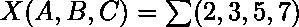
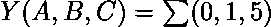
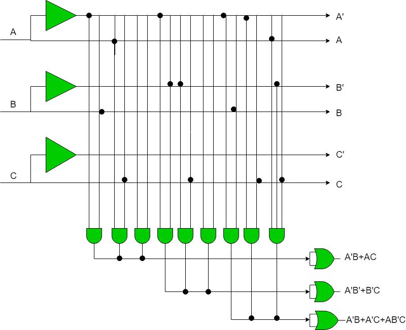

# 编程阵列逻辑

> 原文:[https://www.geeksforgeeks.org/programming-array-logic/](https://www.geeksforgeeks.org/programming-array-logic/)

可编程阵列逻辑是一种常用的可编程逻辑器件。它有可编程的与阵列和固定的或阵列。因为只有与阵列是可编程的，所以与可编程逻辑阵列(PLA)相比，它更容易使用，但不灵活。PAL 唯一的限制是与门的数量。
PAL 由小型可编程只读存储器(PROM)和附加输出逻辑组成，用于以有限的组件实现特定的所需逻辑功能。

**与其他可编程逻辑器件的比较:**
PLA、PAL 和 ROM 的主要区别在于它们的基本结构。在 PLA 中，可编程与门之后是可编程或门。在 PAL 中，可编程的与门后面是固定的或门。在只读存储器中，固定的与门阵列后面是可编程的或门阵列。

描述 PAL 结构(可编程与门后跟固定或门)。

**例:**用 PAL 实现给定函数:
任何形式的积和(SOP)形式或和的积(POS)都可以用来实现一个布尔函数。
有三个输入 A、B、C 和三个函数 X、Y、z，用积和(SOP)项表示给定函数如下:-

以下真值表将有助于理解输入数量函数:

| A | B | C | X | Y | Z |
| --- | --- | --- | --- | --- | --- |
| Zero | Zero | Zero | Zero | one | one |
| Zero | Zero | one | Zero | one | Zero |
| Zero | one | Zero | one | Zero | one |
| Zero | one | one | one | Zero | one |
| one | Zero | Zero | Zero | Zero | Zero |
| one | Zero | one | one | one | one |
| one | one | Zero | Zero | Zero | Zero |
| one | one | one | one | Zero | Zero |

**寻找 X，Y，Z:**
在每个函数输出中寻找高最小值项(在 SOP 的情况下函数值等于 1):
X = A ' b+ AC
Y = A ' b+ B ' c
Z = A ' b+ A ' c+AB ' c

“与”阵列已被编程，但必须按照要求使用固定的“或”阵列。所需线路将连接在可编程逻辑器件中。

**PAL 的优势:**

*   高效
*   与聚乳酸相比，生产成本低
*   高度安全
*   高可靠性
*   工作所需的低功率。
*   设计更灵活。