# 布尔代数中德摩根定律的证明

> 原文:[https://www . geeksforgeeks . org/布尔代数中的摩根法则证明/](https://www.geeksforgeeks.org/proof-of-de-morgans-laws-in-boolean-algebra/)

**语句:**
**1。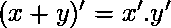** 
**2。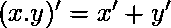**

**证明:**
这里可以看出，我们需要证明两个命题是相辅相成的。
我们知道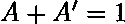和这是湮灭定律。因此，如果我们证明上述法律陈述的这些条件，那么我们将证明它们是相互补充的。

**对于陈述 1:**
我们需要证明:
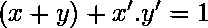和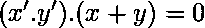

**案例 1。** 
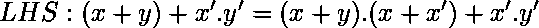
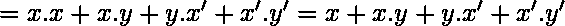{利用分配属性}
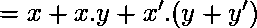
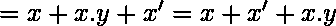
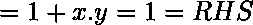
遂被证明。

**案例二。** 

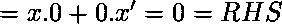
遂证。

**对于陈述 2:**
我们需要证明:
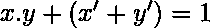和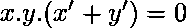

**案例 1。** 
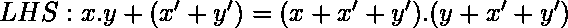
{我们知道 A+BC=(A+B)。(A+C)}
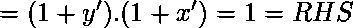
遂证。

**案例二。** 
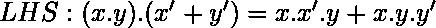
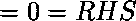
遂证成。
利用布尔代数的恒等式证明了德摩根定理。