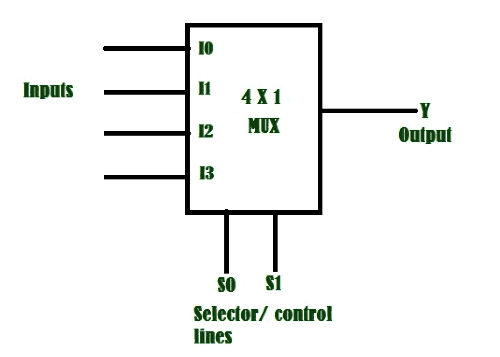

# Python 程序实现 2:4 复用器

> 原文:[https://www . geesforgeks . org/python-程序到实现-24 路多路复用器/](https://www.geeksforgeeks.org/python-program-to-implement-24-multiplexer/)

**先决条件:** [数字逻辑中的多路复用器](https://www.geeksforgeeks.org/multiplexers-in-digital-logic/)

**简介:**
它是一个依靠控制或选择输入，具有多个数据输入和单个输出的组合电路。对于 N 条输入线，记录 n (base2)条选择线，或者我们可以说对于 2n 条输入线，需要 N 条选择线。多路复用器也被称为“数据 n 选择器、并串转换器、多对一电路、通用逻辑电路”。多路复用器主要用于增加在一定时间和带宽内通过网络发送的数据量。



这里，如果我们有四个输入，如上所述，我们将有 log 4(base 2)=2 个输入行。因此，对于多路复用器选择 S0 和 S1 的每个唯一值，我们将选择一条输入线并将其作为输出。下面给出的真值表解释了输入端口的选择。


通常 S0S1 的十进制值给出选择端口。我们被赋予 s[ ](选择器)和 I[ ](输入)我们的任务是基于选择器选择输入端口，并将该端口中的值打印为输出。
关于二进制到十进制的转换，请参考–[二进制到十进制的转换](https://www.geeksforgeeks.org/program-binary-decimal-conversion/)

**示例–**

> **输入:** I[ ]={0，1，1，1]
> s[ ]={1，0}
> 
> **输出:** 1
> 
> **说明:**这里 s[0]=1，s[1]=0，所以它的十进制值会是(1*(2**1))+(0*(2**0))=2。所以我们必须输出引脚 I2 给出的值。即 I[2]=1，因此输出为 1。

> **输入:** I[ ]={1，1，1，0}
> s[ ]={1，1}
> 
> **输出:** 0
> 
> **说明:**这里 s[0]=1，s[1]=1，所以它的十进制值会是(1*(2**1))+(1*(2**0))=3。所以我们必须输出输入 I3 给出的值。即 I[3]=0，因此输出为 0。

> **输入:** I[ ]={0，1，1，0}
> s[ ]={0，1}
> 
> **输出:** 1
> 
> **说明:**这里 s[0]=0，s[1]=1，所以它的十进制值会是(0*(2**1))+(1*(2**0))=1。所以我们必须输出输入 I1 给出的值。即 I[1]=1，因此输出为 1。

**进场:**

*   这里我们必须将选择器转换为十进制值。
*   因此，要将选择器行转换为十进制数，我们应该乘以(s[0]*(2**1))+(s[1]*(2**0))。
*   从 I[ ]输入数组中获取十进制值的索引会给出输出。

## 计算机编程语言

```
# python program to implement multiplexer
 # Function to print output
def Multiplexer(I,s):
    #decimal value of s
    d= (s[0] * 2) + (s[1] * 1)
    # getting the output of decimal value from inputs 
    b = I[d];
    #print the output
    print(b)
# Driver code
I=[1,0,1,0]
s=[1,0]
#passing I and s to function
Multiplexer(I,s)
```