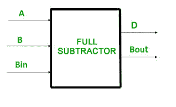
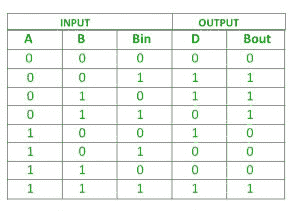

# Python 程序实现全减法器

> 原文:[https://www . geesforgeks . org/python-程序到实现-全减法器/](https://www.geeksforgeeks.org/python-program-to-implement-full-subtractor/)

**先决条件–**[**数字逻辑中的全减法器**](https://www.geeksforgeeks.org/full-subtractor-in-digital-logic/)

在本文中，我们将讨论全减法器的概述，并将在 [python 语言](https://www.geeksforgeeks.org/python-programming-language/)中实现全减法器逻辑。此外，我们将借助示例进行介绍。我们一个一个来讨论。

给定全减法器 A、B、Bin 的三个输入。任务是实现全减法器电路并打印输出，即三个输入的差值(d)和 B-Out。

**全减法器:**

全减法器是一种组合电路，用于执行三个输入位的减法:被减数、减数和借入。全减法器产生两个输出位:差值和借出。



**逻辑表达式:**

```
Difference = (A XOR B) XOR Bin
Borrow Out = Ā Bin + Ā B + B Bin
```

**真值表:**



**示例:**

```
Input       : 0 1 1
Output      : Difference=0, B-Out=1
Explanation : According to logical expression Difference= (A XOR B) XOR Bin  i.e (0 XOR 1) XOR 1  =0 ,
B-Out=Ā Bin + Ā B + B Bin  i.e  1 AND 1 + 1 AND 1 + 1 AND 1 = 1

Input       : 1 0 0
Output      : Difference=1, B-Out=0
```

**进场:**

*   我们取三个输入 **A、** **B** 、**和 Bin。**
*   应用 **(A 异或 B)异或仓**给出差值。
*   应用**āBin+āb+ B Bin**给出 B-Out 的值。

**下面是实现:**

## 蟒蛇 3

```
# python program to implement full Subtractor
# Function to print Difference and B-Out

def getResult(A, B, Bin):

    # Calculating value of Difference
    Difference = (A ^ B) ^ Bin

    # calculating NOT  value of a
    A1 = not(A)

    # Calculating value of B-Out
    B_Out = A1 & Bin | A1 & B | B & Bin

    # printing the values
    print("Difference = ", Difference)
    print("B-Out = ", B_Out)

# Driver code
A = 0
B = 1
Bin = 1
# passing three inputs of fullsubtractor as arguments to get result function
getResult(A, B, Bin)
```

**输出:**

```
Difference =  0
B-Out      =  1
```

注意极客！通过[**【Python 编程基础】**](https://practice.geeksforgeeks.org/courses/Python-Foundation?utm_source=geeksforgeeks&utm_medium=article&utm_campaign=GFG_Article_Bottom_Python_Foundation) 课程巩固基础，学习基础知识。首先，你的面试准备通过 [**Python DS**](https://practice.geeksforgeeks.org/courses/Data-Structures-With-Python?utm_source=geeksforgeeks&utm_medium=article&utm_campaign=GFG_Article_Bottom_Python_DS) 课程增强你的数据结构概念。