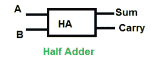
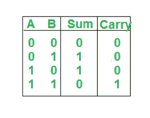

# Python 程序实现半加法器

> 原文:[https://www . geesforgeks . org/python-程序到实现-半加法器/](https://www.geeksforgeeks.org/python-program-to-implement-half-adder/)

**先决条件:** [**数字逻辑中的半加法器**](https://www.geeksforgeeks.org/half-adder-in-digital-logic/)

给定半加法器 A、b 的两个输入，任务是实现半加法器电路并打印输出，即两个输入的和与进位。

半加法器:半加法器是加法器的一种，是一种执行数字相加的电子电路。半加法器能够将两个单二进制数字相加，并提供输出和进位值。它有两个输入，称为 A 和 B，以及两个输出 S(和)和 C(进位)。



**逻辑表达式:**

```
Sum = A XOR B 
Carry = A AND B 
```

**真值表:**



> **示例:**
> 
> 输入:0 1
> 
> 输出:总和=1，进位=0
> 
> 说明:根据逻辑表达式 Sum=A XOR B 即 0 XOR 1 =1，Carry=A AND B 即 0 AND 1 =0
> 
> 输入:1 1
> 
> 输出:总和=0，进位=1
> 
> 说明:根据逻辑表达式 Sum=A XOR B 即 1 XOR 1 =0，进位=A AND B 即 1 AND 1 =1

**进场:**

*   我们接受两个输入 A 和 b。
*   对 A 和 B 进行异或运算得到和的值。
*   对 A 和 B 的与运算给出进位的值。

**下面是实现。**

## 蟒蛇 3

```
# Function to print sum and carry
def getResult(A, B):

    # Calculating value of sum
    Sum = A ^ B

    # Calculating value of Carry
    Carry = A & B

    # printing the values
    print("Sum ", Sum)
    print("Carry", Carry)

# Driver code
A = 0
B = 1

# passing two inputs of halfadder as arguments to get result function
getResult(A, B)
```

**输出:**

```
Sum  1
Carry 0
```