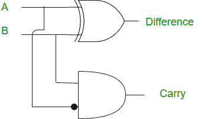

# Python 程序实现半减法器

> 原文:[https://www . geesforgeks . org/python-程序到实现-半减法器/](https://www.geeksforgeeks.org/python-program-to-implement-half-subtractor/)

**先决条件:** [数字逻辑中的半减法器](https://www.geeksforgeeks.org/half-subtractor-in-digital-logic/)

给定半加法器 A、b 的两个输入，任务是实现半减法器电路并打印输出，即两个输入的差和借。

[半减法器](https://www.geeksforgeeks.org/half-subtractor-in-digital-logic/)也是减去两个二进制数的积木。它有两个输入和两个输出。该电路用于减去两个单比特二进制数 A 和 b，差和借是半减法器的两种输出状态。

**示例:**

> **输入:**A = 0；B=1
> 
> **输出** : *差:1*
> 
> *借用:1*
> 
> **说明:**根据逻辑表达式差=A XOR B 即 0 XOR 1 =1，借=āAND B 即 1 AND 1 =1
> 
> **输入:**A = 1；B=1
> 
> **输出:**差值:0
> 
> 借:1

### 逻辑表达式:

```
Difference = A XOR B
Borrow = Ā AND B
```

### 逻辑图:

 

### 真值表:


### **进场:**

*   我们接受两个输入 A 和 b。
*   对 A 和 B 进行异或运算得到差值。
*   对α和β的“与”运算给出了“借”的值。

### 实施:

## 蟒蛇 3

```
# Python program to implement Half subtractor

# Function to print Difference and Borrow
def getResult(A, B):

    # Calculating value of Difference
    Difference = A ^ B

    # Calculating value of Borrow
    # calculating not of A
    A = not(A)
    Borrow = A & B

    # printing the values
    print("Difference:", Difference)
    print("Borrow:", Borrow)

# Driver code
# Inputs A ,B
A = 0
B = 1

# passing two inputs of halfadder
# as arguments to get result function
getResult(A, B)
```

**输出:**

```
Difference: 1
Borrow: 1
```