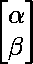
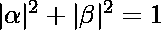
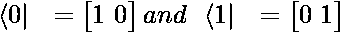
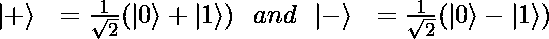
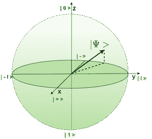

# 量子位表示

> 原文:[https://www.geeksforgeeks.org/qubit-representation/](https://www.geeksforgeeks.org/qubit-representation/)

类似于经典计算中的比特，一个**量子比特**是量子计算机的一个基本构件。它代表状态 0 和 1 的叠加。我们所说的叠加是指给定的状态是状态 0 和状态 1 的线性组合。

> 量子位处于一种状态 0 或 1 是一种常见的误解，我们只是在测量之前不知道。然而，量子比特总是存在于 0 和 1(包括 0 和 1)之间的状态中，测量的行为会把它带到这两个状态中的任何一个。

**矩阵表示:**
一个量子位被表示为大小为 2 的复矢量。通常表示为:

在哪里

分别是状态 0 和 1 的振幅，或者我们可以说分别处于状态 0 和 1 的概率。该向量被归一化，即

状态 0 表示为:

状态 1 表示为:

量子态|0 >和|1 >形成正交基，也称为计算基或规范基。

**狄拉克符号:**
这是一个量子比特的简写符号。向量用一个偈来表示。

它也有一个双重形式写为:

因此，任何任意状态都可以表示为:

使用的其他符号有:

|+>和|->被称为哈达玛基。这些也是相互正交的。

**布洛赫表示:**
布洛赫球是量子态的几何表示，单位半径球表面的不同点代表各种量子态。一个量子位可以在三维空间中表示为一个单位长度的矢量，该矢量连接布洛赫球体表面和球体中心的点。

布洛赫的量子比特表示