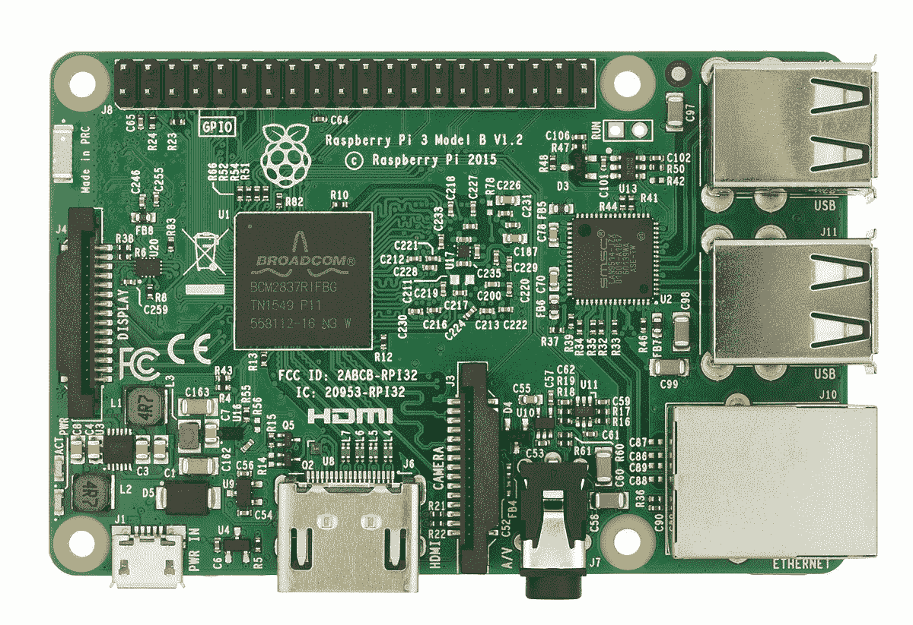
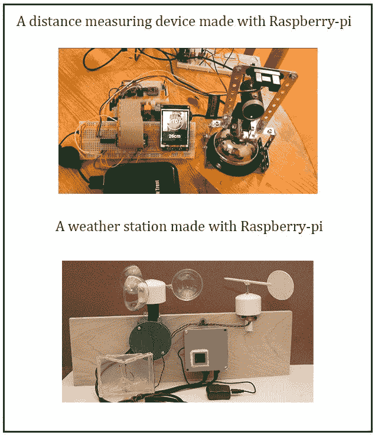

# 树莓皮极客电脑

> 原文:[https://www . geeksforgeeks . org/树莓-pi-a-电脑换极客/](https://www.geeksforgeeks.org/raspberry-pi-a-computer-for-geeks/)

**什么是覆盆子皮？**
树莓 pi 是总部位于英国的树莓 pi 基金会开发的“信用卡大小的计算机板”的名称。它可以插在电视或显示器上，并提供全功能的计算机功能。
旨在以尽可能便宜的价格向更年轻的学生传授计算知识。
虽然它旨在向孩子们教授计算，但每个愿意学习编程、计算基础知识以及利用其多功能性构建不同项目的人都可以使用它。

**电脑规格:–**
电脑搭载的四核 ARM 处理器不支持与 X86 桌面 CPU 相同的指令。它有 1GB 内存、一个 HDMI 端口、四个 USB 端口、一个以太网连接、一个用于存储的微型 SD 插槽、一个组合的 3.5 毫米音频/视频端口和一个蓝牙连接。
它有一系列输入和输出引脚，用于制作家庭安全摄像头、加密门锁等项目。

**树莓皮的多功能性:–**
它确实是一台多功能电脑，可以被各个年龄段的人使用，可以用来看 YouTube 上的视频、看电影、用 Python、Scratch 等语言编程等等。
如上所述，它有一系列输入/输出引脚，使该板能够与其环境交互，因此可以用来构建非常酷的交互式项目。

**项目示例:–**可以通过连接一些仪器，把它变成一个气象站，用来检查温度、风速、湿度等。
由于体积小，可以变成家庭监控系统；通过增加一些摄像头，安全网络将准备就绪。
如果你爱看书，它也可以成为存储成千上万本电子书的存储设备，你也可以使用这个设备通过互联网访问它们。

**结论:**
总结文章很方便地断言，它是一台体积小、功能强、价格极低的计算机，可以像台式计算机一样处理大部分任务。