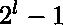
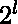
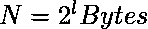
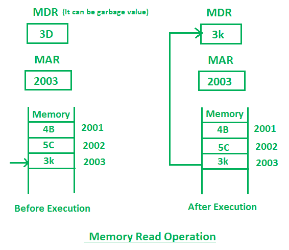
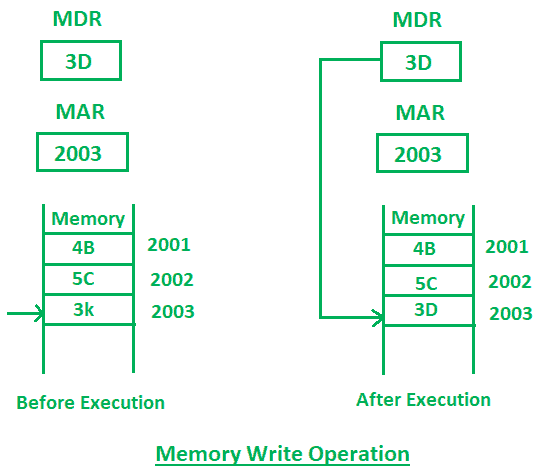

# 内存中的读写操作

> 原文:[https://www . geesforgeks . org/内存读写操作/](https://www.geeksforgeeks.org/read-and-write-operations-in-memory/)

存储单元以称为字的位组存储二进制信息。数据输入线提供要存储到存储器中的信息，数据输出线将信息从存储器中输出。控制线“读取”和“写入”指定数据传输的方向。基本上，在内存组织中，有从 0 到的内存位置索引，其中 l 是地址总线。我们可以用下面的公式用字节来描述内存:


其中，
l 是总地址总线
N 是以字节为单位的内存

例如，下面可以使用上面的公式用字节来描述一些存储:

```
 1kB= 210 Bytes
 64 kB = 26 x 210 Bytes
       = 216 Bytes
 4 GB = 22 x 210(kB) x 210(MB) x 210 (GB)
      = 232 Bytes

```

**存储器地址寄存器(MAR)** 是用于存储正在执行操作的存储器位置的地址的地址寄存器。
**内存数据寄存器(MDR)** 是用于存储正在执行操作的数据的数据寄存器。

1.  **Memory Read Operation:**
    Memory read operation transfers the desired word to address lines and activates the read control line.Description of memory read read operation is given below:

    

    在上图中，最初，MDR 可以包含任何垃圾值，MAR 包含 2003 内存地址。在执行读指令之后，存储单元 2003 的数据将被读取，并且 MDR 将被 2003 存储单元(3D)的值更新。

2.  **Memory Write Operation:**
    Memory write operation transfers the address of the desired word to the address lines, transfers the data bits to be stored in memory to the data input lines. Then it activates the write control line. Description of the write operation is given below:

    

    在上图中，MAR 包含 2003，MDR 包含 3D。执行写指令后，3D 将被写入 2003 存储位置。