# 用通用门实现逻辑门

> 原文:[https://www . geeksforgeeks . org/使用通用门实现逻辑门/](https://www.geeksforgeeks.org/realization-of-logic-gate-using-universal-gates/)

在布尔代数中，**与非门**和**或非门**被称为**通用门**，因为任何数字电路都可以通过使用这两个门中的任何一个来实现，即任何逻辑门都可以仅使用与非门或或非门来创建。

每个逻辑门都有一个表示符号。下图显示了所有[逻辑门](https://www.geeksforgeeks.org/introduction-of-logic-gates/)的图形表示。

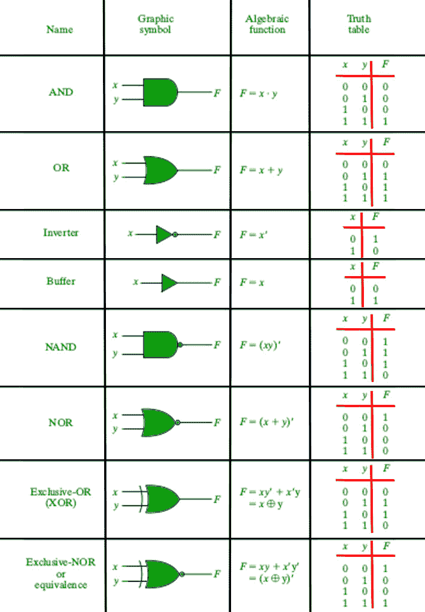

逻辑门的图形表示。

### 1.用通用门实现与门。

#### 使用与非门

与门可以通过以下方式使用两个与非门来实现:

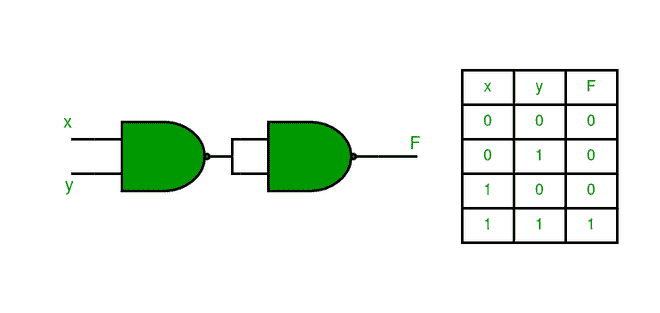

#### 使用或非门

仅使用或非门实现与门，如下所示:

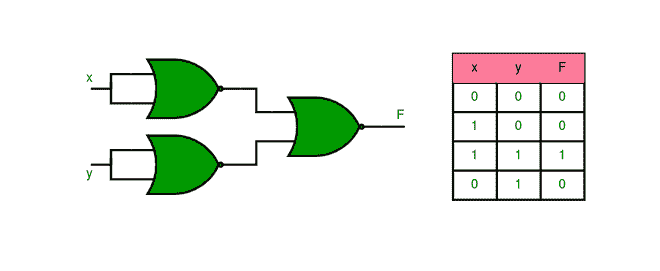

### 2.使用通用门实现或门。

#### 使用与非门

或门可以使用与非门来实现，如下所示:

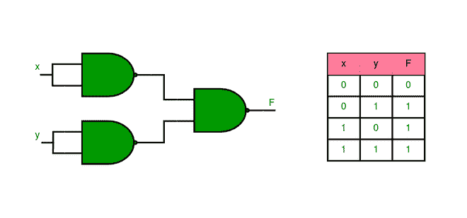

#### 使用或非门

使用两个或非门实现或门，如下图所示:

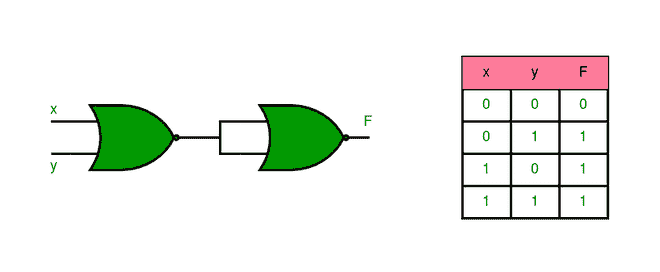

### 3.使用通用门实现非门。

#### 使用与非门

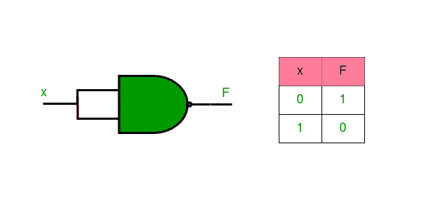

#### 使用或非门

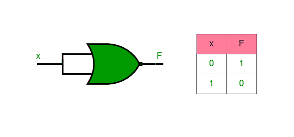

### 4.用通用门实现异或门。

#### 使用与非门

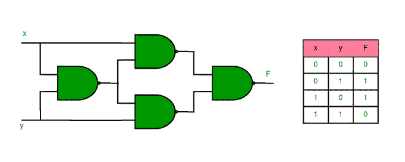

#### 使用或非门

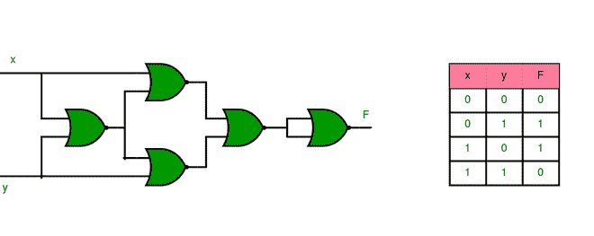

### 5.使用通用门实现 XNOR 门。

#### 使用与非门

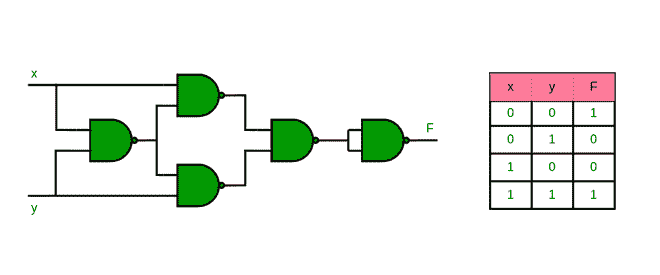

#### 使用或非门

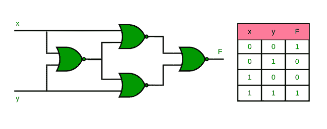

### 6.用与非门实现或非门

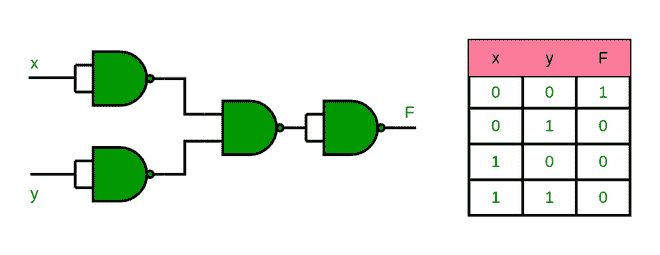

### 7.用或非门实现与非门

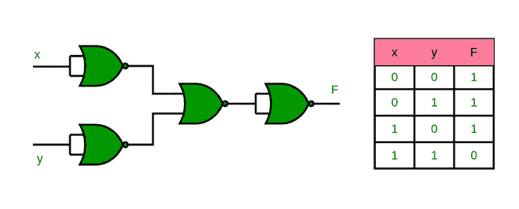