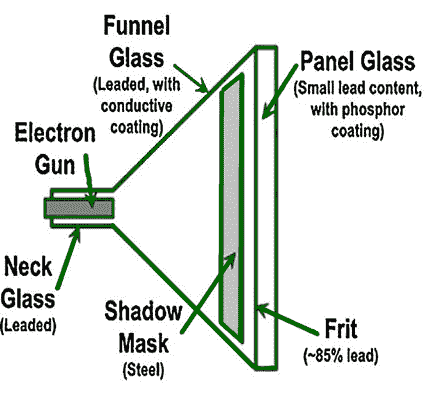
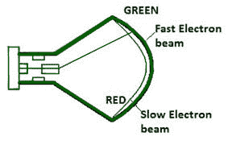
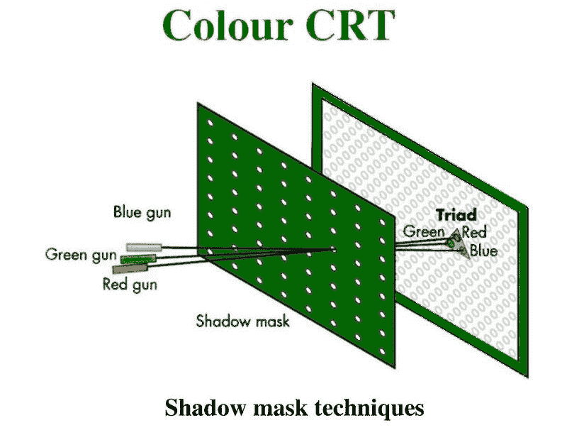

# 刷新计算机图形学中的输出设备

> 原文:[https://www . geesforgeks . org/refresh-type-output-devices-in-computer-graphics/](https://www.geeksforgeeks.org/refresh-type-output-devices-in-computer-graphics/)

**CRT** 代表阴极射线管。它是一个高架玻璃管。电子管一侧的电子枪产生一束电子束，射向电子管的前端或屏幕。屏幕的内侧涂有磷物质，当它被电子阻挡时会发光。

1.  **Standard CRT:**
    In standard CRT the electron gun emits electron beams which fall on the phosphor coating due to which a glow occurs which display the text or a picture. afterglow the light gets filled for continuous viewing the image is therefore refreshed at regular intervals so frequently that the changing image appears as a continuous picture to the human eyes.

    

2.  **电子束穿透阴极射线管:**
    具有磷光体涂层的普通阴极射线管只产生一种颜色的图像。用于画线的彩色阴极射线管在多层磷光体上显示图像。颜色是通过控制光束加速电位来实现的。屏幕上涂有一层绿色磷光体，红色磷光体沉积在该层上。

当低电位电子束撞击屏幕时，只有红磷被激发，从而产生红色痕迹。更高速度的光束将穿透绿色磷光体，通过改变光束电势增加光输出的绿色成分，可以产生不同的红色和绿色光的组合。

7.  **Shadow mask CRT:**
    The majority of colour television sets and computer monitors used Shadow mask colour CRT which has phosphor coated screen behind the screen there is a metal plate with small holes arranged in a specific pattern. It uses three electron guns for red green and blue components of the light output.

    枪以三角形方式排列。偏转系统对三束电子束进行操作，同时将它们带到荫罩上的同一焦点。所有三束电子束通过荫罩上的一个孔，并在所述点撞击荧光体。

    

    
**Figure –** Colour CRT Shadow mask techniques
