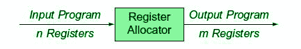
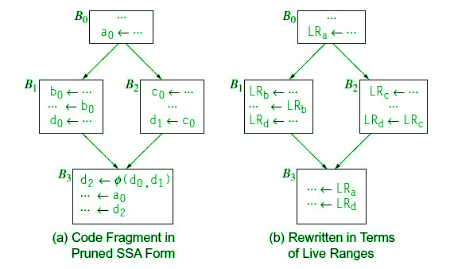
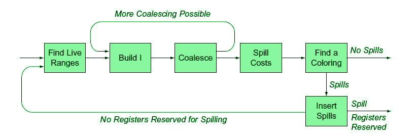

# 代码生成中的寄存器分配

> 原文:[https://www . geesforgeks . org/register-allocation-in-code-generation/](https://www.geeksforgeeks.org/register-allocations-in-code-generation/)

[寄存器](https://www.geeksforgeeks.org/registers-8085-microprocessor/)是内存层次结构中最快的位置。但不幸的是，这种资源是有限的。它位于目标处理器最有限的资源下。寄存器分配是一个 NP 完全问题。然而，这个问题可以简化为图着色来实现分配和赋值。因此，一个好的寄存器分配器可以计算出一个难题的有效近似解。

**图–**输入-输出

寄存器分配器确定哪些值将驻留在寄存器中，哪些寄存器将保存这些值中的每一个。它将一个具有任意数量寄存器的程序作为其输入，并生成一个具有有限寄存器集的程序，该程序可以适合目标机器。(见图)

**分配对分配:**

**分配–**
将一个无限的名字空间映射到目标机器的那个已注册的集合上。

*   **Reg。致 Reg。模型:**将虚拟寄存器映射到物理寄存器，但将多余的量溢出到内存中。
*   **Mem。敬梅。模型:**将内存位置的某个子集映射到一组名称，这些名称对物理寄存器集进行建模。

分配确保代码适合目标机器的 reg。在每个指令处设置。

**分配–**
将分配的名称集映射到目标机器的物理寄存器集。

*   假设分配已经完成，因此代码将适合物理寄存器组。
*   不超过**‘k’**的值被指定到寄存器中，其中‘k’是物理寄存器的数量。

**通用寄存器分配是一个 NP 完全问题:**

*   当(所需寄存器数量)< =(可用物理寄存器数量)时，在多项式时间内求解。
*   使用区间图着色可以在线性时间内产生分配。

**本地寄存器分配和赋值:**
基本块内部的分配称为本地寄存器。分配。本地 reg 的两种方法。分配:自上而下法和自下而上法。

自上而下方法是一种基于“频率计数”的简单方法。确定哪些值应该保存在寄存器中，哪些应该保存在内存中。

**算法:**

1.  计算每个虚拟寄存器的优先级。
2.  将寄存器按优先级排序。
3.  按优先级顺序分配寄存器。
4.  重写代码。

**超越单个区块:**

*   更复杂，因为控制流进入画面。
*   活性和活动范围:活动范围由一组定义和使用组成，它们彼此相关，即在这样的指令/数据对中，没有一个寄存器是通用的。

以下是找出块中实时范围的方法。活动范围表示为区间[i，j]，其中 I 是定义，j 是最后一次使用。

**全局寄存器分配和赋值:**
1。寄存器分配器的主要问题是最小化溢出代码的影响；

*   溢出代码的执行时间。
*   溢出操作的代码空间。
*   溢出值的数据空间。

2.全局分配不能保证溢出代码执行时间的最优解。
3。本地和全局分配的主要区别:

*   全球活动范围的结构自然比本地更复杂。
*   在全局活动范围内，不同的引用可能执行不同的次数。(当基本块形成循环时)

4.为了做出关于分配和赋值的决定，全局分配器主要通过构建干扰图来使用图着色。
5。然后，寄存器分配器尝试为该图构造一个 k 着色，其中“k”是物理寄存器的数量。

*   在这种情况下，编译器不能直接为该图构造 k-着色，它通过将一些值溢出到内存来修改底层代码，然后再次尝试。
*   溢出实际上简化了该图，这确保了算法将停止。

6.全局分配器使用几种方法，但是，我们将看到自顶向下和自底向上的分配策略。与上述方法相关的子问题。

*   发现全球活动范围。
*   估算溢出成本。
*   构建干扰图。

**发现全球活动范围:**
如何发现变量的活动范围？

**图–**发现单个区块中的活动范围

上图恰当地解释了一切。让我们以 Rarp 为例，它在程序点 1 被初始化，最后一次使用是在程序点 11。因此，Rarp 即 Larp 的活范围为[1，11]。同样，其他人也会跟进。

**图–**发现活动范围

**估算全球泄漏成本:**

*   对于做出溢出决策至关重要，包括地址计算、内存操作成本和估计执行频率。
*   为了提高性能，这些溢出值通常会保留在激活记录中。
*   一些嵌入式处理器提供暂存存储器来保存这些溢出的值。
*   **负溢出成本**:单个地址的连续加载存储需要删除，因为它增加了负担，因此导致负溢出成本。
*   **无限溢出成本**:如果在定义和使用之间没有其他活动范围结束，则活动范围应该有无限溢出成本。

**干扰和干扰图:**

**图–**实时范围内的建筑物干扰图

从上图可以观察到，实况范围 LRa 从第一个基本块开始，到最后一个基本块结束。因此，它将与其他所有活动范围共享一个优势，即 Lrb、Lrc、Lrd。然而，Lrb、Lrc、Lrd 不与除 Lra 之外的任何其他活动范围重叠，因此它们仅与 Lra 共享一个优势。

**构建分配器:**

*   注意，k-可着色图的发现是一个 NP 完全问题，所以我们需要一个近似。
*   尝试将活动范围分成一些不平凡的部分(最常用的部分)。

**自上而下着色**:

1.  尝试按照某些排序函数(即基于优先级)确定的顺序对实时范围进行着色。
2.  如果一个活动范围没有可用的颜色，分配器调用溢出或拆分来处理未着色的颜色。
3.  具有 k 个或更多邻居的活动范围称为约束节点，并且难以处理。
4.  不受约束的节点相对容易处理。
5.  **处理溢出:**当某些活动范围没有找到颜色时，需要进行溢出，但这当然可能不是最终/最终的解决方案。
6.  **活动范围分割:**对于未着色的，将活动范围分割为子范围，这些子范围可能比原始范围具有更少的干扰，以便其中一些至少可以着色。

**柴汀的想法:**

*   选择(度< k)的任意节点，并将其放入堆栈中。
*   从图中移除该节点及其所有边。(这可能会降低其他一些节点的度，导致更多一些节点的度= k，一些节点不得不溢出。
*   如果没有顶点需要溢出，连续弹出堆栈中的顶点，并用邻居不使用的颜色给它们着色。(尽可能重复使用颜色)。

**合并副本以降低程度:**
编译器可以使用干扰图合并两个活动范围。所以通过合并，你能得到什么样的好处？

**图–**合并活动范围

**比较自顶向下和自底向上分配器:**

*   自顶向下分配器可以采用自底向上分配器中使用的“溢出和迭代”哲学。
*   “溢出和迭代”用额外的编译时间来换取可能使用更少溢出代码的分配。
*   自顶向下使用优先级排序对所有受约束的节点进行排序。(但是，它以任意顺序对无约束节点进行着色)
*   自下而上构建一个顺序，其中大多数节点在不受约束的图中都是彩色的。

**图–**合并活动范围