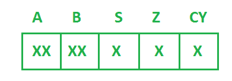
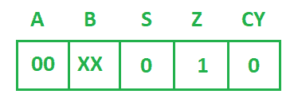
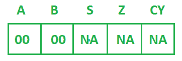
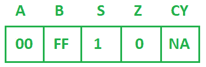
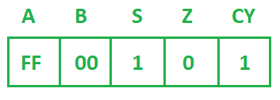

# 指令后登记内容和标志状态

> 原文:[https://www . geesforgeks . org/register-content-and-flag-status-after-instructions/](https://www.geeksforgeeks.org/register-content-and-flag-status-after-instructions/)

基本上就是给你一套指令和 [8085 微处理器](https://www.geeksforgeeks.org/pin-diagram-8085-microprocessor/)的寄存器和标志的初始内容。每次指令后，您必须找到[寄存器](https://www.geeksforgeeks.org/registers-8085-microprocessor/)和[标志状态](https://www.geeksforgeeks.org/flag-register-8085-microprocessor/)的内容。

**最初，**T2

下面是该组指令:

```
SUB A
MOV B, A
DCR B
INR B
SUI 01H
HLT 
```

**假设:**
每条指令将使用前一条指令的结果进行寄存器。以下是带有寄存器内容和标志状态的每条指令的描述:

*   **Instruction-1:**
    **SUB A** instruction will subtract the content of the accumulator itself. It is used to clear the content of the accumulator. After this operation the content of the registers and flags will be like figure given below.

    

*   **Instruction-2:**
    **MOV B, A** will copy the content from source register (A) to the destination register (B). Since it is the Data Transfer instruction so it will not affect any flag. After this operation the content of the registers and flags will be like figure given below.

    

*   **Instruction-3:**
    **DCR B** will decrease the content of the register B by 1\. DCR operation doesn’t affect Carry flag(CY).

    ```
    B-00H 0 0 0 0  0 0 0 0 
    ```

    对于 DCR，B 取 01H 的 2 的补码，01H 的 2 的补码:

    ```
     0 0 0 0  0 0 0 1
     1 1 1 1  1 1 1 0  (1's complement)
                  + 1
    ------------------
     1 1 1 1  1 1 1 1 
    ------------------ 

    +(00)  0 0 0 0  0 0 0 0 
    -----------------------
           1 1 1 1  1 1 1 1   
    ----------------------  
    ```

    (FFH)这将是 b 的内容。所以在这个操作之后，寄存器和标志的内容将如下图所示。

    

*   **Instruction-4:**
    **INR B** will increase the content of the register B by 1\. INR operation doesn’t affect Carry flag(CY).

    ```
    B(FFH)     
            1 1 1 1  1 1 1 1 
    +(01)   0 0 0 0  0 0 0 1 
           ------------------
    CY=1    0 0 0 0  0 0 0 0  
           ------------------ 
    ```

    (0 0 0 0 0 0 0)将是寄存器 b 的内容。因此，在此操作之后，寄存器和标志的内容将如下图所示。

    

*   **Instruction-5:**
    **SUI 01H** will subtract 01H from the content of the accumulator and store the result in the accumulator.

    ```
    A-00H  0 0 0 0  0 0 0 0 
    ```

    对于 SUI，01H 取 01H 的 2 的补码，01H 的 2 的补码:

    ```
           0 0 0 0  0 0 0 1
           1 1 1 1  1 1 1 0  (1's complement)
                        + 1
          ------------------
           1 1 1 1  1 1 1 1 
          ------------------ 
    +(00)  0 0 0 0  0 0 0 0   (Content of the accumulator)
        -----------------------
           1 1 1 1  1 1 1 1   
    ```

    (FFH)这将存储在蓄能器中。在此操作之后，寄存器和标志的内容将如下图所示。

    

    HLT 将终止程序的执行。