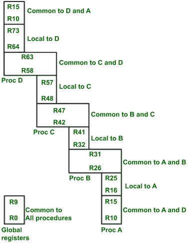

# 在 RISC CPU 中注册组织

> 原文:[https://www . geesforgeks . org/register-organization-in-RISC-CPU/](https://www.geeksforgeeks.org/register-organization-in-risc-cpu/)

**RISC 处理器:**
它们是使用小指令集和简单寻址模式的处理器，因此它们的指令可以在 CPU 内更快地执行，对内存的引用更少。这种类型的处理器被归类为精简指令集计算机(RISC)。

**要详细了解 RISC 处理器及其特性，请参考** [**本**](https://www.geeksforgeeks.org/computer-organization-risc-and-cisc/)
RISC 处理器的其他一些特性有–

*   它们包含大量寄存器。
*   它们使用重叠的寄存器窗口来加速过程调用和返回。
*   他们有一个高效的指令流水线。
*   它们支持编译器将高级语言程序高效地翻译成机器语言程序。

**RISC 指令:**

*   典型的 RISC 处理器指令集主要包括用于内存和中央处理器之间通信的 LOAD 和 STORE 指令。
*   所有其他指令都在中央处理器的寄存器中执行，而不涉及内存。
*   一个 RISC 中央处理器的程序包含加载和存储指令，这些指令有一个内存和一个中央处理器寄存器地址以及计算指令(ADD、SUB MUL 等)。)有三个地址，这三个地址都是指处理器寄存器。

**例如:**
一个计算 X = (A*B) + (C*D)的程序，这里 A、B、C、D 是包含四个数字的内存位置，X 是包含该表达式结果的内存位置。

<figure class="table">

| 

指令

 | 

评论

 |
| --- | --- |
| R1 负载，A负荷 R2，乙负载 R3，CR4 负荷骡子 R1 R2骡子 R3 R4添加 R1、R1、R3R1 第十商店 | ；处理器寄存器 R1 加载有存储单元 a 的内容；处理器寄存器 R2 加载了存储单元 b 的内容；处理器寄存器 R3 加载有存储单元 c 的内容；处理器寄存器 R4 加载了存储单元 d 的内容；R1 和 R2 寄存器的内容相乘，结果存储在 R1 寄存器中(即执行 A*B)。；R3 和 R4 寄存器的内容相乘，结果存储在 R1 寄存器中(即执行 C*D)。；将寄存器 R1 和 R3 的内容相加，结果存储在 R1 寄存器中(即(A*B) + (C*D))。；R1 寄存器的内容存储在存储单元 x 中 |

</figure>

**RISC CPU 中的寄存器组织:**

*   一些 RISC 处理器的特点是使用一个重叠的寄存器窗口，向被调用过程传递参数，并将结果存储到调用过程。
*   对于每个过程调用，新的寄存器窗口是从新过程使用的寄存器文件中分配的。
*   每个过程调用都通过增加一个指针来激活新的寄存器窗口，而 return 语句则通过减少指针来激活前一个窗口。
*   相邻过程的窗口具有重叠的寄存器，这些寄存器被共享以提供参数的传递和结果的存储。



**RISC CPU 的重叠寄存器窗口**

*   在这个组织中，RISC CPU 包含 74 个寄存器。寄存器 R0 至 R9 是全局寄存器，包含所有程序共有的参数。
*   其余寄存器(R10 至 R73)分为四个窗口，包含程序 A、B、C 和 d。
*   每个窗口包含 10 个本地寄存器和两组连续窗口共有的 6 个寄存器。局部寄存器包含局部变量，公共重叠寄存器有助于在相邻过程之间传递参数，而无需实际移动数据。
*   一次激活一个寄存器窗口。调用过程的高寄存器与被调用过程的低寄存器重叠，因此参数很容易从调用传递到被调用过程。

**例如**:

*   过程 C 调用过程 D。因此，寄存器 R58 到 R63 对过程 C 和 D 都是公共的。因此，过程 C 在这些寄存器中存储过程 D 的参数。过程 D 使用寄存器 R64 至 R73 存储局部变量。
*   当程序 B 在完成计算后返回时，来自寄存器(R26 至 R31)的结果被传送回窗口 a
*   寄存器 R10 至 R15 是程序 A 和 D 的公共寄存器，并且四个窗口具有循环结构。
*   由于 R0 至 R9(即 10 个寄存器)在所有程序中都可用。因此，当程序处于活动状态时，程序包含 32 个寄存器(包括 10 个全局寄存器、10 个局部寄存器、6 个低重叠寄存器和 6 个高重叠寄存器)。
*   注册窗口的组织关系如下
*   全局寄存器数量= g
*   每个窗口中存在的本地寄存器数量= l
*   两个相邻窗口共有的寄存器数量= c
*   窗口数= w

然后，每个窗口可用的寄存器数量计算如下

```
Window size = l+2c+g
```

处理器中所需的寄存器总数为

```
Register file = (l + c)w+ g
```

**例如:**

*   在上图中，我们有 g= 10，l= 10，c= 6，w= 4，那么
*   窗口大小= 10+2×6+4 = 36，寄存器文件大小= (10+6)×4 + 10 = 74