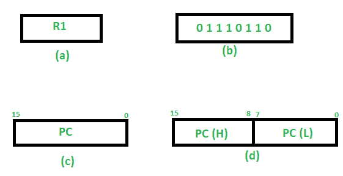
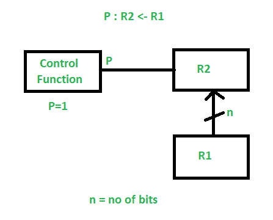
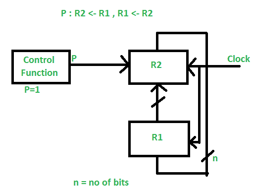

# 语域转换语言(RTL)

> 原文:[https://www . geeksforgeeks . org/register-transfer-language-RTL/](https://www.geeksforgeeks.org/register-transfer-language-rtl/)

在符号表示法中，它用来描述寄存器之间的微操作转移。它是一种非常接近汇编语言的中间表示，例如在编译器中使用的中间表示。术语“寄存器传输”可以执行微操作，并将操作结果传输到相同或其他寄存器。

**微操作:**
对寄存器中存储的数据执行的操作称为微操作。它们是一些设计中用来实现复杂机器指令的详细低级指令。

**寄存器传输:**
从一个寄存器转换到另一个寄存器的信息由替换运算符以符号形式表示，称为寄存器传输。

**替代操作员:**
声明中，R2 < - R1、**-T6】-**充当替代操作员。该声明界定了 R1 登记册内容向 R2 登记册的转移。

RTL 有各种各样的方法

1.  表示一个寄存器的一般方法是用(a)所示的矩形框中的寄存器名称。

2.  寄存器按照 0 到(n-1)的顺序编号，如(b)所示。

3.  寄存器中的位数可以标记在方框的顶部，如(c)所示。

4.  16 位寄存器 PC 分为两部分-位(0 至 7)分配 16 位地址的低位字节，位(8 至 15)分配 16 位地址的高位字节，如(d)所示。

**RTL 的基本符号:**

<figure class="table">

| 标志 | 描述 | 例子 |
| --- | --- | --- |
| 字母和数字 | 降级寄存器 | 海洋，R1，R2 |
| ( ) | 降级寄存器的一部分 | R1(8 位)R1(0-7) |
|  | 降级信息传输 | R2 |
| , | 指定寄存器传输的两个微操作 | R1

R2 |
| ： | 降级条件操作 | R2如果 P=1 |
| 命名运算符(:=) | 为已存在的寄存器/别名降级另一个名称 | 拉:= R1 |

**寄存器传输操作:**

对存储在寄存器中的数据执行的操作称为寄存器传输操作。

有不同类型的寄存器传输操作:

**1。简单转移-R2<-R1**

**R1 的内容复制到 R2，不影响 R1 的内容。这是一种无条件的转移操作。**

****2。有条件转移–****

****

**它表示如果 P=1，那么 R1 的内容被转移到 R2。这是单向操作。**

****3。同时操作–**
如果两个或两个以上的操作同时发生，则用逗号**()**隔开。**

****

**如果控制函数 P=1，则将 R1 的内容加载到 R2，同时将 R2 的内容加载到 R1。** 

</figure>