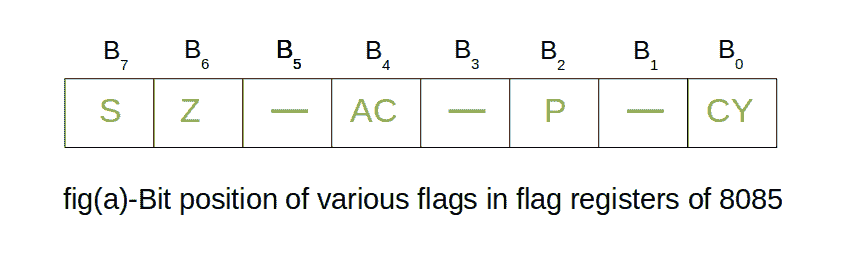
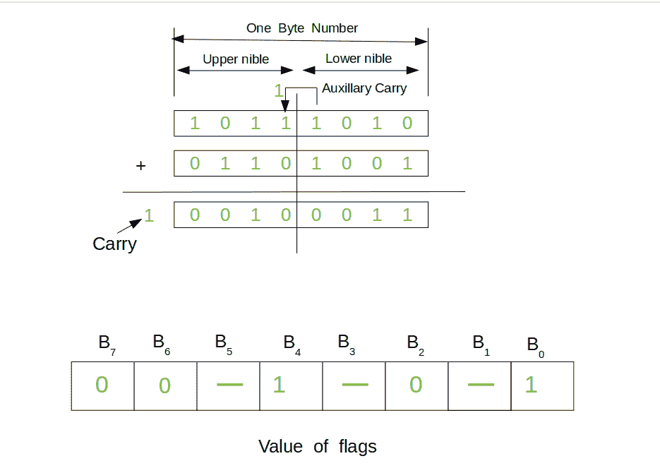

# 8085 微处理器的寄存器

> 原文:[https://www . geesforgeks . org/registers-8085-微处理器/](https://www.geeksforgeeks.org/registers-8085-microprocessor/)

**微处理器**是一种多用途、可编程、时钟驱动、基于寄存器的电子设备，它从称为存储器的存储设备中读取二进制指令，接受二进制数据作为输入，并根据这些指令处理数据，并将结果作为输出提供。8085 微处理器是第二代 8 位微处理器，是研究和使用市场上所有微处理器的基础。

**在 8085 中注册:**

**(a)通用寄存器–**

8085 有六个通用寄存器来存储 8 位数据；这些被标识为- B、C、D、E、H 和 l。这些可以组合为寄存器对——BC、DE 和 HL，以执行一些 16 位操作。这些寄存器用于在程序执行期间，通过使用指令来存储或复制临时数据。

**(b)专用寄存器–**

*   **累加器:**
    累加器是一个 8 位寄存器(可以存储 8 位数据)，是算术逻辑单元(ALU)的一部分。执行算术或逻辑运算后，结果存储在累加器中。累加器也被定义为寄存器 a。
*   **Flag registers:**

    

    标志寄存器是一个专用寄存器，它与微处理器中的其它寄存器完全不同。它由 8 位组成，其中只有 5 位是有用的。另外三个是空的，将在未来的英特尔版本中使用。根据累加器和其他寄存器中结果的数据条件进行操作后，这 5 个标志被置位或复位(当标志的值为 1 时，称为置位，当值为 0 时，称为复位)。5 个标志寄存器是:

    1.  **符号标志:**它占据标志寄存器的第七位，也称为最高有效位。它帮助程序员知道累加器中存储的数字是正的还是负的。如果设置了符号标志，则意味着存储在累加器中的数字为负，如果重置，则该数字为正。
    2.  **零标志:**:占用标志寄存器的第六位。当在算术逻辑单元中执行的运算结果为零(所有 8 位都为零)时，该位置 1，否则复位。它有助于确定两个数字是否相等。
    3.  **Auxiliary Carry Flag:** It occupies the fourth bit of the flag register. In an arithmetic operation, when a carry flag is generated by the third bit and passed on to the fourth bit, then Auxiliary Carry flag is set. If not flag is reset. This flag is used internally for BCD(Binary-Coded decimal Number) operations.

        **注意–**这是 8085 中唯一不能被用户访问的标志寄存器。

    4.  **奇偶校验标志:**它占据标志寄存器的第二位。该标志测试累加器中的 1 个数。如果累加器保持偶数个 1，那么这个标志被置位，它被称为偶数奇偶校验。另一方面，如果 1 的数量是奇数，那么它被重置，并被称为奇数奇偶校验。
    5.  **进位标志:**它占据标志寄存器的第 0 位。如果算术运算导致进位(如果结果大于 8 位)，则设置进位标志；否则，它将被重置。

**(c)存储器寄存器–**

有两个 16 位寄存器用于保存内存地址。这些寄存器的大小是 16 位，因为存储器地址是 16 位。它们是:-

*   **程序计数器:**该寄存器用于对指令的执行进行排序。程序计数器的功能是指向要从中提取下一个字节的存储器地址。当提取一个字节(机器代码)时，程序计数器加 1，指向下一个存储单元。
*   **Stack Pointer:** It is used as a memory pointer. It points to a memory location in read/write memory, called the stack. It is always incremented/decremented by 2 during push and pop operation.

    **例–**
    这里加了两个二进制数。产生的结果存储在累加器中。现在让我们检查一下每一位的含义。请同时参考下面的解释，将它们与示例联系起来。

    

    *   **符号标志(第 7 位):**复位(0)，表示累加器中存储的数字为正。
    *   **零标志(第 6 位):**它被复位(0)，因此在算术逻辑单元中执行的操作的结果是非零的。
    *   **辅助进位标志(第 4 位):**我们可以看到 b3 产生一个进位，该进位被 b4 获取，因此辅助进位标志被置位(1)。
    *   **奇偶校验标志(第 2 位):**复位(0)，表示奇偶校验为奇数。累加器保存奇数个 1。
    *   **进位标志(第 0 位):**置 1，输出结果超过 8 位。