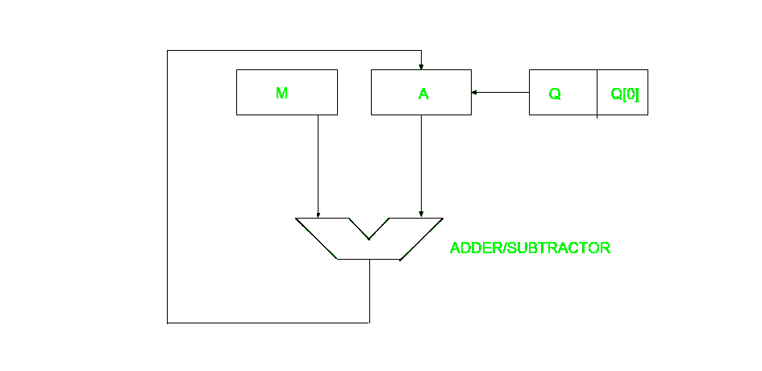
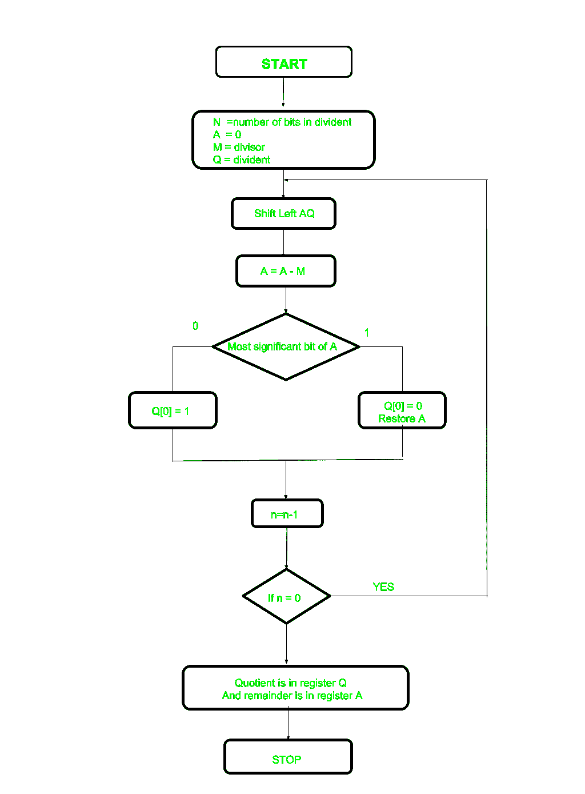

# 恢复无符号整数除法算法

> 原文:[https://www . geesforgeks . org/restore-除法-算法-无符号-整数/](https://www.geeksforgeeks.org/restoring-division-algorithm-unsigned-integer/)

当我们除以两个数时，除法算法提供一个商和一个余数。它们一般有两种类型**慢速算法和快速算法**。慢除法算法有恢复法、非恢复法、非执行恢复法、SRT 算法，在快除法算法之下是牛顿-拉夫森和戈德施密特算法。

在本文中，将对无符号整数执行恢复算法。恢复项是由于寄存器 A 的值在每次迭代后被恢复。



这里，寄存器 Q 包含商，寄存器 A 包含余数。这里，n 位被除数加载在 Q 中，除数加载在 m 中。寄存器的值最初保持为 0，这是其值在迭代期间被恢复的寄存器，因此它被称为恢复。



让我们选择相关步骤:

*   **步骤-1:** 首先用相应的值初始化寄存器(Q =被除数，M =除数，A = 0，n =被除数的位数)
*   **步骤-2:** 然后寄存器 A 和 Q 的内容左移，就好像它们是一个单元一样
*   **步骤-3:** 然后从 A 中减去寄存器 M 的内容，结果存储在 A 中
*   **步骤-4:** 然后检查 A 的最高有效位是否为 0，Q 的最低有效位是否设置为 1，否则如果为 1，Q 的最低有效位设置为 0，寄存器 A 的值被恢复，即与 M 相减之前的 A 值
*   **步骤-5:** 计数器 n 的值递减
*   **第 6 步:**如果 n 的值变为零，我们就退出循环，否则我们从第 2 步开始重复
*   **步骤-7:** 最后，寄存器 Q 包含商，A 包含余数

**示例:**

```
Perform Division Restoring Algorithm 
Dividend = 11
Divisor  = 3
```

| n | M | A | Q | 操作 |
| --- | --- | --- | --- | --- |
| four | 00011 | 00000 | One thousand and eleven | 初始化 |
|  | 00011 | 00001 | 011_ | 向左移动 AQ |
|  | 00011 | Eleven thousand one hundred and ten | 011_ | A=A-M |
|  | 00011 | 00001 | 0110 | Q[0]=0，恢复 A |
| three | 00011 | 00010 | 110_ | 向左移动 AQ |
|  | 00011 | Eleven thousand one hundred and eleven | 110_ | A=A-M |
|  | 00011 | 00010 | One thousand one hundred | Q[0]=0 |
| Two | 00011 | 00101 | 100_ | 向左移动 AQ |
|  | 00011 | 00010 | 100_ | A=A-M |
|  | 00011 | 00010 | One thousand and one | Q[0]=1 |
| one | 00011 | 00101 | 001_ | 向左移动 AQ |
|  | 00011 | 00010 | 001_ | A=A-M |
|  | 00011 | 00010 | 0011 | Q[0]=1 |

记住恢复 A 的值，A 的最高有效位是 1。因为寄存器 Q 包含商，即 3，而寄存器 A 包含余数 2。