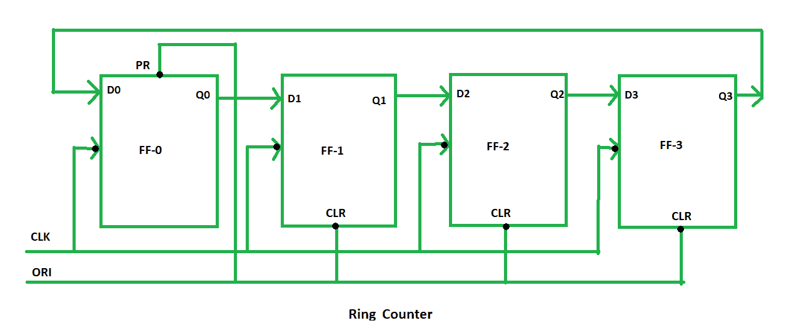
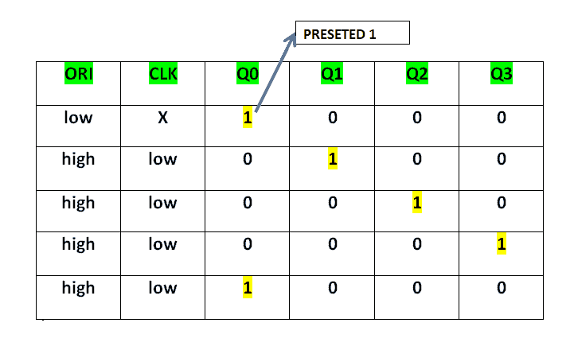
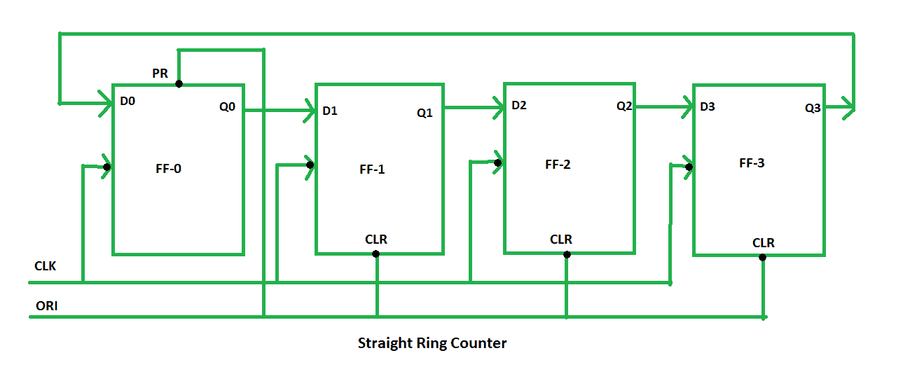
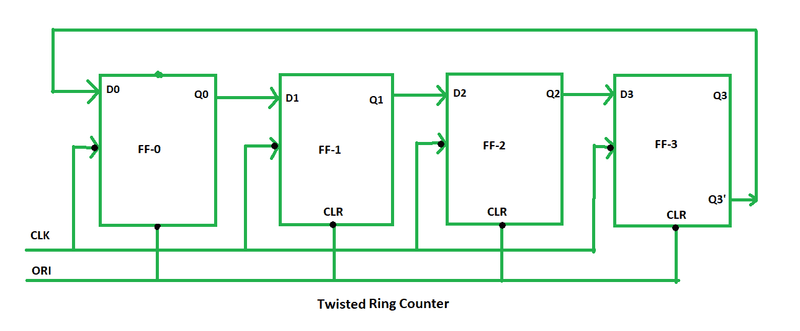

# 数字逻辑中的环形计数器

> 原文:[https://www . geesforgeks . org/ring-counter-in-digital-logic/](https://www.geeksforgeeks.org/ring-counter-in-digital-logic/)

环形计数器是移位寄存器的典型应用。环形计数器和移位计数器几乎一样。唯一的变化是，在环形计数器的情况下，最后一个触发器的输出连接到第一个触发器的输入，但是在移位寄存器的情况下，它被作为输出。除此之外，其他的都一样。

```
 No. of states in Ring counter = No. of flip-flop used
```

因此，为了设计 4 位环形计数器，我们需要 4 个触发器。



在该图中，我们可以看到时钟脉冲(CLK)同时施加到所有触发器。因此，它是一个同步计数器。
此外，这里我们对每个触发器使用覆盖输入(ORI)。预设(PR)和清除(CLR)用作 ORI。

当 PR 为 0 时，则输出为 1。当 CLR 为 0 时，输出为 0。PR 和 CLR 都是低电平有效信号，始终工作在值 0。

```
PR = 0, Q = 1
CLR = 0, Q = 0
```

这两个值总是固定的。它们与输入 D 的值和时钟脉冲(CLK)无关。

**工作–**
这里，ORI 连接到 FF-0 中的预设(PR)，它连接到 FF-1、FF-2 和 FF-3 中的清除(CLR)。因此，输出 Q = 1 在 FF-0 产生，触发器的其余部分产生输出 Q = 0。FF-0 处的输出 Q = 1 被称为预置 1，用于在环形计数器中形成环形。



该预置 1 是通过将 ORI 设为低电平而产生的，此时时钟(CLK)变得无关紧要。此后，当时钟(CLK)为负沿触发时，ORI 变为高电平并施加低电平时钟脉冲信号。此后，在每个时钟脉冲，预置 1 被转移到下一个触发器，从而形成环。

从上表可以看出，4 位环形计数器有 4 种状态。

```
4 states are:
  1 0 0 0
  0 1 0 0
  0 0 1 0
  0 0 0 1

```

这样可以用四个 D 触发器设计 4 位环形计数器。

**环形计数器的类型–**环形计数器有两种类型:

1.  **Straight Ring Counter –**
    It is also known as One hot Counter. In this counter, the output of the last flip-flop is connected to the input of the first flip-flip. The main point of this Counter is that it circulates a single one (or zero) bit around the ring.

    

    这里，我们在第一个触发器中使用预设(PR)，在最后三个触发器中使用时钟(CLK)。

2.  **Twisted Ring Counter –**
    It is also known as switch-tail ring counter, walking ring counter or Johnson counter. It connects the complement of the output of the last shift register to the input of the first register and circulates a stream of ones followed by zeros around the ring.

    

    在这里，我们使用时钟(CLK)为所有的触发器。