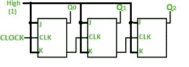
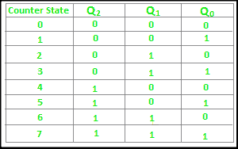
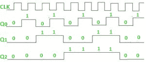

# 数字逻辑中的波纹计数器

> 原文:[https://www . geesforgeks . org/ripple-数字逻辑中的计数器/](https://www.geeksforgeeks.org/ripple-counter-in-digital-logic/)

先决条件–[计数器](https://www.geeksforgeeks.org/counters-in-digital-logic/)、 [n 位约翰逊计数器](https://www.geeksforgeeks.org/digital-logic-n-bit-johnson-counter/)、
A **计数器**基本上用于计数施加到触发器的时钟脉冲数。它还可以用于分频器、时间测量、频率测量、距离测量以及产生方波。在这种情况下，触发器是异步计数器，并被提供不同的时钟信号，在产生输出时可能会有延迟。
同样，设计异步计数器需要几个逻辑门。所以它们在设计上很简单，也不太贵。

**纹波计数器–**
一个 n 位纹波计数器最多可以计数 2 个 n 个状态。它也被称为 MOD n 计数器。它之所以被称为纹波计数器，是因为时钟脉冲在触发器中波动的方式。波纹计数器的一些特点是:

1.  这是一个异步计数器。
2.  不同的触发器使用不同的时钟脉冲。
3.  所有触发器都在触发模式下使用。
4.  只有一个触发器被施加外部时钟脉冲，而另一个触发器的时钟是从前一个触发器的输出获得的。
5.  施加外部时钟脉冲的触发器在计数序列中充当最低有效位。

根据输入控制，计数器可以是向上计数的向上计数器，也可以是向下计数的向下计数器，或者既可以向上计数也可以向下计数。计数的顺序通常在极限后重复。向上计数时，对于 n 位计数器，计数序列从 000、001、010、… 110、111、000、001、…等开始。当倒计时时，计数序列以相反的方式进行:111，110，… 010，001，000，111，110，…等。

**使用 JK 触发器的 3 位纹波计数器–**

在上图所示的电路中，Q0(LSB)将在每个时钟脉冲触发，因为当 J 和 K 都施加 1、1 或高输入时，JK 触发器工作在触发模式。当前一个计数器从 1 变为 0 时，下面的计数器将切换

**真值表–**

上述电路中使用的 3 位纹波计数器有 8 种不同的状态，每种状态代表一个计数值。类似地，具有 n 个触发器的计数器可以具有最大 2 的 n 次方状态。计数器拥有的状态数称为它的模数。因此，3 位计数器是 mod-8 计数器。

mod-n 计数器也可以描述为 n 分频计数器。这是因为最高有效触发器(离原始时钟脉冲最远的触发器)在最低有效触发器(由时钟脉冲触发的触发器)的时钟输入端每 n 个脉冲产生一个脉冲。因此，上述计数器是 4 分频计数器的一个例子。

**时序图–**我们假设时钟是负沿触发的，因此上面的计数器将充当上行计数器，因为时钟是负沿触发的，输出取自 q。

计数器被非常频繁地用于划分时钟频率，它们的用途主要涉及数字时钟和多路复用。计数器的一个广为人知的例子是并行到串行数据转换逻辑。