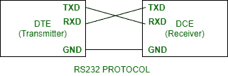
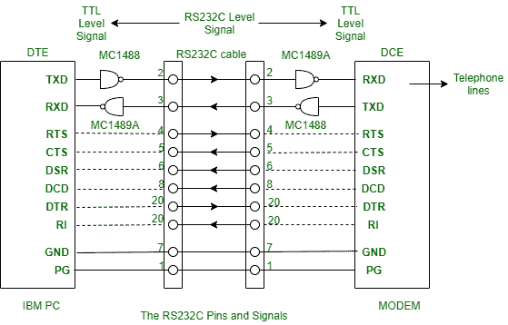

# RS232C 用于数据传输

> 原文:[https://www.geeksforgeeks.org/rs232c-for-data-transfer/](https://www.geeksforgeeks.org/rs232c-for-data-transfer/)

RS232 是一个接口，是 DTE(数据终端设备)和 DCE(数据通信设备)之间使用串行二进制数据交换的协议。这里 C 用于当前版本。*通用异步数据接收器&发送器(UART)* ，安装在主板上，用于与 RS232 连接，从其 DTE 接口向任何串行设备(如调制解调器或打印机)传输数据。

**电气规格:**

**1。电压:**
RS232 c 引脚的信号电平可以有两种状态。

*   **标记状态–**是高电平位，由二进制 1 表示，具有负电压。其传输信号的电压限值范围为-5 至-15V。其接收信号的电压限值范围为-3 至-25V。
*   **空间状态–**是低位，用二进制 0 表示，有正电压。其传输信号的电压限值范围为+5 至+15V。其接收信号的电压限值范围为+3 至+25V。

**2。电缆和电线:**
RS232 c 的最大电缆长度等于 15.24 米或等于 2500pF 的电容。电线阻抗的限值范围从 3 欧姆到 7 欧姆。

**3 数据和转换速率:**
通过 RS232C 的数据传输速率高达 20Kbps。信号电平的变化率。压摆率高达 30V/微秒。

**4。电流:**
最大额定电流为 3 安培，最大工作电压为 250 伏交流电。

**销和工作:**

RS232C 需要 25 针连接器来连接 DTE 和 DCE。下面是 RS232C 的引脚和信号列表，以及 DTE 和 DCE 之间使用驱动器和接收器的连接。

1.  **TXD&RXD–**
    在 DTE 上发送数据和接收数据是串行数据线。这些线在 DCE 上有相反的功能。TXT 向 DCE 发送输出数据。RXD 接收来自数字地面设备的输入数据。

2.  **RTS&CTS–**
    发送器在需要通过线路发送数据时激活发送请求。当通信停止时，线路本身被停用。接收器激活清除发送，告知发送器是否准备好接收数据。它在传输过程中保持活动状态。

3.  **DTR&DSR–**
    通过数据终端就绪线，DTE 通知 DCE 处于在线模式，可以进行通信过程。数据集就绪信号的主要任务是通知 DCE 准备通信。

4.  **DCD–**
    DCE 激活数据载体检测，以显示其已连接至数据终端设备。

5.  **RI–**
    当 DCE 检测到电话线路上有来电时，振铃指示灯就会激活。

**握手:**
在实际数据传输之前，信号从 DTE 传输到 DCE，以便通过称为握手的过程建立连接。以下是信号握手的顺序:

*   最初，当数据从计算机传输到调制解调器时，计算机激活发送给调制解调器的即时战略信号。
*   调制解调器依次激活 DCD，然后 CTS 被激活。
*   然后计算机发送 TXD 的数据。数据传输完成后，计算机将停用即时战略，这将导致调制解调器停用即时战略。

**应用:**
不过 RS232C 执行的大部分功能已经被 USB 拿走了，但是在执行以下应用方面还是成功的。

1.  它用于在计算机和嵌入式系统之间建立通信。
2.  由于成本较低，它在数控机床和伺服控制器中起着至关重要的作用
3.  一些微控制器板和可编程控制器机器使用 RS232C。
4.  RS232C 端口用于在没有任何网络连接的无头系统中进行通信。
5.  许多计算机数控系统都包含 RS232C 端口。

**限制:**

1.  它不能用于芯片到芯片或芯片到传感器设备的通信
2.  在存在噪声的情况下，它会降低系统的性能，并且由于 DTE 和 DCE 之间存在公共接地，因此需要更短的电缆
3.  由于 RS232C 接口需要单独的收发器芯片，系统成本增加。
4.  只有当传输速度很高时，它的性能才会下降到短距离。