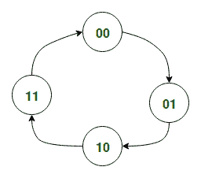
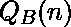
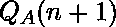
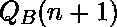
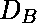
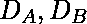
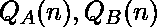
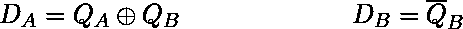
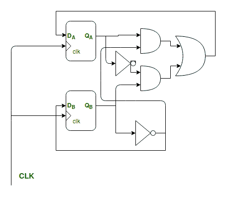

# RTL(寄存器传输级)设计与时序逻辑设计

> 原文:[https://www . geeksforgeeks . org/RTL-寄存器-传输-级别-设计-vs-时序逻辑-设计/](https://www.geeksforgeeks.org/rtl-register-transfer-level-design-vs-sequential-logic-design/)

在本文中，我们试图解释寄存器传输级(RTL)设计和时序逻辑设计之间的根本区别。

在 **RTL 设计**方法中，不同类型的寄存器，如计数器、移位寄存器、SIPO(串行输入并行输出)、PISO(并行输入串行输出)被用作任何时序逻辑电路的基本构建模块。

另一方面**同步时序逻辑设计**方法论不同的逻辑门和不同的存储元件如触发器(随时存储电路的状态)被用作时序逻辑电路的基本构造块。

下面的例子解释了使用状态图的同步时序逻辑设计过程及其缺点:

假设，我们要设计一个 2 位同步二进制计数器，其计数序列为:

```
00 -> 01 -> 10 -> 11 -> 00 -> 01 -> ..... so on.
```

1.  **Step-1:** In the 1st step we draw a ***State Diagram*** representing the above sequential circuit.
    The State Diagram representing the above counter is shown below:

    

    <center>**Figure –** State Diagram for 2-bit UP Counter</center>

2.  **Step-2:** In the next step we derive the ***State Table*** from the above given *State Diagram*

    状态表如下所示:

    <center>

    | 当前状态 Q(n) | 下一状态 Q(n+1) | 输出 |
    | --- | --- | --- |
    | 00 | 01 | 01 |
    | 01 | Ten | Ten |
    | Ten | Eleven | Eleven |
    | Eleven | 00 | 00 |

    </center>

3.  **Step-3:** In the third step we need to choose the type of flip flop we will be using to store the state of the circuit, for simplicity, we will be considering the Positive Edge Triggered D-type Flip-Flop.We also need to determine the number of Flip-Flops required to represent the internal state of the circuit. The general formula for the number of Flip-Flops required:

    ```
    Total Number of Flip-Flops = 
         Where,
                N = Total Number of States in State Table   
    ```

    然后我们需要记下所选触发器的*激励表*。D 型触发器的激励表如下所示:

    <center>

    | 当前状态 Q(n) | 下一状态 Q(n+1) | D |
    | --- | --- | --- |
    | X | Zero | Zero |
    | X | one | one |

    </center>

4.  **Step-4:** In this step we combine the State Table from the 2nd step with the excitation table of the previous step as follows:

    <center>

    |  |  |  |  |  |  |
    | --- | --- | --- | --- | --- | --- |
    | Zero | Zero | Zero | one | Zero | one |
    | Zero | one | one | Zero | one | Zero |
    | one | Zero | one | one | one | one |
    | one | one | Zero | Zero | Zero | Zero |

    </center>

5.  **Step-5:** Next, from the above table we try to express  as boolean functions of .

    在这种情况下，两个的表达式都是微不足道的。

    

    最终时序电路如下所示:

    

    <center>**Figure –** The Final Circuit</center>

**上述流程的缺点**:

*   从上面的例子中，我们观察到*同步时序逻辑设计过程*是一个相当复杂的过程，即使对于像上面这样的简单电路，也需要我们经历一系列定义明确的步骤。
*   其次，如果*状态的数量*变大，那么这个过程就变得麻烦和耗时，有时甚至是不可能的。

为了解决时序逻辑设计过程的上述缺点，并使数字设计人员能够轻松设计更复杂的电路，引入了 *RTL 设计*方法。RTL 设计最受欢迎的例子是处理器，它只不过是一个非常复杂的*有限状态机*，具有非常多的状态。

RTL 设计和时序逻辑设计的主要区别如下:

<center>

| RTL 设计 | 时序逻辑设计 |
| --- | --- |
| 在 RTL 设计中，基本的构建模块是寄存器、多路复用器、加法器。 | 在时序逻辑设计中，基本的构件是逻辑门、触发器。 |
| RTL 设计更接近逻辑电路的行为设计，因为它模拟不同寄存器之间的数据流，因此更直观。 | 与 RTL 设计过程相比，时序逻辑设计过程本质上更机械 |
| 最后，与时序逻辑设计相比，RTL 建模允许我们更容易地合成具有大量状态的复杂电路。 | 时序逻辑设计技术仅适用于具有少量状态的电路。 |

</center>