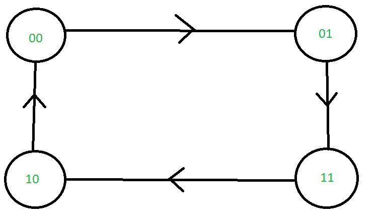
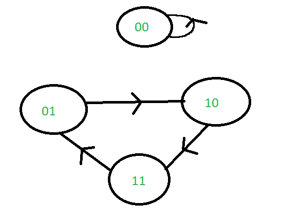

# 自启动计数器

> 原文:[https://www.geeksforgeeks.org/self-starting-counter/](https://www.geeksforgeeks.org/self-starting-counter/)

计数器是一种存储特定事件或过程发生次数的设备(根据维基百科)。顾名思义，计数器是一种用于“计数”的设备——主要与时钟信号有关。

如果不管初始状态如何，计数器都有可能进入计数器循环，则称计数器是自启动的。众所周知，所有的计数器都会产生一种数字序列(每个触发器代表一个数字中的一位)。现在，如果序列中最长的循环(或主循环)可以从任何状态遍历，那么只有这样计数器才被称为自启动。

自启动计数器可以避免“陷阱”状态。陷阱状态是由于计数器操作中的某些错误而被访问的状态。自启动计数器在电路中做了一定的修改，这样如果计数器进入陷阱状态，它可以自动移出陷阱，回到主计数循环。

**示例:**

**第一步:**

在这个例子中，整个序列构成了主要的计数循环。不管我们从什么状态开始，我们总是只停留在主循环中。因此这个计数器是自动启动的。

**第 2 步:**

在这个例子中，子序列 010->011->100->101->110->010 形成了主计数循环。然而，可以看出，不管我们选择在什么状态下开始，都可以到达主计数循环。因此这个计数器是自动启动的。

**第三步:**

在这个例子中，子序列 01->10->11->01 是主要的计数循环。可以看出，如果我们从状态 00 开始，我们永远无法到达主计数循环。因此，这个循环不是自启动的。