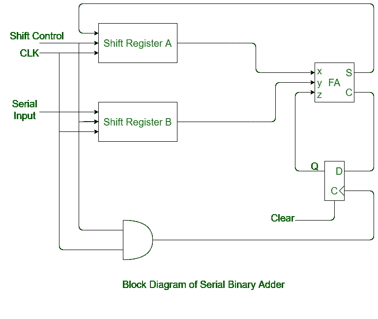

# 数字逻辑中的串行二进制加法器

> 原文:[https://www . geesforgeks . org/serial-binary-adder-in-digital-logic/](https://www.geeksforgeeks.org/serial-binary-adder-in-digital-logic/)

**串行二进制加法器**是一个[组合逻辑电路](https://www.geeksforgeeks.org/construction-of-combinational-circuits/)，以串行形式执行两个二进制数的相加。串行二进制加法器执行逐位加法。两个移位寄存器用于存储要相加的二进制数。

单个[全加器](https://www.geeksforgeeks.org/full-adder-in-digital-logic/)用于一次将一对位与进位相加。全加器的进位输出被施加到一个 [D 触发器](https://www.geeksforgeeks.org/flip-flop-types-their-conversion-and-applications/)。之后，输出用作下一个有效位的进位。全加器输出的和位可以被传送到第三移位寄存器。

**串行二进制加法器框图:**

**[移位寄存器](https://www.geeksforgeeks.org/shift-registers-in-digital-logic/) :**
移位寄存器是一组用于存储多位数据的触发器。串行二进制加法器中使用两个移位寄存器。在一个移位寄存器中存储加数，在另一个移位寄存器中存储加数。

**[【全加器】T2:](https://www.geeksforgeeks.org/full-adder-in-digital-logic/)**
全加器是取三个输入，给出两个输出作为和与进位的组合电路。电路在它的帮助下一次增加一对。

**[D 触发器](https://www.geeksforgeeks.org/flip-flop-types-their-conversion-and-applications/) :**
全加器的进位输出加到 D 触发器上。此外，D 触发器的输出用作下一对有效位的进位输入。

**工作过程:**
下面是使用串行二进制加法器相加的过程:

*   **步骤-1:**
    两个移位寄存器 A 和 B 用来存储要相加的数字。
*   **步骤-2:**
    使用单个全加器一次将一对位与进位相加。
*   **步骤-3:**
    移位寄存器的内容从左向右移位，并且它们从 a 和 b 开始的输出在施加每个时钟脉冲时与进位触发器的输出一起被馈送到单个全加器中。
*   **步骤-4:**
    全加器的和输出被馈送到和寄存器的最高有效位。
*   **步骤-5:**
    当施加时钟脉冲时，求和寄存器的内容也向右移动。
*   **步骤-6:**
    在施加四个时钟脉冲后，两个寄存器(A & B)的相加内容存储在求和寄存器中。