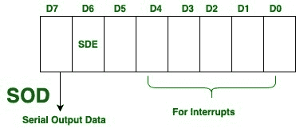
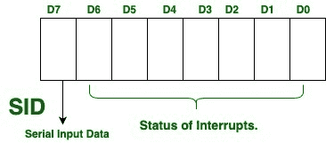

# 8085 微处理器中的串行输入输出线

> 原文:[https://www . geesforgeks . org/serial-I-o-line-in-8085-微处理器/](https://www.geeksforgeeks.org/serial-i-o-lines-in-8085-microprocessor/)

[8085 微处理器](https://www.geeksforgeeks.org/pin-diagram-8085-microprocessor/)的串行输入/输出线由以下两个引脚组成:

```
1. Serial Output Data (SOD)
2. Serial Input Data (SID) 
```

它们都是专门为输入/输出而制造的，输入/输出由软件进一步控制。数据传输由两个指令控制，即 SIM 和 RIM。

现在，让我们逐一查看这两个引脚:

1.  **串行输出数据(SOD):**
    应启动 SIM 指令，以串行方式输出数据。这是通过草皮线完成的。

**示例:**

> **说明:**
> 
> MVI A，80H:在累加器中设置 D7 = 1
> RAR:设置 D6 = 1 并带入 D7
> SIM:输出 D7

在上述指令集中，通过将 1 旋转到位位置 D6 来启用串行输出线；指令 SIM 通过位位置 D7 输出进位位。
可以表示为:



<center>**Figure –** Interpretation by SIM Instruction</center>

*   **Serial Input Data (SID):**
    In SID, the RIM Instruction is initiated to input data in a serial manner. This is done through SID line.
    It can be represented as:

    

    <center>**Figure –** Interpretation by RIM Instruction</center>

    **优势:**
    在软件控制的输入/输出系统中，SID 和 SOD 线分别消除了输入和输出端口的需要。