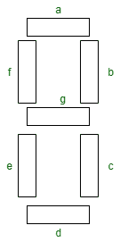
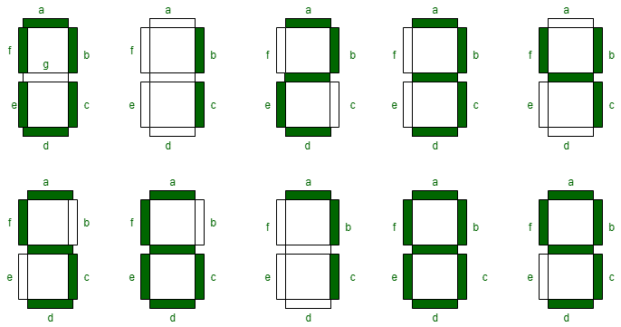
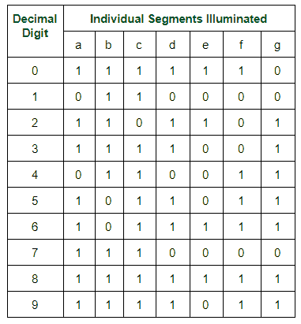

# 七段显示

> 原文:[https://www.geeksforgeeks.org/seven-segment-displays/](https://www.geeksforgeeks.org/seven-segment-displays/)

发光二极管是最广泛使用的半导体，当正向偏置时，它发射可见光或不可见光。遥控器产生不可见光。当施加电压时，发光二极管将光能转化为电能。

**七段显示器:**
七段显示器是一种输出显示设备，它提供了一种以图像或文本或十进制数字的形式显示信息的方式，这是更复杂的点阵显示器的替代方案。它广泛用于数字时钟、基本计算器、电子仪表和其他显示数字信息的电子设备。它由七段发光二极管组成，组装方式类似数字 8。

**七段显示工作:**
当所有段都通电时，显示数字 8，如果“g”断开电源，则显示数字 0。在七段显示器中，不同引脚上的功率(或电压)可以同时施加，因此我们可以形成从 0 到 9 的显示数值组合。由于七段显示不能像 X 和 Z 那样形成字母表，因此不能用于字母表，只能用于显示十进制数值大小。然而，七段显示可以形成字母 A、B、C、D、E 和 F，因此它们也可以用于表示十六进制数字。

我们可以为每个十进制数字生成一个真值表

因此，需要相应发光二极管的每个十进制数字的布尔表达式为开或关。数字使用的段数:0、1、2、3、4、5、6、7、8 和 9 分别是 6、2、5、5、4、5、6、3、7 和 6。七段显示器必须由其他外部设备控制，不同类型的微控制器有助于与这些外部设备通信，如开关、键盘和存储器。

**七段显示器的类型:**
根据应用的类型，七段显示器有两种配置:共阳极显示器和共阴极显示器。

1.  在普通阴极七段显示器中，所有发光二极管段的阴极连接一起连接到逻辑 0 或地。我们通过限流电阻使用逻辑 1 正向偏置各个阳极端子 a 至 g。
2.  而发光二极管段的所有阳极连接一起连接到公共阳极七段显示器中的逻辑 1。我们通过限流电阻将逻辑 0 连接到特定 a 至 g 段的阴极。

常见的阳极七段显示器比阴极七段显示器更受欢迎，因为逻辑电路吸收的电流比它们提供的电流多，这与反向连接发光二极管相同。

**七段显示器的应用:**
七段显示器的常见应用有:

1.  数字时钟
2.  带闹钟的定时开启收音机
3.  计算器
4.  手表
5.  速度计
6.  机动车辆里程表
7.  射频指示器