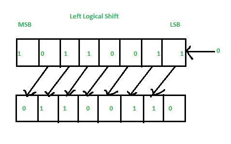
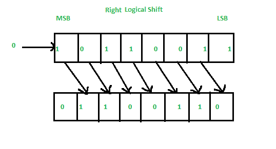
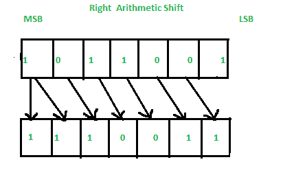
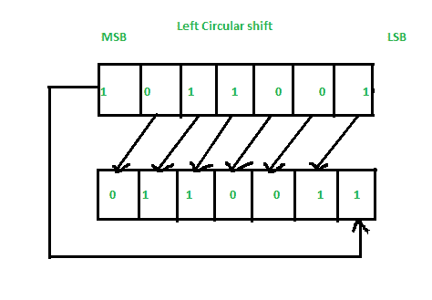
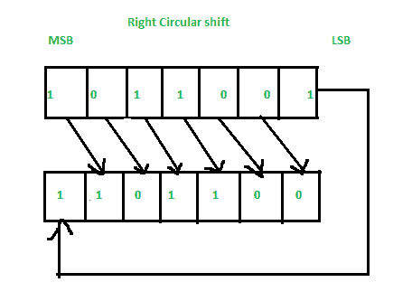

# 转移计算机体系结构中的微操作

> 原文:[https://www . geeksforgeeks . org/shift-micro-operations-in-computer-architecture/](https://www.geeksforgeeks.org/shift-micro-operations-in-computer-architecture/)

移位微操作是那些用于信息串行传输的微操作。这些也与算术微操作、逻辑微操作和其他数据处理操作结合使用。

有三种类型的轮班微操作:

**1。逻辑:**
通过串行输入传输 0 零。我们使用符号 shl 表示逻辑左移，shr 表示右移。

1.  **逻辑左移–**
    在此移位中，一个位置将每个位一个接一个地左移。空最低有效位(LSB)用零填充(即串行输入)，最高有效位(MSB)被拒绝。

*   **Right Logical Shift –**
    In this one position moves each bit to the right one by one and the least significant bit(LSB) is rejected and the empty MSB is filled with zero.

    

    **2。算术:**
    这个微操作将一个有符号的二进制数向左或向右移动。在算术左移中，它将一个有符号的二进制数乘以 2，在算术右移中，它将该数除以 2。

    1.  **Left Arithmetic Shift –**
        In this one position moves each bit to the left one by one. The empty least significant bit (LSB) is filled with zero and the most significant bit (MSB) is rejected. Same as the Left Logical Shift.

        

    2.  **Right Arithmetic Shift –**
        In this one position moves each bit to the right one by one and the least significant bit is rejected and the empty MSB is filled with the value of the previous MSB.

        

**3。循环:**
循环移位使寄存器序列中的位在两端循环，不会丢失任何信息。

1.  **Left Circular Shift –**

    

2.  **Right Circular Shift –**

    