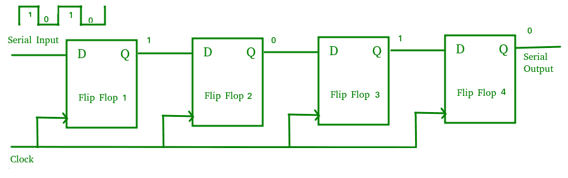
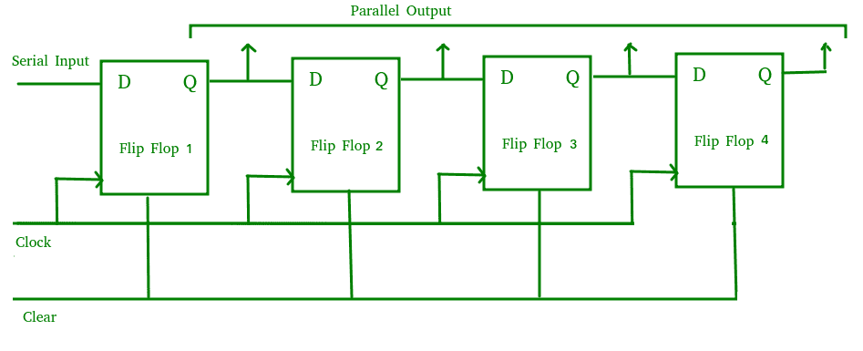
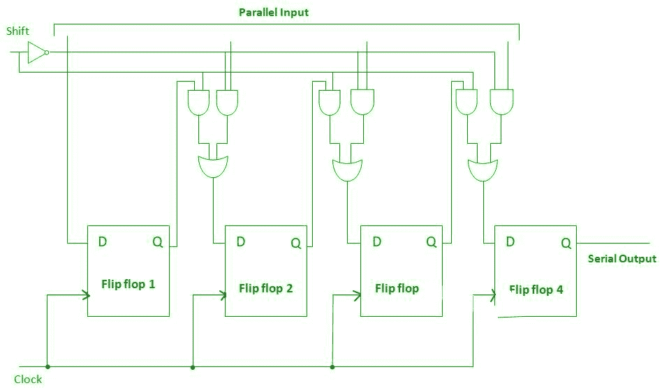
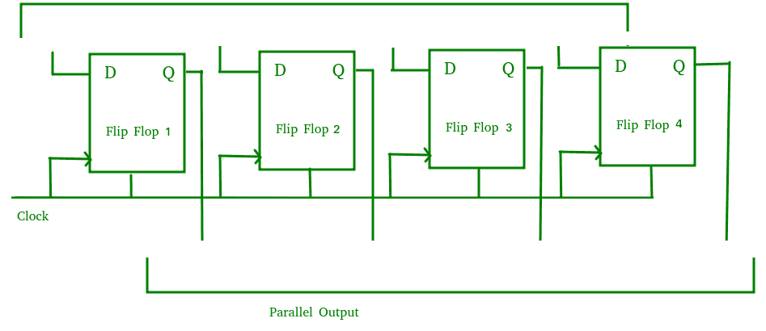
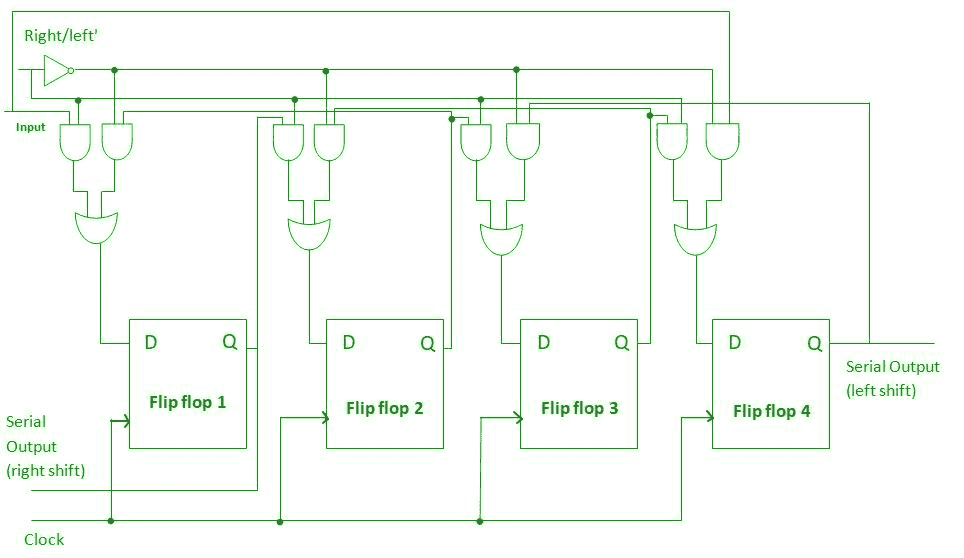
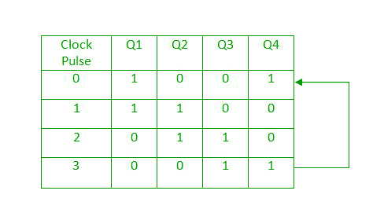
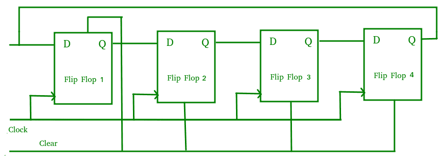
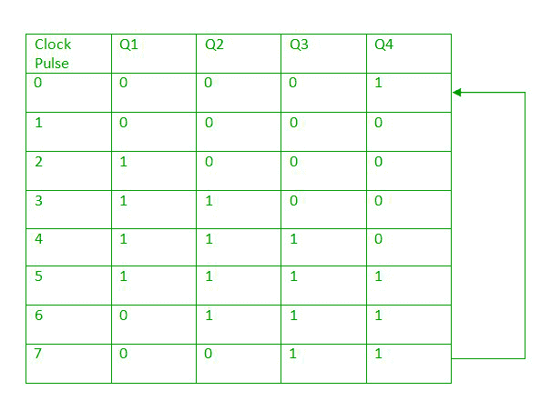
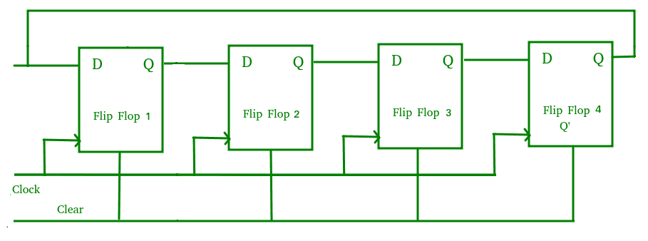

# 数字逻辑中的移位寄存器

> 原文:[https://www . geesforgeks . org/移位寄存器数字逻辑/](https://www.geeksforgeeks.org/shift-registers-in-digital-logic/)

触发器可以用来存储一位二进制数据(1 或 0)。然而，为了存储多位数据，我们需要多个触发器。n 个触发器按照存储 n 位数据的顺序连接。A **寄存器**是用于存储此类信息的设备。它是一组串联的触发器，用于存储多位数据。

存储在这些寄存器中的信息可以在**移位寄存器**的帮助下传输。移位寄存器是一组用于存储多位数据的触发器。通过施加时钟脉冲，可以使存储在这些寄存器中的位在寄存器内移动和移入/移出寄存器。n 位移位寄存器可以通过连接 n 个触发器形成，其中每个触发器存储一位数据。
将比特左移的寄存器称为“左移寄存器”。
将位向右移位的寄存器称为“右移位寄存器”。

移位寄存器基本上有 4 种类型。这些是:

1.  串行输入串行输出移位寄存器
2.  串行输入并行输出移位寄存器
3.  并行输入串行输出移位寄存器
4.  并行输入并行输出移位寄存器

### 串行输入串行输出移位寄存器(SISO)–

允许串行输入(通过一条数据线一位接一位)并产生串行输出的移位寄存器称为串行输入串行输出移位寄存器。由于只有一个输出，数据以串行模式一次离开移位寄存器一位，因此称为串行输入串行输出移位寄存器。

下面给出的逻辑电路显示了一个串行输入串行输出移位寄存器。该电路由四个串联的 D 触发器组成。所有这些触发器彼此同步，因为相同的时钟信号被施加到每个触发器。

上述电路是右移位寄存器的一个例子，从触发器的左侧获取串行数据输入。SISO 的主要用途是作为延迟元件。

### 串行输入并行输出移位寄存器(SIPO)–

允许串行输入(通过一条数据线一位接一位)并产生并行输出的移位寄存器称为串行输入并行输出移位寄存器。

下面给出的逻辑电路显示了一个串行-并行-输出移位寄存器。该电路由四个相连的 D 触发器组成。清除(CLR)信号与时钟信号一起连接到所有 4 个触发器，以便复位它们。第一个触发器的输出连接到下一个触发器的输入，以此类推。所有这些触发器彼此同步，因为相同的时钟信号被施加到每个触发器。

上述电路是右移位寄存器的一个例子，从触发器的左侧获取串行数据输入，并产生并行输出。它们用于通信线路中，因为 SIPO 寄存器的主要用途是将串行数据转换为并行数据，所以需要将一条数据线解复用为多条并行线。

### 并行输入串行输出移位寄存器(PISO)–

移位寄存器允许并行输入(数据分别以同步方式提供给每个触发器)并产生串行输出，称为并行输入串行输出移位寄存器。

下面给出的逻辑电路显示了一个并行-串行-输出移位寄存器。该电路由四个相连的 D 触发器组成。时钟输入直接连接到所有触发器，但输入数据通过每个触发器输入端的多路复用器单独连接到每个触发器。前一个触发器的输出和并行数据输入连接到多路复用器的输入，多路复用器的输出连接到下一个触发器。所有这些触发器彼此同步，因为相同的时钟信号被施加到每个触发器。

一种并行输入串行输出(PISO)移位寄存器，用于将并行数据转换为串行数据。

### 并行输入并行输出移位寄存器(PIPO)–

移位寄存器允许并行输入(数据以同时的方式分别提供给每个触发器)并产生并行输出，称为并行输入并行输出移位寄存器。

下面给出的逻辑电路显示了一个并行输入并行输出移位寄存器。该电路由四个相连的 D 触发器组成。清除(CLR)信号和时钟信号连接到所有 4 个触发器。在这种类型的寄存器中，各个触发器之间没有互连，因为不需要数据的串行移位。数据作为输入分别提供给每个触发器，同样，输出也从每个触发器单独收集。

并行输入并行输出(PIPO)移位寄存器被用作临时存储设备，并且像 SISO 移位寄存器一样，它充当延迟元件。

### 双向移位寄存器–

如果我们把一个二进制数向左移动一个位置，就相当于把这个数乘以 2，如果我们把一个二进制数向右移动一个位置，就相当于把这个数除以 2。为了执行这些操作，我们需要一个可以在任一方向上移位数据的寄存器。

双向移位寄存器是能够根据所选模式左右移位数据的寄存器。如果选择的模式是 1(高)，数据将向右移动，如果选择的模式是 0(低)，数据将向左移动。

下面给出的逻辑电路显示了一个双向移位寄存器。该电路由四个相连的 D 触发器组成。输入数据连接在电路的两端，根据所选模式，只有一个与门处于活动状态。

### 移位寄存器计数器–

移位寄存器计数器是移位寄存器，其中输出连接回输入，以产生特定的序列。这些基本上有两种类型:

1.  **Ring Counter –**

    环形计数器基本上是一个移位寄存器计数器，其中第一个触发器的输出连接到下一个触发器，以此类推，最后一个触发器的输出再次反馈到第一个触发器的输入，因此称为环形计数器。只要施加时钟脉冲，移位寄存器内的数据模式就会循环。

    下面给出的逻辑电路显示了一个环形计数器。该电路由四个相连的 D 触发器组成。由于电路由四个触发器组成，数据模式将在每四个时钟脉冲后重复，如下真值表所示:

    

    

    通常使用环形计数器，因为它是自解码的。不需要额外的解码电路来确定计数器处于什么状态。

2.  **Johnson Counter –**
    A Johnson counter is basically a shift register counter in which the output of the first flip flop is connected to the next flip flop and so on and the inverted output of the last flip flop is again fed back to the input of the first flip flop. They are also known as twisted ring counters.

    下面给出的逻辑电路显示了一个约翰逊计数器。该电路由四个相连的 D 触发器组成。n 级约翰逊计数器产生 2n 种不同状态的计数序列，因此也被称为 mod-2n 计数器。由于电路由四个触发器组成，数据模式将每八个时钟脉冲重复一次，如下真值表所示:

    

    

    约翰逊计数器的主要优点是，与环形计数器相比，它只需要 n 个触发器来循环给定的数据，以产生 2n 个状态的序列。

### 移位寄存器的应用–

*   移位寄存器用于临时数据存储。
*   移位寄存器也用于数据传输和数据处理。
*   串行输入串行输出和并行输入并行输出移位寄存器用于产生数字电路的时间延迟。
*   串行输入并行输出移位寄存器用于将串行数据转换为并行数据，因此它们用于需要将一条数据线解复用为多条并行线的通信线路中。
*   一种并行输入串行输出移位寄存器，用于将并行数据转换为串行数据。

**参考–**
[寄存器–](https://www.ee.usyd.edu.au/tutorials/digital_tutorial/part2/register01.html)