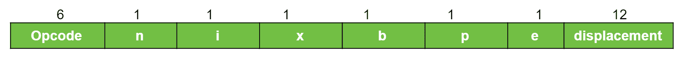

# SIC/XE 架构

> 原文:[https://www.geeksforgeeks.org/sic-xe-architecture/](https://www.geeksforgeeks.org/sic-xe-architecture/)

SIC/XE 代表**简化教学计算机额外设备或额外昂贵**。这台电脑是 SIC 的高级版本。SIC 和 SIC/XE 彼此密切相关，这就是它们向上兼容的原因。

**SIC/XE 机器架构:**

**1。内存:**

内存由 8 位字节组成，内存大小为 1 兆字节(2 <sup>20</sup> 字节)。标准 SIC 内存大小非常小。存储器大小的这种变化导致指令格式以及寻址模式的变化。在 SIC/XE 架构中，3 个连续的字节组成一个字(24 位)。

所有地址都是字节地址，字由它们的最低编号字节的位置来寻址。

**2。寄存器:**
它包含 9 个寄存器(5 个 SIC 寄存器+ 4 个附加寄存器)。另外四个寄存器是:

```
 Mnemonics             Use of Register
           B                  Base register
           S                  General working register
           T                  General working register
           F                  Floating-point accumulator

```

**3。数据格式:**

*   整数由二进制数表示。
*   字符用 ASCII 码表示。
*   浮点用 48 位表示。

**4。指令格式:**

*   在 SIC/XE 架构中，有 4 种格式可供选择
*   位(e)用于区分格式 3 和格式 4，

    ```
    e=0 means Format 3 and e=1 means Format 4
    ```

**格式 1(1 字节)**
T3

**格式 2(2 位元组):**


**格式 3(3 位元组):**


**格式 4(4 位元组):**


*n =间接模式，I =立即寻址，x =索引寻址，b =基础寻址，p=程序计数器，e =指数寻址*

**5。寻址模式:**
要使用格式 3，需要使用基本寄存器和程序计数器。

```
   Mode               Indication           Target Address (TA) 
           Base relative      b=1, p=0             TA=(B) + displacement 
           Program-counter    b=0, p=1             TA=(PC) + displacement 
           relative   

```

目标地址是指令的有效地址。

**6。指令集:**

*   在 SIC/XE 中，所有指令都与 SIC 体系结构相同，但由于浮点数据格式，它也提供浮点算术功能。
*   要执行浮点算术运算，

    ```
    ADDF = Add floating points, 
    SUBF = Subtract floating points, 
    MULF = Multiply floating points, 
    DIVF = Divide floating points 
    ```

*   SIC/XE 架构中还提供了 SVC ( **主管调用**)来处理中断。

**7。输入和输出:**
SIC/XE 架构包括输入/输出通道，允许在中央处理器执行其他任务的同时执行输入/输出操作。它将允许计算和输入/输出的重叠，这使得该架构更加高效。诸如 SIO、TIO、HIO 等指令用于启动、测试和停止输入/输出通道的操作。