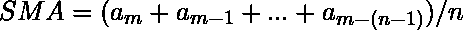
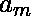
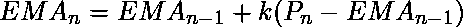
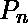
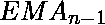
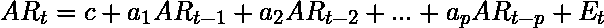
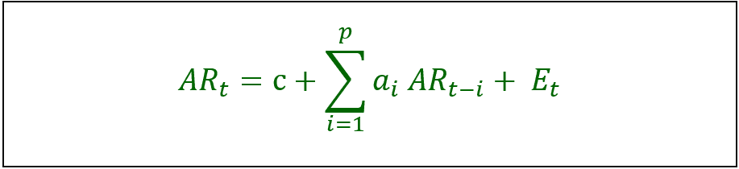
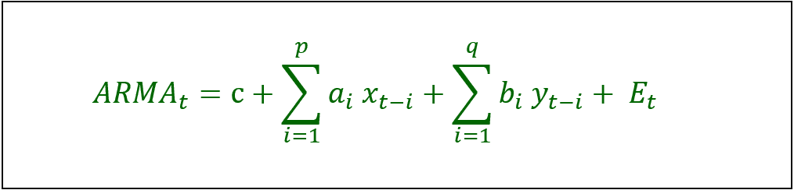
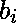
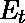

# 信号处理和时间序列(数据分析)

> 原文:[https://www . geesforgeks . org/信号处理和时间序列数据分析/](https://www.geeksforgeeks.org/signal-processing-and-time-series-data-analysis/)

**信号处理**是一个专注于分析模拟和数字信号相对于时间的工程领域。**时间序列分析**是信号处理的范畴之一。

时间序列是以规则的时间间隔记录的数据点序列。时间序列分析是开发序列预测之前的重要步骤，值的顺序在时间序列分析中很重要。这一过程有助于提取有意义的统计数据和其他数据特征，从而有助于创建准确的预测。时间序列广泛用于天气、股票价格、零售等数据。

我们将在本节中讨论以下主题:

```
1. Moving Average
2. Autoregressive Models
3. ARMA Models 
```

这些解释如下。

**1。移动平均线:**
移动平均线是一种广泛用于分析时间序列的计算方法。这指定了特定时间段的数据窗口，当新数据可用时，该窗口每次被平均一个时间段。

两种常用的移动平均线是:

1.  **Simple Moving Average (SMA) –**
    SMA’s calculation provides the average data for a defined number of time periods. The mathematical formula as follows:

    
    其中，
     =模型参数
    n =总天数

2.  **Exponential Moving Average (EMA) –**
    Exponential moving average gives more priority to recent data. The mathematical formula as follows:

    
    其中，
     =当前收盘价
     =前期均线【首次计算的 SMA】
    k = 2/(N+1)【指数或平滑常数】
    N =均线计算考虑的总天数

**均线计算:**
这里我们计算 5 天的均线。通常，对于第一种情况，我们要么采用当前收盘价，要么采用前 5 天的形状记忆合金值来获得第一个均线。对于下面的例子，当前收盘价(22.81 美元)作为第一个均线值。

下一步是计算 k 值。由于计算基于 5 天，N = 5，k 值计算如下:

```
 k = 2/(5+1) = 0.3 
```

<center>

| 天 | 收盘价 | 导弹电子搜索系统 | 主题区（subject matter area 的缩写） |
| --- | --- | --- | --- |
| one | Twenty-two point eight one | Twenty-two point eight one | – |
| Two | Twenty-three point zero nine | – | – |

</center>

第二天的均线计算如下:

```
Current closing price = 23.09
Previous period EMA = 22.81
k = 0.3 
```

```
EMA 
= 22.81 + 0.3 * (23.09 - 22.81)
= 22.81 + 0.3 * 0.28
= 22.81 + 0.084
= 22.894 
```

<center>

| 天 | 收盘价 | 导弹电子搜索系统 | 主题区（subject matter area 的缩写） |
| --- | --- | --- | --- |
| one | Twenty-two point eight one | Twenty-two point eight one | – |
| Two | Twenty-three point zero nine | Twenty-two point eight nine | – |
| three | Twenty-two point nine one | – | – |

</center>

第三天的均线计算如下:

```
Current closing price = 22.91
Previous period EMA = 22.89
k = 0.3 
```

```
EMA 
= 22.89 + 0.3 * (22.91 - 22.89)
= 22.89 + 0.3 * .02
= 22.89 + .006
= 22.896 
```

<center>

| 天 | 收盘价 | 导弹电子搜索系统 | 主题区（subject matter area 的缩写） |
| --- | --- | --- | --- |
| one | Twenty-two point eight one | Twenty-two point eight one | – |
| Two | Twenty-three point zero nine | Twenty-two point eight nine | – |
| three | Twenty-two point nine one | Twenty-two point eight nine | – |

</center>

**SMA 计算:**
由于我们考虑总天数(N)为 5，SMA 计算为 5 个最近收盘价的平均值。

<center>

| 天 | 收盘价 | 导弹电子搜索系统 | 主题区（subject matter area 的缩写） |
| --- | --- | --- | --- |
| one | Twenty-two point eight one | Twenty-two point eight one | – |
| Two | Twenty-three point zero nine | Twenty-two point eight nine | – |
| three | Twenty-two point nine one | Twenty-two point eight nine | – |
| four | Twenty-three point two three | Twenty-two point nine nine | – |
| five | Twenty-two point eight three | Twenty-two point nine four | – |

5 天的形状记忆合金计算如下:

```
SMA 
= (22.81 + 23.09 + 22.91 + 23.23 + 22.83) / 5
= 114.87 / 5 
= 22.97  
```

<center>

| 天 | 收盘价 | 导弹电子搜索系统 | 主题区（subject matter area 的缩写） |
| --- | --- | --- | --- |
| one | Twenty-two point eight one | Twenty-two point eight one | – |
| Two | Twenty-three point zero nine | Twenty-two point eight nine | – |
| three | Twenty-two point nine one | Twenty-two point eight nine | – |
| four | Twenty-three point two three | Twenty-two point nine nine | – |
| five | Twenty-two point eight three | Twenty-two point nine four | Twenty-two point nine seven |
| six | Twenty-three point zero five | – | – |

</center>

**2。自回归模型:**
自回归模型可以用来根据过去的数据预测未来的数据。在这个模型中，假设数据依赖于它以前的数据。由于自回归模型完全依赖过去的数据来生成未来的模型，因此在某些条件下，如金融危机或突然的技术变化，有可能生成不准确的数据。
数学公式如下:





**AR 计算:**
以下数据提供了今天(t)、前一天(t-1)、前两天(t-2)和前三天(t-3)的股价。

<center>

| t | t-1 | t-2 | t-3 |
| --- | --- | --- | --- |
| Twenty-three point two three | Twenty-two point nine one | Twenty-three point zero nine | Twenty-two point eight one |
| Twenty-two point eight three | Twenty-three point two three | Twenty-two point nine one | Twenty-three point zero nine |
| Twenty-three point zero five | Twenty-two point eight three | Twenty-three point two three | Twenty-two point nine one |
| Twenty-three point zero two | Twenty-three point zero five | Twenty-two point eight three | Twenty-three point two three |
| Twenty-three point two nine | Twenty-three point zero two | Twenty-three point zero five | Twenty-two point eight three |
| Twenty-three point four one | Twenty-three point two nine | Twenty-three point zero two | Twenty-three point zero five |
| Twenty-three point four nine | Twenty-three point four one | Twenty-three point two nine | Twenty-three point zero two |
| Twenty-four point six | Twenty-three point four nine | Twenty-three point four one | Twenty-three point two nine |
| Twenty-four point six three | Twenty-four point six | Twenty-three point four nine | Twenty-three point four one |
| Twenty-four point five one | Twenty-four point six three | Twenty-four point six | Twenty-three point four nine |
| Twenty-three point seven three | Twenty-four point five one | Twenty-four point six three | Twenty-four point six |
| Twenty-three point three one | Twenty-three point seven three | Twenty-four point five one | Twenty-four point six three |
| Twenty-three point five three | Twenty-three point three one | Twenty-three point seven three | Twenty-four point five one |
| Twenty-three point zero six | Twenty-three point five three | Twenty-three point three one | Twenty-three point seven three |
| Twenty-three point two five | Twenty-three point zero six | Twenty-three point five three | Twenty-three point three one |
| Twenty-three point one two | Twenty-three point two five | Twenty-three point zero six | Twenty-three point five three |
| Twenty-two point eight | Twenty-three point one two | Twenty-three point two five | Twenty-three point zero six |
| Twenty-two point eight four | Twenty-two point eight | Twenty-three point one two | Twenty-three point two five |

</center>

有了上面的股价数据，就需要进行线性回归，得到 ar 模型所需的参数。为此，您可以使用 excel 中的数据分析功能。对于回归，可以提供 t 数据作为 Y 输入，提供(t-1)、(t-2)、(t-3)作为 X 输入。Microsoft excel 将为您提供以下结果。

**回归统计:**

```
Multiple R: 0.786903932
R Square: 0.619217798
Adjusted R Square: 0.537621612
Standard Error: 0.398415364
Observations: 18 
```

<center>

|  | 系数 | 标准误差 |
| --- | --- | --- |
| 拦截 | 8.59250239 | 4.494566177 |
| t-1 | 0.840795074 | 0.249566271 |
| t-2 | 0.100511124 | 0.331626753 |
| t-3 | -0.308260596 | 0.250400704 |

</center>

让我们看看如何使用回归的输出值。

以前的股票数据:

```
Coefficient of t-1 = 0.840795074 and Close price = 22.8
Coefficient of t-2 = 0.100511124 and Close price = 23.12
Coefficient of t-3 = -0.308260596 and Close price = 23.25 
```

常量的值:

```
Coefficient of Intercept = 8.59250239 = 8.6 
```

标准误差:

```
t-1 = 0.249566271
t-2 = 0.331626753
t-3 = -0.250400704 
```

```
Standard Error 
= 0.25 + 0.33 - 0.25
= 0.33 
```

```
AR 
= 8.6 + [ (0.84*22.8) + (0.1*23.12) + (-0.31*23.25) ] + 0.33
= 8.6 + [ 19.15 + 2.31 - 7.20] + 0.33
= 8.6 + 14.26 + 0.33
= 23.19 
```

你可以用今天的股价和 R 平方值来预测明天的股价，而不是进行整个计算(参考上面的回归统计输出)。

假设，今天的股价是 22.84 美元，那么明天的股价计算如下:

```
AR(t+1) = Coefficient of Intercept + (R square * Today's Price) 
                                        + Standard Error

R Square = 0.619217798 

Standard Error (from regression statistics) = 0.398415364 
```

```
AR 
= 8.6 + (0.619*22.84) + 0.39
= 8.6 + 14.14 + 0.39
= 23.13 
```

**3。ARMA 模型:**
ARMA 模型是另一个用来预测时间序列的工具。这些模型基于自回归模型和移动平均模型的组合。在 AR 模型中，我们使用过去的数据来回归变量，在 MA 模型中，我们使用时间序列平均值的总和来进行预测。

由于 ARMA 模型是 AR 部分和 MA 部分的组合，因此该模型被称为 ARMA(p，q)模型，其中 p 是 AR 部分，q 是 MA 部分。

数学公式如下:



其中，
 =自回归模型的参数
 =移动平均模型的参数
c =常数
 =误差项的【白噪声】

</center>