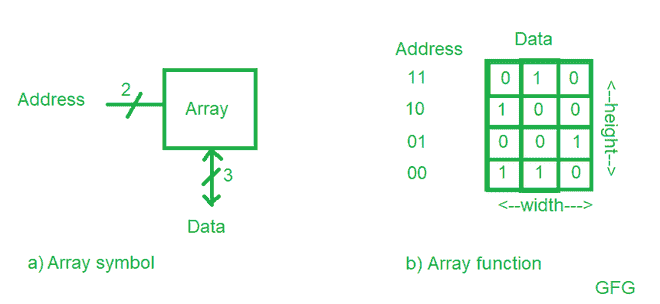

# n 位加法器/减法器只读存储器的大小

> 原文:[https://www . geesforgeks . org/n 位加减器 rom-size/](https://www.geeksforgeeks.org/size-of-rom-for-n-bit-adder-subtractor/)

[只读存储器](https://www.geeksforgeeks.org/random-access-memory-ram-and-read-only-memory-rom/)是用于存储数据的只读存储器。只读存储器中的存储器被组织成二维阵列的[存储单元](https://www.geeksforgeeks.org/introduction-to-memory-and-memory-units/)。存储器将读取或写入阵列的一行的内容。该行由地址指定，地址是位。读取或写入的值称为数据。



**图 a)** 示出了具有两个地址位和三个数据位的存储器阵列。两个地址位指定数组中四行(数据字)中的一行。每个数据字宽三位。
**图 b)** 显示了内存数组的一些可能内容。

如图所示，具有 n 位地址和 m 位数据的存储单元阵列将具有行和 m 列。每行数据被称为一个字。因此，该数组包含一个字×m 位数组。

在图的情况下，具有 2 位地址和 3 位数据的存储单元阵列将具有 4 和 3 列的行，因此该阵列包含 x m =  x 3 = 4 字 x 3 位阵列。

为了清楚地理解，让我们取 10 个地址位和 32 个数据位，那么只读存储器的大小将是–

```
2^(10) x 32 = 1024 x 32 = 32 Kb
```

现在要找到只读存储器的大小，我们需要找到输入和输出位数–

输入数量= n(A) + n(B) + 1(Cin) = 2n+1 个地址位

输出数= n(和/差)+ 1(Cout) = n+1

因此，这将需要一个**2^(2n+1 x(n+1)**位 ROM。

这里， **n(A)** 表示 A 的输入数， **n(B)** 表示 B 的输入数

**示例-1 :** 可用于为带有 Cin 和库特的 16 位加法器/减法器编程的只读存储器的大小是 ____？

**解决方案:**

输入数量= 16 (A) + 16 (B) + 1(Cin) = 2(16)+1 = 33 个地址位。

输出数= 16(和/差)+ 1(Cout) = 16+1 = 17

```
Thus, this would require a 2^(2n+1)x(n+1) = 2^(33)x17 bit ROM.
```

**示例-2 :** 可用于为带有 Cin 和库特的 8 位加法器/减法器编程的只读存储器的大小是 ____？

**解决方案:**

输入数量= 8 (A) + 8 (B) + 1(Cin) = 2(8)+1 = 17 个地址位。

输出数= 8(和/差)+ 1(Cout) = 8+1 = 9

```
Thus, this would require a 2^(2n+1)x(n+1) = 2^(17)x9 bit ROM.
```