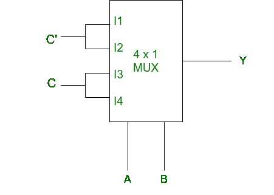
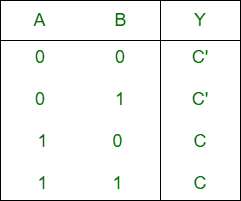
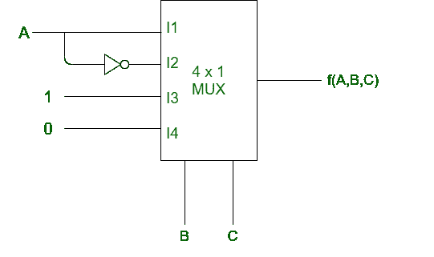
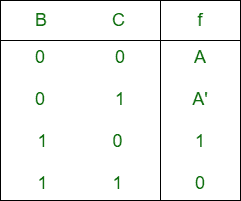

# 解复用器电路

> 原文:[https://www.geeksforgeeks.org/solving-multiplexer-circuit/](https://www.geeksforgeeks.org/solving-multiplexer-circuit/)

求解和寻找给定[复用器](https://www.geeksforgeeks.org/multiplexers-in-digital-logic/)的输出函数的过程非常简单。首先，我们将讨论程序，然后举例说明。

**程序:**

*   首先为给定的多路复用器构造真值表。
*   多路复用器中的选择线被视为真值表的输入。
*   真值表中的输出可以是四种形式(即 0，1，Q，Q’)。
*   现在借助真值表我们找到了扩展表达式。
*   然后使用布尔代数规则最小化表达式。
*   最终函数可以是表达式形式，也可以是标准操作程序或位置形式。

**示例-1:**
给定多路复用器如下:



**说明:**

*   **Step-1:** First draw the truth table. For the truth table, select lines A and B are the input.
    According to the circuit,

    ```
    I0 = C' (hence first row of truth table will be C')
    I1 = C'
    I2 = C
    I3 = C 
    ```

    I0、I1、I2、I3 分别被认为是真值表的第 1、2、3、4 行的输出。

    

*   **第 2 步:**现在我们将找到 Y 的表达式:

    ```
    Y = A'B'C' + A'BC' + AB'C + ABC
      = A'C'(B' + B) + AC(B' + B)
      = A'C' + AC

    ```

**示例-2:**
给定 MUX，



**说明:**

*   **Step-1:** Truth table is following. For the truth table select lines B and C are input.
    According to the circuit,

    ```
    I0 = A (hence first row of truth table will be A)
    I1 = A'
    I2 = 1
    I3 = 0 
    ```

    I0、I1、I2、I3 分别被认为是真值表的第 1、2、3、4 行的输出。

    

*   **第 2 步:**现在我们将找到输出:

    ```
    f(A, B, C) = AB'C' + A'B'C + BC'.1
             = AB'C' + A'B'C + BC'(A + A')
             = AB'C' + A'B'C + ABC' + A'BC'
             =  100     001    110     010
             = m(1, 2, 4, 6)
    ```