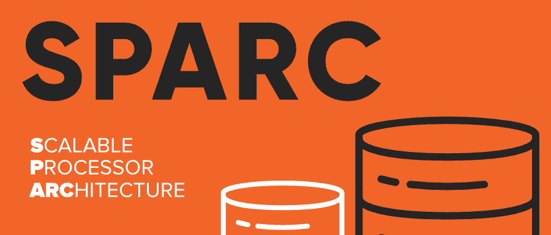

# SPARC 完整版

> 原文:[https://www.geeksforgeeks.org/sparc-full-form/](https://www.geeksforgeeks.org/sparc-full-form/)

**SPARC** 代表**可扩展处理器架构。**
SPARC 是一个通用的 32 位整数和 32、64 和 128 位浮点单元， [**ISA**](https://www.geeksforgeeks.org/microarchitecture-and-instruction-set-architecture/) (指令集架构)基于 [**RISC**](https://www.geeksforgeeks.org/computer-organization-risc-and-cisc/) (精简指令集计算机)设计，建立在**加州大学伯克利分校。**

开发 SPARC 体系结构的主要目标是优化编译器并有效地流水线化硬件执行。SPARC 的开发和实施为市场改进计划提供了前所未有的高执行率和更短的时间框架。SPARC“寄存器窗口”结构允许存储器加载/存储指导原则集的异常减少。

#### 历史

SPARC 于 1987 年中期在 T2 太阳微系统公司首次被提出。 SPARC 已经在从笔记本电脑到超级计算机等一系列个人电脑中使用的处理器中实现。自 1986 年 Sun 和 Fujitsu 首次宣布系统兼容十几种不同的微处理器以来，国际成员组织推出了十几种不同的微处理器，比任何具有这种二进制兼容性的芯片家族都多。Sun 已将打造为一个高度可扩展的开源、非专有架构，因此所有组织和个人都可以利用基于架构的产品，并且可以向微处理器制造商授权。1989 年，该结构移交给 SPARC 国际贸易集团，该集团管理、许可、推进 SPARC 配置、监督 SPARC 商标并进行一致性测试。SPARC 体系结构现在广泛用于基于 UNIX 的操作系统的硬件，包括 Sun 自己的 Solaris 系统。

**对设计的重大修改如下:**

*   **SPARC-V7:** 32 位架构，1986
*   **SPARC-V8:** 32 位架构，1992 年
*   **SPARC-V9:** 64 位架构，1993
*   **UltraSPARC:**SPARC-V9 的延伸，1995

#### SPARC 的特点

*   **开源:** Sparc 提供了许可证的灵活性，并为任何个人使用 Sparc 架构配置自己的解决方案提供了机会。
*   **性能和经济性:**用更少的晶体管解开更多的指令集。
*   **可扩展性:**SPARC 结构在成本和容量方面都具有适应性。高速缓存、内存和浮点运算单元的适应性整合。
*   **兼容性:**SPARC 架构提供了该结构的代与代之间的完全兼容性，就像在依赖于 SPARC 实现的项目的整个范围内一样。
*   **多功能性:**SPARC 架构提供多种商业、技术、航空航天和军事应用等。
*   **面向对象:**面向对象编程特性在 SPARC 占主导地位。

#### 优势

*   SPARC 的建筑简单而强大。
*   SPARC 的结构是先进的，以满足客户的期望，提供高性能的现实世界的应用程序和低拥有成本
*   SPARC 框架通常具有 60%-85%的突出的每中心生产率。
*   Sun 服务器与的安排传达了扩展的适应性、可扩展性和更高的可访问性。
*   SPARC-V9 结构为每个内核提供了多个线程，减少了中央处理器的等待时间，增加了中央处理器的使用时间。

    #### 不足之处

    *   SPARC 体系结构不是用于教育目的，而是由开发人员和计算机架构师使用，他们管理服务器应用程序和与其他 RISC 体系结构(如 MIPS 和 ARM)相比较低的编程级别。
    *   由于 SPARC 是一个面向所有个人的开放架构，可能会滥用基于 SPARC 架构的产品。