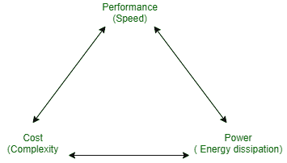

# 数字系统规格

> 原文:[https://www . geesforgeks . org/数字系统规范/](https://www.geeksforgeeks.org/specification-of-digital-system/)

[系统的规格](https://www.geeksforgeeks.org/introduction-to-digital-systems/)是对其功能和所需的其他特性的描述，例如速度、成本和功率。

设计可以以两者都恶化为代价来改进。这些权衡存在于系统设计的每一个层面，每一个子部分和组件。设计者必须做出必要的权衡以实现组件内的功能。

规范应具有以下属性:

*   简单但完整。
*   解读不含糊。