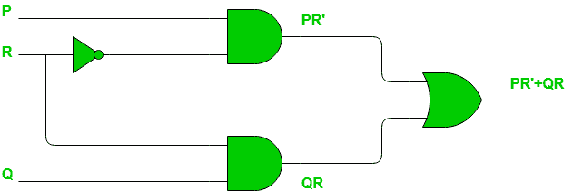
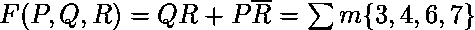
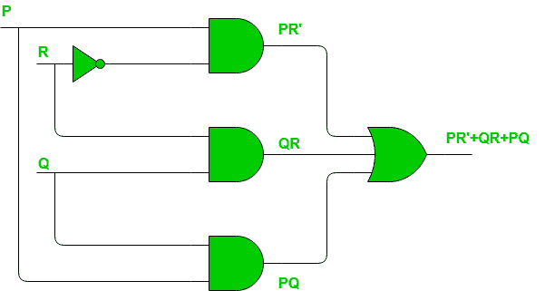

# 数字逻辑中的静态危险

> 原文:[https://www . geeksforgeeks . org/static-risks-in-digital-logic/](https://www.geeksforgeeks.org/static-hazards-in-digital-logic/)

数字电路中存在的**危险**会导致电路输出暂时波动。换句话说，数字电路中的危险是电路理想操作中的暂时干扰，如果给定时间，它会自行解决。当从输入到输出的不同路径具有不同的延迟时，就会发生这些干扰或波动，由于这一事实，输入变量的变化不会立即改变输出，而是在电路构建元件(即逻辑门)引起的小延迟之后出现在输出端。

在数字电路中发现三种不同的危险

1.  静态危险
2.  动态危险
3.  功能性危害

我们将在这里只讨论静态危险，以便完全理解它。

在形式上，当输入的变化导致输出在稳定到其正确值之前瞬间改变时，就会发生**静态危险**。根据什么是正确的值，有两种类型的静态危险，如下图所示:

1.  **静态-1 危险:**如果输出当前处于逻辑状态 1，并且在输入改变其状态后，输出在稳定在 1 之前瞬间改变为 0，则它是静态-1 危险。
2.  **静态-0 危险:**如果输出当前处于逻辑状态 0，并且在输入改变其状态后，输出在稳定在 0 之前暂时改变为 1，则它是静态-0 危险。

**使用 K-map 检测静态危险:**
让我们首先考虑静态-1 危险。要检测数字电路的静电危害，可采用以下步骤:

*   **第一步:**记下数字电路的输出，说 **Y** 。
*   **第 2 步:**绘制该功能的 K 图 **Y** 并记下所有相邻的 1
*   **步骤-3:** 如果有任何一对带有 1 的细胞不在同一组(即 prime implicant)，则表明存在静态 1 危险。每一对都是静电危害。

让我们举个例子:

**示例–**考虑如下所示的电路。

我们有输出，比如 F，如下所示:
让我们为这个布尔函数绘制如下的 K 图:

绿色圆圈中的一对 1 不属于该布尔函数输出提供的分组/配对。这将在该电路中造成静电危害。

**消除静态 1 危害:**
一旦检测到静态 1 危害，可以通过在功能(电路)中引入更多的术语(逻辑门)来轻松消除。最常见的想法是在现有的布尔函数中添加缺失的组，因为添加这个项无论如何都不会影响函数，但会消除危险。因为在上面的例子中，用蓝色圈起来的一对 1 导致了静态 1 的危险，我们只是把它作为一个主要的隐含添加到现有的函数中，如下所示:

请注意，该函数的最小位数没有区别。原因是静态-1 危险是基于我们如何对 K 图中给定的一组 1 的 1(或静态-0 危险的 0)进行分组。因此，在 K 图中 1 的数量没有任何区别。电路看起来如下图所示，为消除静电危害进行了更改。

类似地，对于**静态-0 危险**，我们需要考虑 0 而不是 1，如果 K 图中任何相邻的 0 没有被分组到同一组中，可能会导致静态-0 危险。检测和解决静态-0 危害的方法与我们针对静态-1 危害所遵循的方法完全相同，只是在这种情况下，我们将使用 POS 代替 SOP 来处理 0。