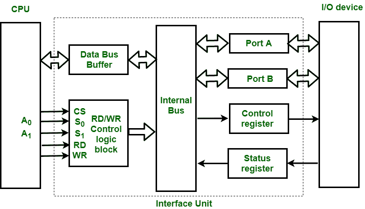

# 输入输出接口结构

> 原文:[https://www . geesforgeks . org/structure-of-input-output-interface/](https://www.geeksforgeeks.org/structure-of-input-output-interface/)

一个[输入输出接口](https://www.geeksforgeeks.org/io-interface-interrupt-dma-mode/)单元的框图包含以下几个块:

```
1. Data Bus Buffer
2. Read/Write Control Logic
3. Port A, Port B register
4. Control and Status register 
```



这些解释如下。

**数据总线缓冲区:**
总线缓冲区使用双向数据总线与 CPU 通信。接口单元和中央处理器之间的所有控制字数据和状态信息都通过数据总线传输。

**端口 A 和端口 B :**
端口 A 和端口 B 用于输入输出设备和接口单元之间的数据传输。每个端口由双向数据输入缓冲器和双向数据输出缓冲器组成。接口单元直接连接输入设备和输出磁盘，或者通过端口 A 和端口 B 连接需要输入和输出的设备，即调制解调器、外部硬盘、磁盘。

**控制和状态寄存器:**
中央处理器根据控制信息向控制寄存器给出控制信息。接口单元控制中央处理器和输入输出设备之间的输入输出操作。状态寄存器中的位用于检查状态条件。状态寄存器指示数据寄存器、端口 A、端口 B 状态，还记录数据传输期间可能发生的错误。

**读/写控制逻辑:**
该模块为整个设备操作产生必要的控制信号。来自中央处理器的所有命令都通过这个块被接受。它还允许接口单元的状态通过这个块被传送到数据总线上，接受来自系统总线的 CS、读写控制信号和来自系统地址总线的 S <sub>0</sub> ，S <sub>1</sub> 。读取和写入信号用于定义数据总线上的数据传输方向。

```
Read Operation: CPU <---- I/O device
Write Operation: CPU ----> I/O device

```

读信号引导数据从接口单元传输到中央处理器，写信号通过数据总线引导数据从中央处理器传输到接口单元。

地址总线用于选择接口单元。地址总线的两条最低有效线(A <sub>0</sub> 、A <sub>1</sub> )连接到选择线 S <sub>0</sub> 、S <sub>1</sub> 。这两条选择输入线用于选择接口单元中四个寄存器中的任何一个。接口单元的选择依据以下标准:

**读取状态:**

<center>

| 芯片选择 | 操作 | 选择行 | 

选择

接口装置

 |
| --- | --- | --- | --- |
| 特许测量员 | 阅读 | 写 | S
<sub>0</sub> | S
<sub>1</sub> |
| --- | --- | --- | --- | --- |
| Zero | Zero | one | Zero | Zero | 港口 A |
| Zero | Zero | one | Zero | one | 端口 B |
| Zero | Zero | one | one | Zero | 控制寄存器 |
| Zero | Zero | one | one | one | 状态寄存器 |

**写入状态:**

<center>

| 芯片选择 | 操作 | 选择行 | 
接口单元的选择 |
| --- | --- | --- | --- |
| 特许测量员 | 阅读 | 写 | S
<sub>0</sub> | S
<sub>1</sub> |
| --- | --- | --- | --- | --- |
| Zero | one | Zero | Zero | Zero | 港口 A |
| Zero | one | Zero | Zero | one | 端口 B |
| Zero | one | Zero | one | Zero | 控制寄存器 |
| Zero | one | Zero | one | one | 状态寄存器 |

</center>

**示例:**

*   如果 S <sub>0</sub> ，S <sub>1</sub> = 0 1，则选择端口 B 数据寄存器用于 CPU 和 I/O 设备之间的数据传输。
*   如果 S <sub>0</sub> ，S <sub>1</sub> = 1 0，则选择控制寄存器，存储中央处理器发送的控制信息。

</center>