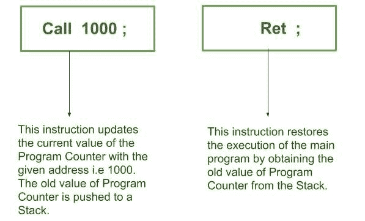
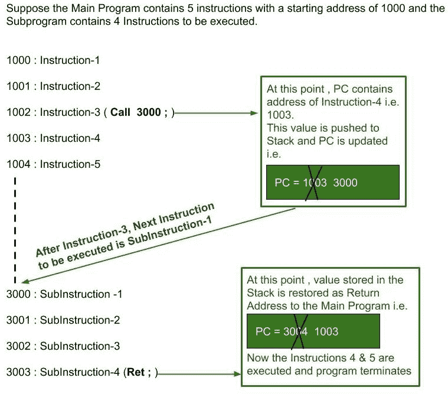

# 子程序及其特点

> 原文:[https://www . geeksforgeeks . org/subroutine-and-its-traditions/](https://www.geeksforgeeks.org/subprogram-and-its-characteristics/)

A **子程序**是任何较大程序内部的一个程序，可以重复使用任意次。

**<u>子程序的特性</u> :**

(1)用汇编语言的**调用&返回**指令实现子程序。

(2)调用指令存在于主程序中，返回(Ret)指令存在于子程序本身中。

(3)需要注意的是，在执行任何子程序的过程中，主程序都是暂停的。此外，子程序完成后，主程序从程序计数器中的下一个顺序地址开始执行。

(4)对于任何子程序的实现，都使用一个**“栈”**来存储主程序的**“返回地址”**。这里，返回地址是指主程序中调用指令之后紧接着的下一个指令地址。该返回地址存在于程序计数器中。因此，在调用指令执行期间，首先将程序计数器值作为返回地址推送到堆栈，然后将程序计数器值更新到调用指令中的给定地址。类似地，在执行返回(Ret)指令期间，堆栈中存在的值被弹出，并且程序计数器值被恢复，用于主程序的进一步执行。

(5)子程序的主要优点是避免了代码的重复，允许我们一次又一次地重用相同的代码。

