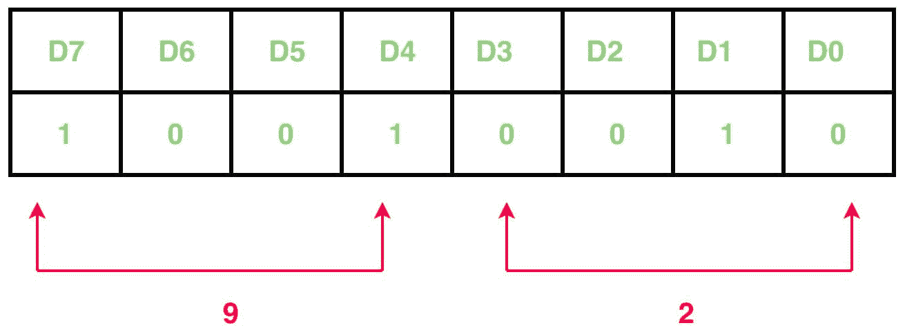
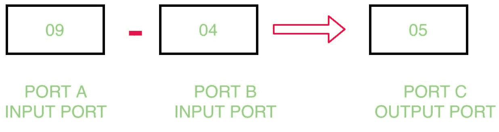

# 通过 8255 与 8085 微处理器的接口

减去两个端口的内容

> 原文:[https://www . geeksforgeeks . org/通过 8255 与 8085 微处理器接口减去两个端口的内容/](https://www.geeksforgeeks.org/subtract-content-of-two-ports-by-interfacing-8255-with-8085-microprocessor/)

**问题–**编写一个汇编程序，通过 8255 与 8085 微处理器的接口，确定从端口 A 减去端口 B 的内容，并将结果存储在端口 C 中。

**示例–**




**算法–**

1.  构造控制字寄存器
2.  从端口 A 和端口 B 输入数据
3.  减去端口 A 和端口 B 的内容
4.  在端口 C 显示结果
5.  暂停程序

**程序–**

<center>

| 记忆术 | 评论 |
| --- | --- |
| MVI A， 92 | A |
| 输出 83 | 控制寄存器 |
| 81 年 | a |
| 莫夫 b，a | B |
| 80 年 | 一个 |
| SUB B | A |
| 输出 82 | 端口 C |
| 浸水使柔软 | 返回 |

</center>

**解释–**

1.  **MVI A，92:** 表示控制寄存器的值为 92。

    ```
    D7=1         I/O mode
    D6=0 & D5=0  Port A is in mode 0
    D4=1         Port A is taking input
    D3=0 & D0=0  Port C is not taking part
    D2=0         Port B is in mode 0
    D1=1         Port B is taking input

    ```

2.  **OUT 83:** 将 A 的值放入端口控制寄存器的端口号 83H。
3.  **IN 81:** 从端口 b 的端口号 81H 取输入
4.  **MOV B、A:** 将 A 寄存器的内容复制到 B 寄存器。
5.  **IN 80:** 从端口 a 的端口号 80H 取输入
6.  **SUB B:** 减去 A 寄存器和 B 寄存器的内容。
7.  **OUT 82:** 在 81H 中显示结果，81H 是端口 c 的端口号。
8.  **RET:** 返回