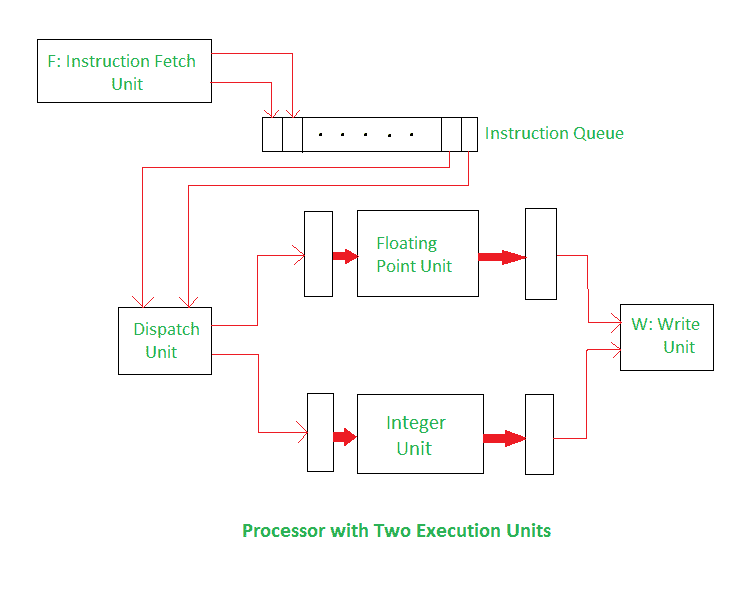

# 超标量架构

> 原文:[https://www.geeksforgeeks.org/superscalar-architecture/](https://www.geeksforgeeks.org/superscalar-architecture/)

先决条件–[流水线化](https://www.geeksforgeeks.org/computer-organization-and-architecture-pipelining-set-1-execution-stages-and-throughput/)
更激进的方法是为处理器配备多个处理单元，以便在每个处理阶段并行处理几条指令。通过这种安排，几个指令在同一时钟周期开始执行，并且该过程被称为使用多个发布。这种处理器能够实现每个周期多于一条指令的指令执行吞吐量。它们被称为“超标量处理器”。

在上图中，有一个带有两个执行单元的处理器；一个用于整数运算，一个用于浮点运算。取指令单元能够一次读取指令并将它们存储在指令队列中。在每个周期中，调度单元从队列的前端检索并解码多达两条指令。如果有一个整数、一个浮点指令并且没有危险，则这两个指令在相同的时钟周期内被调度。

**超标量架构的优势:**

*   编译器可以通过明智地选择和排序指令来避免许多危险。
*   编译器应该努力交错浮点和整数指令。这将使调度单元在大部分时间保持整数和浮点单元忙碌。
*   一般来说，如果编译器能够安排程序指令来最大限度地利用可用的硬件单元，就可以实现高性能。

**超标量架构的缺点:**

*   在超标量处理器中，各种危害对性能的不利影响变得更加明显。
*   由于这种类型的架构，可能会出现调度问题。