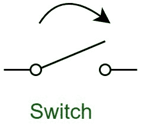
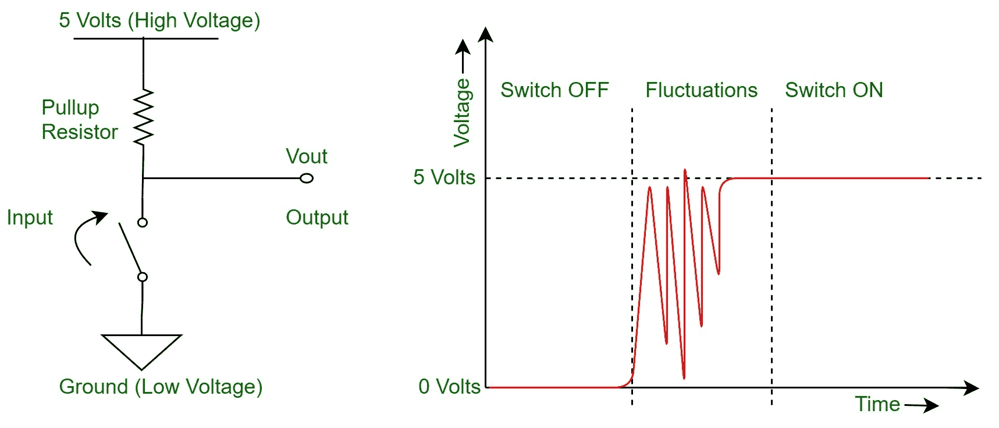
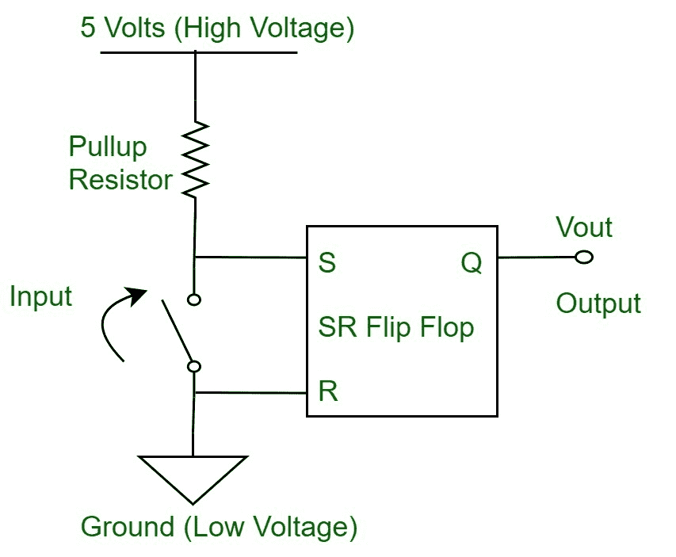
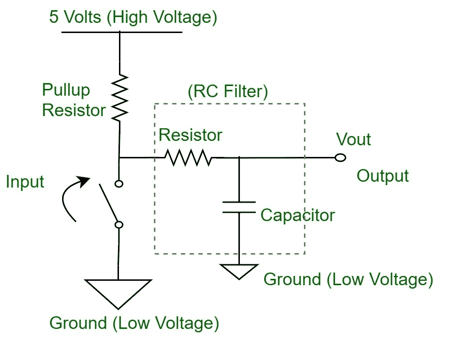

# 数字电路中的开关去抖

> 原文:[https://www . geesforgeks . org/switch-数字电路去抖/](https://www.geeksforgeeks.org/switch-debounce-in-digital-circuits/)

我们都知道开关或按钮是如何工作的，你只需按下它来切换它的状态。在电子学中，开关被用来驱动或代表许多事物，而这些事物主要是以不同的电压电平的形式出现的，因此使系统成为二进制的，即或者是开或者是关，以及处于电压电平高或者是低。因此，这些电压电平(例如 5 伏=高=开=闭路，0 伏=低=关=开路)帮助我们表示 0(0)和 1(1)的二进制逻辑。

**Figure –** Normal Switch Diagram

但是，在我们的键盘和各种其他设备上的简单按钮下，正在发生很多事情。一个简单的按钮基本上是两个金属触点，在用户的输入下接触，即按下按钮的动作。然后，这些金属触点使下面的电路完整，并通知传感元件(在大多数情况下是微控制器)按钮被按下。

**Figure –** Switch Bounce Graph

这种接触金属触点的动作在物理上以不同的方式起作用，即金属触点相互弹起，在受到用户按压动作的冲击后，使开关打开和关闭一段时间。因此，如果传感元件足够灵敏，它会记录单个动作的多个按钮按压。这可能会在您正在使用的系统中引入错误，并可能会阻碍许多进程。

因此，为了避免这种误释按钮按压，需要开关去抖的概念。这有助于正确记录开关的动作。开关去抖可以通过软件编程和硬件电路的使用来实现。让我们简单地看看这些方法。

**软件开关去抖:**
在该方法中，使用各种算法和滤波器消除开关的弹跳状态效应。程序员可以使用移位寄存器和计数器来设计一种算法，以便在延迟后记录开关的状态。另一种方法是对来自开关的采样输入使用滤波算法，并根据这种数字滤波器的输出确定开关的状态。所有这些都会使软件稍微低效，如果没有正确实现，会增加性能延迟。

**硬件开关去抖:**
在这一类中，有各种各样的电路实现可以用来在硬件层面上消除开关去抖的影响。使用的不同类型的电路有:

**Figure –** Switch Debounce using SR Flip Flop Latch

S-R 触发器锁存电路的使用。该电路当引入开关的输出部分时，它将保持输入的电压电平作为输出状态。因此，当引入状态变化时，锁存到输入端。这种方法很有用，但增加了简单电路的体积。

**Figure –** Switch Debounce using RC Filter

使用射频电路。该电路由一个电阻和一个电容电路组合而成，充当滤波器来消除开关的输出毛刺。

专用集成电路的使用。市场上有各种各样的集成电路专门用来消除开关弹跳动作。这些电路使用组合电路来消除开关的波动输出。