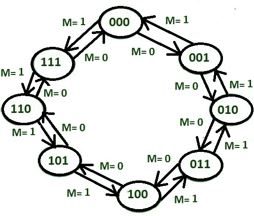
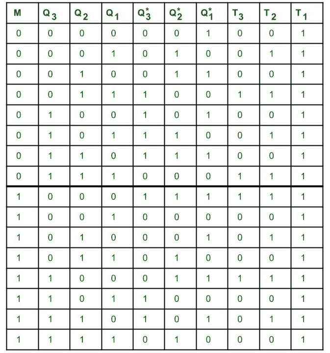
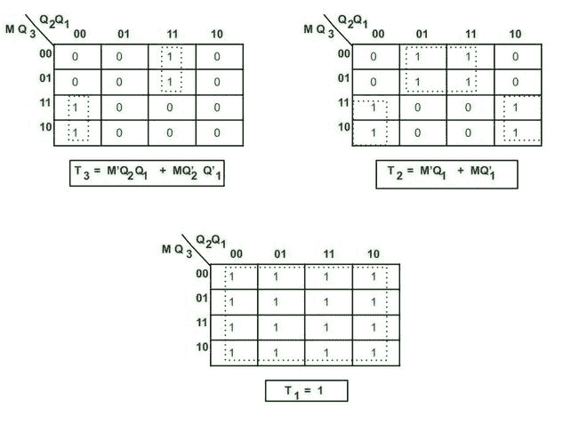
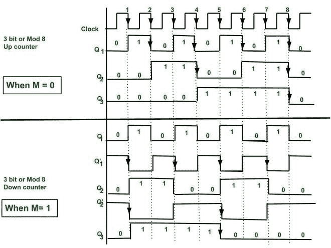
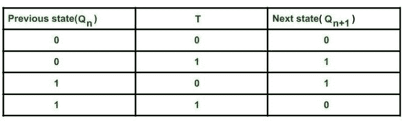

# 同步 3 位升/降计数器

> 原文:[https://www . geesforgeks . org/synchronic-3 位上下计数器/](https://www.geeksforgeeks.org/synchronous-3-bit-up-down-counter/)

**先决条件** : [3 位递减计数器。](https://write.geeksforgeeks.org/post/2715243)

**概述:**

*   这些类型的计数器属于同步控制器计数器的范畴。
*   这里，模式控制输入用于决定计数器是否将产生哪个序列。
*   在这种情况下，模式控制输入用于决定计数器将执行向上计数还是向下计数。
*   这种计数器的设计与同步计数器的设计相同，但需要用于模式控制输入的额外组合逻辑。

**设计同步 3 位升/降计数器**的步骤:

**1。决定 FF 的数量和类型–**

*   这里我们执行 3 位或 mod-8 **向上或向下计数，**所以需要 3 个触发器，最多可以计数到 2 个 3 个 -1 = 7。
*   这里使用 T 触发器。

2.**写触发器的激励表–**

**T FF**励磁表

**3。模式控制输入 M 的决策–**

*   当 M=0 时，计数器将向上计数。
*   当 M=1 时，那么计数器将执行递减计数。

**4。绘制状态转移图和电路激励表–**

**3 位升/降计数状态转换图。**

**5。电路激励表–**

电路激励表表示计数序列的当前状态和施加时钟脉冲后的下一个状态以及触发器的输入。通过查看当前状态和下一个状态之间的转换，我们可以使用触发器激励表找到 3 个触发器的输入值。该表是根据所需的计数顺序设计的。

**电路励磁表**

如果触发器的输出状态发生变化(即 0 到 1 或 1 到 0)，则相应的 T 值变为 1，否则为 0。

**6。使用 k 映射找到一个简化的等式–**
这里我们使用 k 映射找到每个触发器输入 T 的最小布尔表达式。

**K 图的简化方程**

**7。创建电路图–**
触发器的简化表达式用于设计电路图。这里所有的连接都是根据触发器的简化表达式进行的。

**3 位同步升/降计数器。**

**8。时序图–**

**3 位同步升/降计数器时序图**

**说明:**
此处-ve 边沿触发时钟脉冲用于切换目的。

**T FF**特性表

在每个下降沿之后，当 T = 1 时，触发器的输出状态将切换。

*   最初 Q 3 = 0，Q 2 = 0，Q 1 = 0。

**情况 1:当 M=0 时，则 M’= 1**

*   t3= M ' Q2Q1+MQ '2Q '1= Q2Q1。
*   t2= M ' q1+MQ '1= 1。Q 1 = Q 1 。
*   T 1 = 1。
*   因为 T 1 = 1，所以 FF1 输出状态在每个下降沿切换。
    当 Q 1 = 1 且时钟脉冲的下降沿出现时，FF 2 的输出状态将切换。
    只有当 Q 2 时，FF 3 的输出状态才会切换。Q 1 = 1，时钟脉冲下降沿出现。
*   这样，在每个下降沿之后，都会发生状态转换，我们就可以得到所需的计数序列。

**情况 2:当 M=1 时，则 M’= 0**

*   t3= M ' Q2Q1+MQ '2Q '1= Q '2Q '1
*   t2= M ' q1+MQ '1= 1。Q1= Q’1。
*   T 1 = 1。
*   因为 T 1 = 1，所以 FF1 输出状态在每个下降沿切换。
    当 Q' 1 = 1 且时钟脉冲的下降沿出现时，FF 2 的输出状态将切换。
    只有当 Q' 2 时，FF 3 的输出状态才会切换。Q' 1 = 1，时钟脉冲的下降沿出现。
*   这样，在每个下降沿之后，都会发生状态转换，我们就可以得到所需的计数序列。