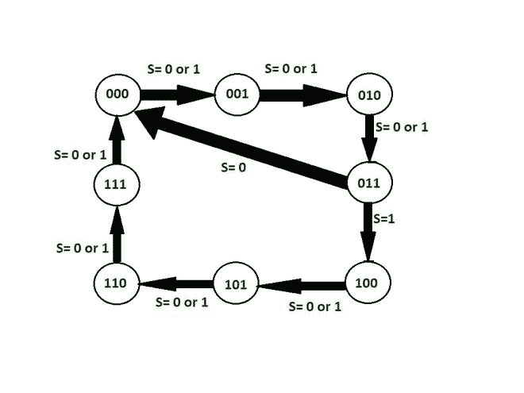
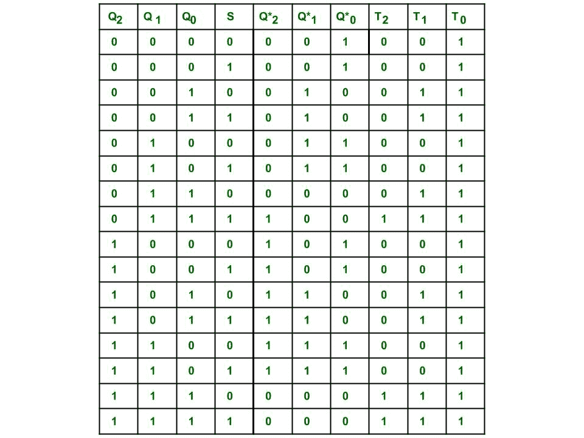
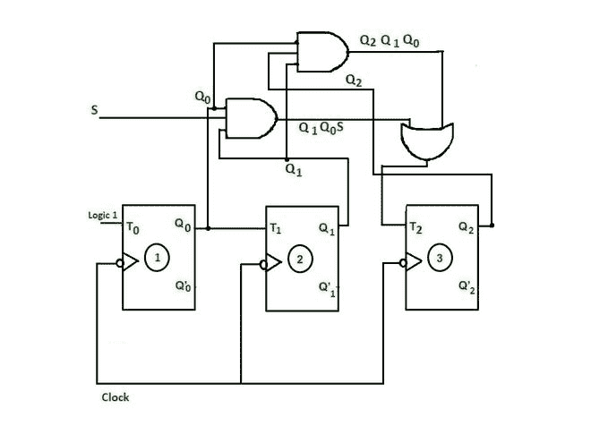
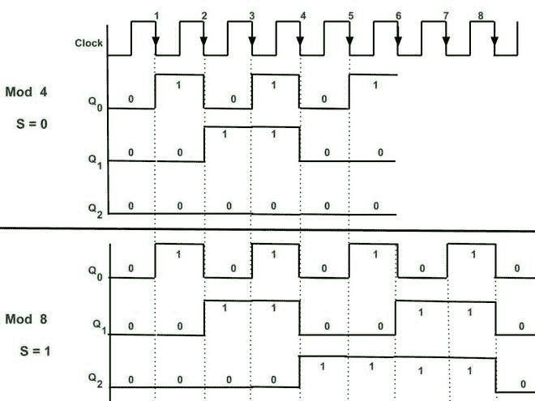

# 同步控制计数器

> 原文:[https://www . geesforgeks . org/同步控制计数器/](https://www.geeksforgeeks.org/synchronous-controlled-counter/)

在本文中，我们将讨论同步控制计数器的概述，并详细讨论其电路图、电路激励表、时序图。我们一个一个来讨论。

**概述:**
可以用 Toggle 或 D 型触发器制作同步计数器，比异步计数器更容易设计。由于触发器的时钟输入都是一起计时的，并且同时具有相同的时钟信号，这就是为什么它被称为同步计数器。它也被称为并行计数器，因为时钟被并行馈送到所有触发器。

**先决条件**–
设计[同步计数器](https://www.geeksforgeeks.org/differences-between-synchronous-and-asynchronous-counter/)和以下先决条件如下。

*   在这种类型的计数器模式中，应用控制输入。
*   模式控制输入由计数器跟随的序列决定。
*   设计过程与同步计数器设计相同。
*   任何类型的 FF 都可以用于这样的设计。

**例:**
考虑一个可以计数 mod 4 或 mod 8 的计数器，由模式控制输入(比如 S)决定。如果 S= 0，那么它将作为 mod 4 计数器工作，如果 S=1，它将执行递减计数。

*   对于这种类型计数器的设计，2 <sup>3</sup> = 8(因为计数到 7 需要 3 位)，即需要 3 个 FF。这里用的是 T FF。状态图如下图所示。



*   在这种情况下，如果计数器状态低于 011，S 的值可以是 0 或 1，因为在 mod -4 或 mod 8 中，直到 011 的计数顺序是相同的，在这两种情况下是相同的。所以 S 的值可以是 0 或 1。如果 S= 0，从 011 到 000 的转换发生，计数器将复位。如果 S= 1，则发生从 011 到 100 的转换。之后，S 的值可以是 0 或 1，直到状态 000 出现。

**电路激励表:**
显示 FF 的当前状态和施加时钟脉冲后的下一个状态以及输入值。这里用的是 T FF。所以 FF 的 T(toggle)输入的值只有在对应的状态输出值从 0 变为 1 或从 1 变为 0 时才为 1。否则，它保持不变。下表是根据所需的计数顺序。

```
Q  - means Present state 
Q* - means next state.
```



在这里，我们使用 K 映射找到了 3 个触发器的输入变量的最小布尔表达式。


**电路图:**
这里的电路是针对我们已经得到的表达式实现的。电路输出顺序与状态图所示相同。



**时序图:**
从时序图可以验证计数器的顺序。如果计数器复位并且控制输入 S 为 0，那么它将遵循 mod–4 的顺序，即它将计数 000、001、010、011 并重复。如果计数器复位并且控制输入 S 为 1，那么计数器将计数序列 000、001、010、011、100、101、110、111，并重复。

**情况-1** :
当 S= 0 时，第 4-ve 边沿触发时钟脉冲后。

*   当 Q <sub>2</sub> =0，Q <sub>1</sub> = 1，Q <sub>0</sub> = 1，S=0 时，即第 3-ve 沿时钟脉冲后 3 FF 的状态。
*   将这些表示为 T2 = Q<sub>2</sub>Q<sub>1</sub>Q<sub>0</sub>+SQ<sub>1</sub>Q<sub>0</sub>= 0+0 = 0，然后在第 4 个 ve 边沿触发时钟脉冲 FF 3 后保留其状态，即 Q <sub>2</sub> = 0
*   T <sub>1</sub> = Q <sub>0</sub> = 1，因此 FF 2 切换其输出状态，即 Q1 变为 0
*   T <sub>0</sub> = 1，因此 FF 1 切换其输出状态，即 Q <sub>0</sub> 变为 0
*   Q <sub>2</sub> Q <sub>1</sub> Q <sub>0</sub> 在第 4 个负时钟 0 0 0 之后变为 0，其十进制等价为 0
*   所以 110 到 000 的转换(复位)发生在第 4 个 Ve 沿之后。

**情况-2** :
当 S=1 时，在第 4-ve 边沿触发时钟脉冲之后。

*   当 Q <sub>2</sub> =0，Q <sub>1</sub> = 1，Q <sub>0</sub> = 1，S=1 时，即第 3-ve 沿时钟脉冲后 3 FF 的状态。
*   将这些表示为 T2 = Q<sub>2</sub>Q<sub>1</sub>Q<sub>0</sub>+SQ<sub>1</sub>Q<sub>0</sub>= 0+1 = 1，然后在第 4 个 ve 边沿时钟脉冲 FF 3 保留其切换输出状态，即 Q <sub>2</sub> 变为 1。
*   T <sub>1</sub> = Q <sub>0</sub> = 1，因此 FF 2 切换其输出状态即 Q <sub>1</sub> 变为 0
*   T <sub>0</sub> = 1，因此 FF 1 切换其输出状态，即 Q <sub>0</sub> 变为 0
*   Q <sub>2</sub> Q <sub>1</sub> Q <sub>0</sub> 在第 4 个负时钟 1 0 处变为 0，其十进制等效值为 4



**mod-4 或 mod-8 计数器的时序图**

**解释** :
这里-Ve 边沿触发用于切换目的。

*   As T1= Q <sub>0</sub> 。因此，只有当存在下降沿(即使用 ve 边沿触发时钟)并且 Q <sub>0</sub> =1 时，FF 1 的输出状态才会改变，然后发生切换，T1 的输出状态也会改变。
*   作为 T2 = Q<sub>1</sub>Q<sub>0</sub>S+Q<sub>2</sub>Q<sub>1</sub>Q<sub>0</sub>。如果 S= 0，那么只有当 Q<sub>2</sub>Q<sub>1</sub>Q<sub>0</sub>将导致 1 并且还存在下降沿时，FF 2 的输出状态才会改变，否则该状态将被保留。
*   如果 S= 1，T2 = Q<sub>1</sub>Q<sub>0</sub>+Q<sub>2</sub>Q<sub>1</sub>Q<sub>0</sub>，因此当 Q <sub>1</sub> Q <sub>0</sub> 结果为 1 或 Q<sub>2</sub>Q<sub>1</sub>Q<sub>0</sub>结果为 1 且存在时钟下降沿时，FF 3 的输出状态会发生变化。
*   因此，在每个-Ve 边沿时钟脉冲，输出状态都会改变。