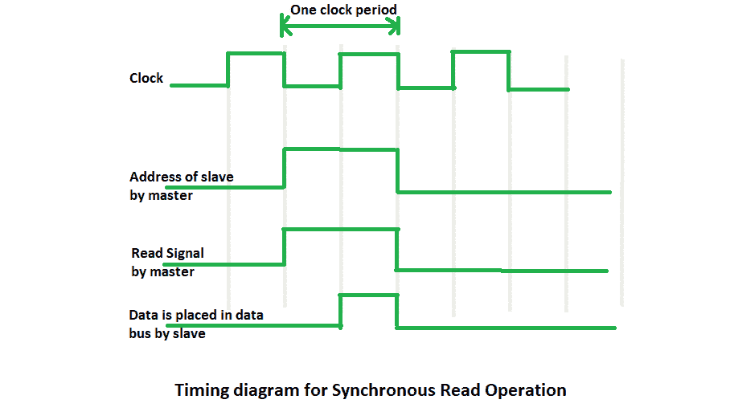

# 计算机组织中的同步数据传输

> 原文:[https://www . geesforgeks . org/synchronic-data-transfer-in-computer-organization/](https://www.geeksforgeeks.org/synchronous-data-transfer-in-computer-organization/)

在**同步数据传输**中，发送和接收单元用相同的时钟信号使能。当两个单元中的每一个都知道另一个的行为时，它们之间是可能的。主机以预定义的顺序执行数据传输指令序列。所有这些动作都与公共时钟同步。主机被设计成在从机完全准备好的时候提供数据。通常，主机会引入足够的延迟，以考虑从机的缓慢响应，而无需从机的任何请求。

当主机向从机发送数据时，主机不期望从机发出任何确认信号。类似地，当主机读取从机数据时，从机既不通知数据已放在数据总线上，主机也不确认数据已被读取。主设备和从设备都在设计的时钟周期内执行各自的数据传输任务。由于两个设备都知道彼此的行为(响应时间)，因此不会出现困难。
在传输数据之前，主机必须通过发送从机地址或向从机发送**“设备选择”**信号来逻辑选择从机。但是如果选择了设备，从机到主机没有**确认信号**。

同步读取操作的时序图如下所示:

在此时序图中，主机首先将从机地址放入地址总线，并在时钟下降沿将读取信号放入控制线。整个读取操作在一个时钟周期内结束。

**优势–**

1.  设计过程很容易。尽管主机等待的时间等于从机的响应时间，但主机并不等待从机的任何确认信号。
2.  从机不产生确认信号，尽管它按照主机或系统设计者设置的协议遵守时序规则。

**缺点–**

1.  如果低速设备连接到公共总线，会降低系统的整体传输速率。
2.  如果从机以低速运行，在数据传输期间，主机将空闲一段时间，反之亦然。