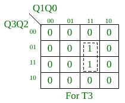
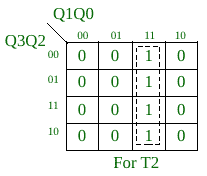
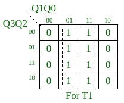
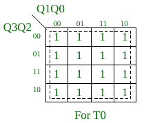
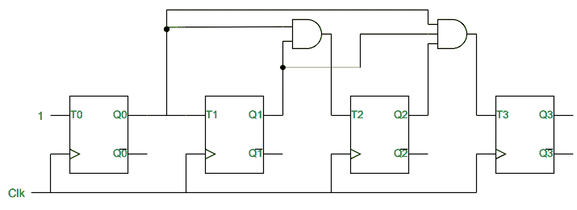
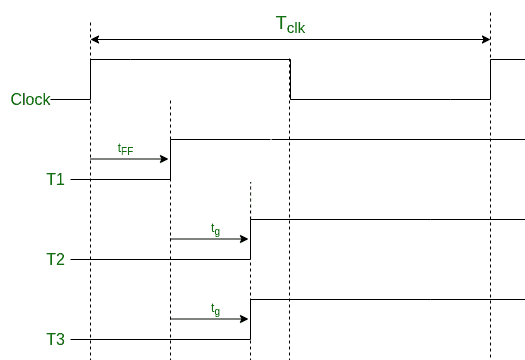

# 同步并行进位二进制计数器

> 原文:[https://www . geesforgeks . org/synchronic-parallel-carry-binary-counter/](https://www.geeksforgeeks.org/synchronous-parallel-carry-binary-counter/)

**同步计数器**:是在触发器的帮助下，同时触发所有触发器，以二进制数进行计数的数字电路。

**给定计数顺序的同步计数器设计程序**:

1.  识别计数序列所需的触发器(FFs)、输入和输出的数量。
2.  选择将要使用的 FF 的[类型。](https://www.geeksforgeeks.org/flip-flop-types-their-conversion-and-applications/)
3.  构建包含计数器当前状态和下一个状态的状态表以及所用 FFs 的激励表。
4.  找出 FFs 每个输入的方程或表达式。这里我们可以使用 [K-map 方法](https://www.geeksforgeeks.org/introduction-of-k-map-karnaugh-map/)，它提供了最小化的表达式。
5.  现在根据在步骤 4 中获得的表达式，在所用的 FFs 和 gates 之间建立连接。

**示例**–首先，我们将使用 T-FF 实现一个 4 位同步上行计数器。所以，我们需要 4 个 FFs，分别是 FF0、FF1、FF2 和 FF3。它可以从 0 数到 15(16 个数字)。下面是这个计数器使用的表，激励表用于 T-FF，

<figure class="table">

| **当前状态**

 | **下一状态** | **输入到 FFs** |
| **Q3** | **Q2** | **Q1** | **Q0** | **Q3** | **Q2** | **Q1** | **Q0** | **T3** | **T2** | **T1** | **T0** |
| Zero | Zero | Zero | Zero | Zero | Zero | Zero | one | Zero | Zero | Zero | one |
| Zero | Zero | Zero | one | Zero | Zero | one | Zero | Zero | Zero | one | one |
| Zero | Zero | one | Zero | Zero | Zero | one | one | Zero | Zero | Zero | one |
| Zero | Zero | one | one | Zero | one | Zero | Zero | Zero | one | one | one |
| Zero | one | Zero | Zero | Zero | one | Zero | one | Zero | Zero | Zero | one |
| Zero | one | Zero | one | Zero | one | one | Zero | Zero | Zero | one | one |
| Zero | one | one | Zero | Zero | one | one | one | Zero | Zero | Zero | one |
| Zero | one | one | one | one | Zero | Zero | Zero | one | one | one | one |
| one | Zero | Zero | Zero | one | Zero | Zero | one | Zero | Zero | Zero | one |
| one | Zero | Zero | one | one | Zero | one | Zero | Zero | Zero | one | one |
| one | Zero | one | Zero | one | Zero | one | one | Zero | Zero | Zero | one |
| one | Zero | one | one | one | one | Zero | Zero | Zero | one | one | one |
| one | one | Zero | Zero | one | one | Zero | one | Zero | Zero | Zero | one |
| one | one | Zero | one | one | one | one | Zero | Zero | Zero | one | one |
| one | one | one | Zero | one | one | one | one | Zero | Zero | Zero | one |
| one | one | one | one | Zero | Zero | Zero | Zero | one | one | one | one |

使用 K-map，我们可以找到 T0、T1、T2 和 T3 的布尔表达式。

   

所以， *T0 = 1，*T2*T1 = Q0，*T5*T2 = Q0。Q1，*
*T3 = Q0。Q2 Q1*

[**4 位同步串进位计数器**](https://www.geeksforgeeks.org/synchronous-series-carry-counter/) :上例我们可以用这个[链接(文章](https://www.geeksforgeeks.org/synchronous-series-carry-counter/))实现串进位计数器。在这个系列进位计数器中，所有使用的与门的扇入值(输入数)是 2，并且是固定的。

***为什么我们需要同步并行进位计数器而不是同步串行进位计数器？*** 如果我们看到上面例子中串行进位计数器的实现，它的与门使用其他一些与门的输出。如上述表达式所示，与门产生 *Q0。Q1.Q2* 可以使用与门的输出产生 *Q0。Q1* ，或者我们可以写 *T3 = T2。Q2* 。这同样适用于更高计数的序列。这种安排会导致计数器电路的电平增加。而高电平意味着电路稳定状态需要更多时间。同样的事情，我们可以在上面的链接中看到，计数的一个增量的延迟取决于 FFs 的数量。因此，我们使用同步并行进位计数器来降低电路的电平。

**4 位同步并行进位计数器:**
对于上面给出的例子
**逻辑图-**

**时序图-**

在这里，

*****Tclk>= Tff+Tg，n>= 3*****…………。**(一)******

****在哪里****

*   *****T clk* —所用时钟的时间段。****
*   *****tFF*—FF 完成其操作所需的时间。****
*   *****t g* —任何闸门完成其操作所需的最长时间。****
*   *****n* —使用的 FFs 数量。****

*******并行进位计数器*** 背后的想法——在这个设计中，我们试图实现一个只有两级的电路。第一级为 FFs 保留，第二级为电路中使用的门的执行。无论计数顺序是什么，并行进位计数器总是保持在 2 级电路中，但是串行进位计数器随着计数数量的增加而增加。我们可以说*同步并行进位计数器比同步串行进位计数器*快得多。****

*******优势:*** 在等式(a)中，时间段与 FFs 的数量或计数无关(如果 n > =3)。因此，无论计数序列的大小如何，时钟的时间周期都将保持不变。但是，这在串进位计数器的情况下是不可能的。这是同步并行进位计数器相对于同步串行进位计数器的一个主要优点。****

*******劣势:*** 计数器中使用的与门的扇入值(输入数)随着 FFs 的数量线性增加。对于计数器中的 n 个 FFs，我们需要扇入值从 2 到 n-1 的与门。而扇入值高得多的闸门实际上并不存在。因此，对于较小的计数序列大小，并行进位计数器比串行进位计数器好得多，但对于较大的计数序列大小则不然。****

******上例中关于同步并行进位和串行进位计数器的一些事实******

*   ****我们可以看到，对于相同的计数，两个计数器所需的门的数量是相同的。****
*   ****上面两个计数器都使用了与门，但是门的类型可以根据计数顺序进行更改。这完全取决于我们在程序的第 4 步中为 FFs 的所有输入获得的最小化表达式。例如[环计数](https://www.geeksforgeeks.org/ring-counter-in-digital-logic/) r 是同步计数器，但不使用任何与门或其他门。****

******最小化并行进位和串行进位计数器缺点的策略**
我们可以将上述两种计数器的特点结合起来做一个计数器。例如，我们可以使用新的门，这些门使用其他门的一些值作为串行进位计数器，但是它的扇入值比对应于并行进位计数器的门少。例如，一个有 n 个 FFs 和 n 的计数器更高，串行进位计数器将有 n-1 个电平(FFs 为 1，门为 n-2)，并行进位计数器将有一个 2 电平电路，现在我们可以实现一个接近 n/2 电平的计数器电路。该策略适用于给定示例中的类型计数序列。****

</figure>