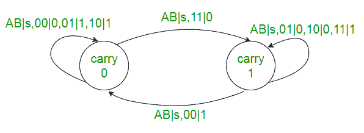
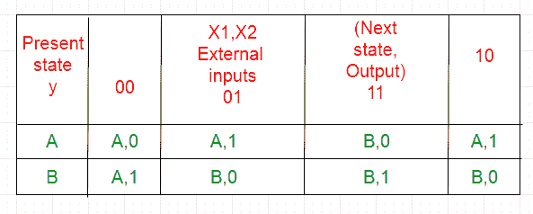
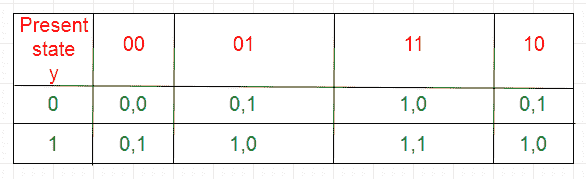
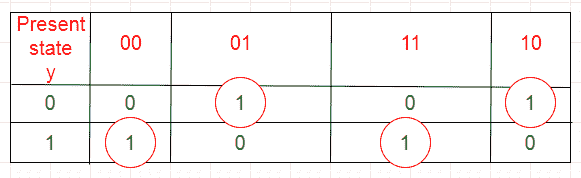
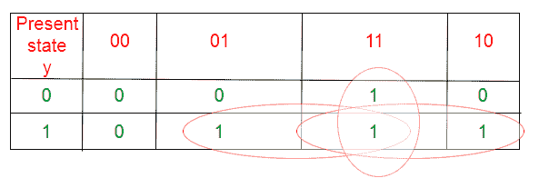
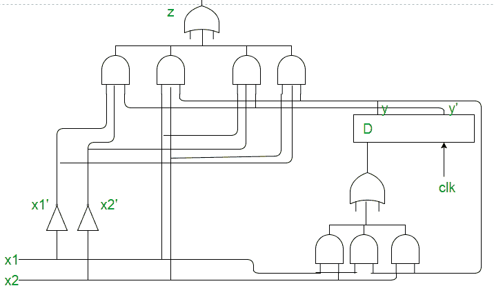

# 数字逻辑中的同步时序电路

> 原文:[https://www . geesforgeks . org/同步时序数字逻辑电路/](https://www.geeksforgeeks.org/synchronous-sequential-circuits-in-digital-logic/)

解决问题的步骤:
**1。**根据问题陈述或给定的状态表绘制状态图。

**例:**串行加法器。
串行加法器的功能可以用下面的状态图来描述。X1 和 X2 是输入，A 和 B 是代表进位的状态。

**2。**绘制状态表。如果有任何冗余状态，则减少状态表。

**3。**选择**状态分配**，即根据状态总数为状态分配二进制数。还要决定电路的存储元件(触发器)。
A - > 0

B -> 1
**4。**替换状态表中的赋值，得到过渡表:

**5。**将输出表与过渡表分开。

z = x1x’2y+x’1x2y’+x1x2y+x1x’2y’

**6.** Excitation table for the flip-flop is obtained from the transition table using the output of flip-flop.
**Excitation table for D flip-flop:**

D = x1x2+x1y+x2y

**7.** Draw the circuit diagram using gates and flip-flops.

This article is contributed by **Kriti Kushwaha**
Please write comments if you find anything incorrect, or you want to share more information about the topic discussed above.