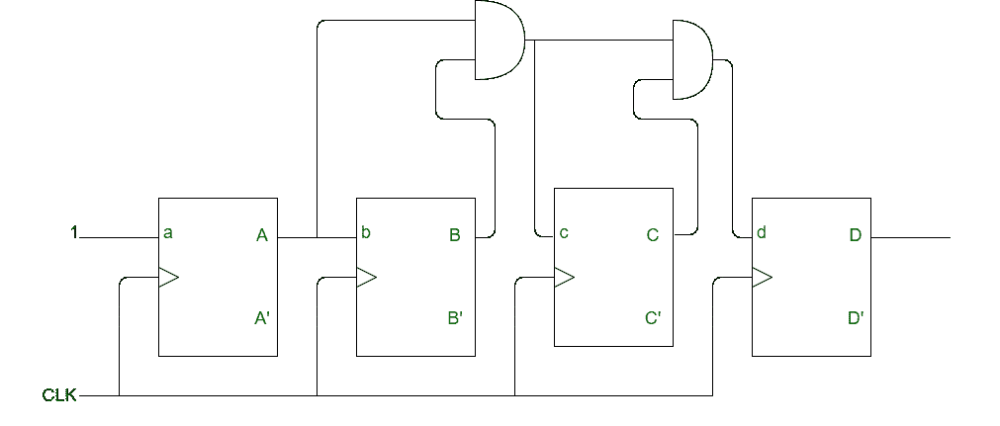
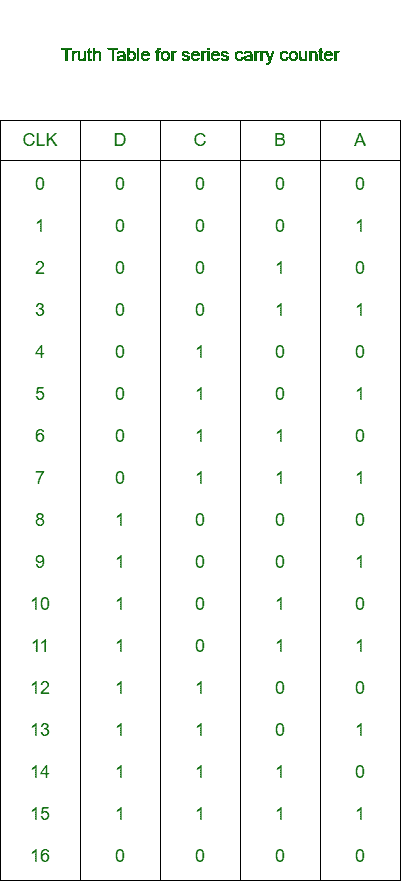

# 同步串联进位计数器

> 原文:[https://www . geesforgeks . org/synchronic-series-carry-counter/](https://www.geeksforgeeks.org/synchronous-series-carry-counter/)

同步串行进位计数器是这样一种同步计数器，其中触发器的输入以这样一种方式连接，即只有那些在给定时钟上触发的触发器将具有作为逻辑 1 的输入值。这个计数器的优点是减少了解码误差。

**同步串行进位计数器框图:**
这是一个 4 位(MOD-16)串行进位计数器的框图。



在上面的计数器中:

1.  应用每个 CLK 脉冲的切换。
2.  当 A = 1 并且施加 CLK 脉冲时，b 切换。
3.  当 B = 1 和 A = 1 并且施加 CLK 脉冲时，c 切换。
4.  当 C = B = A = 1 并且施加 CLK 脉冲时，d 切换。

**系列进位计数器真值表:**



**注:**
为了得到同步递减计数器，补码输出(A’、B’等)。)连接到下一级的输入端。

**总时间延迟:**
同步串行进位计数器的总延迟为:

```
T >= t(pd) + (n-2) x t(pd of AND gate) 
```

随着位数的增加，触发器的传播延迟和与门的传播延迟也增加，这将增加电路的总延迟。

**系列进位计数器的优势:**
系列进位计数器最重要的优势是减少了解码错误。