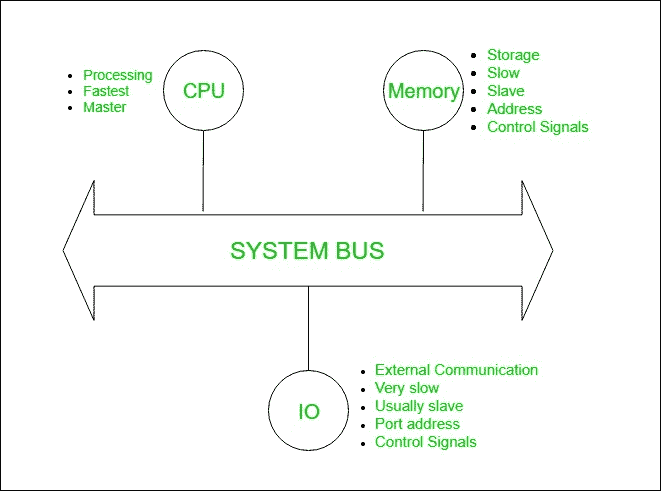
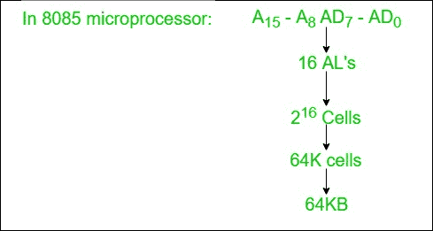
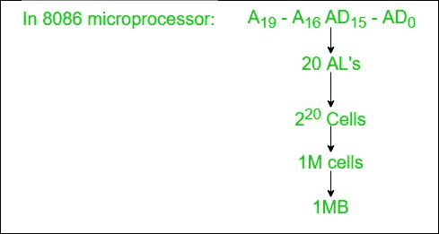
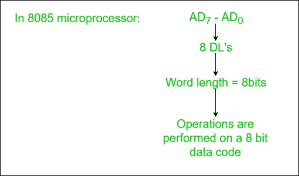
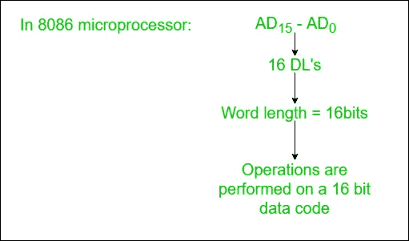

# 系统总线设计

> 原文:[https://www.geeksforgeeks.org/system-bus-design/](https://www.geeksforgeeks.org/system-bus-design/)

**定义:**

任何数字电子设备内部传输数据的导电路径。计算机总线由一组平行导体组成，这些导体可以是传统的导线、印刷电路板上的铜迹线或硅片表面的微小铝迹线。每条线只传输一位，因此线的数量决定了总线可以传输的最大数据字:一条有八条线的总线只能传输 8 位数据字，因此将设备定义为 8 位设备。

*   总线是一个通信通道。
*   总线的特点是共享传输介质。
*   总线的限制是一次只能传输一次。
*   用于在计算机的主要部件之间提供通信的总线称为**系统总线**。

**电脑:**



系统总线包含 3 类线路，用于提供 CPU、内存和 IO 之间的通信，命名为:

```
1. Address lines (AL)
2. Data lines (DL)
3. Control lines (CL) 
```

**1。地址线:**

*   用于将地址传送到内存和 IO。
*   单向的。
*   根据地址总线的宽度，我们可以确定主存储器的容量

**示例:**





**2。数据线:**

*   用于在中央处理器、内存和输入输出之间传输二进制数据。
*   双向的。
*   根据数据总线的宽度，我们可以确定中央处理器的字长。
*   根据字长，我们可以确定一个 CPU 的性能。

**示例:**





**3。控制线:**

*   用于承载控制信号和定时信号
*   控制信号指示操作类型。
*   用于使内存和输入输出操作与中央处理器时钟同步的定时信号。