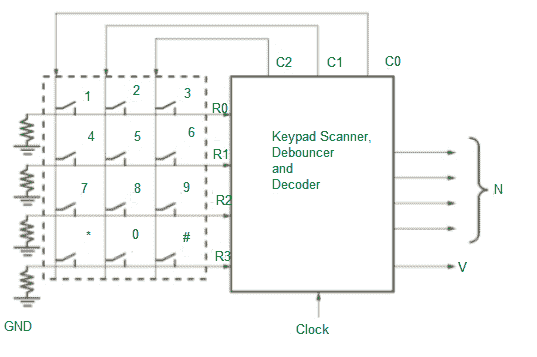
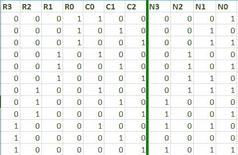

# 电话键盘扫描仪

> 原文:[https://www.geeksforgeeks.org/telephone-keypad-scanner/](https://www.geeksforgeeks.org/telephone-keypad-scanner/)

电话键盘使用[可编程逻辑器件](https://www.geeksforgeeks.org/programmable-logic-array/)设计。
键盘以矩阵形式连接，每行和每列的交叉点都有一个开关。该键盘扫描仪的目的是确定哪个键被按下，并输出一个二进制数 N = N3·N2·N1 N0，它对应于键号。例如:按下键“5”将输出 0101，按下键“*”将输出 1010。





每当检测到一个有效的键时，扫描仪应该输出一个信号 V，用于时钟时间 t。假设一次按下一个键，电阻和地连接到键盘的每一行，这样当没有键被按下时，R1=R2=R3=R4=0。

1.  将逻辑 1 应用于列 sC0、c 1、C2，然后等待。
2.  如果按下任何键，逻辑 1 将出现在相应的电阻-R0、R1、R2 或 R3 上。
3.  仅对 C0 列应用逻辑 1。如果任一电阻为 1，则检测到有效密钥。设置 V=1，输出为相应的 n。
4.  如果在第一列中没有检测到任何键，将 1 应用于 C1 并重复。如果在第二列中未检测到任何键，请对 C2 重复此步骤。
5.  当检测到有效键时，将 1s 应用于 C0、C1、C2，并等待直到没有键被按下。
    在扫描键盘以确定哪个键被按下的过程中，扫描仪必须考虑“接触反弹”。当机械开关打开或关闭时，开关触点会反弹，导致开关输出噪音。
6.  因此，输出信号指示按键必须与时钟同步。
    因此对于去抖电路来说，**时钟周期>反弹时间**。

解码器的逻辑公式如下:

```
N3 = R2(C0)' + R3(C1)'
N2 = R1 + R2CO
N1 = R0(C0)' + (R2)'C2 + (R1)'(R0)'(C0)
N0 = R1C1 + (R1)'C2 + (R3)'(R1)'(C1)'
```